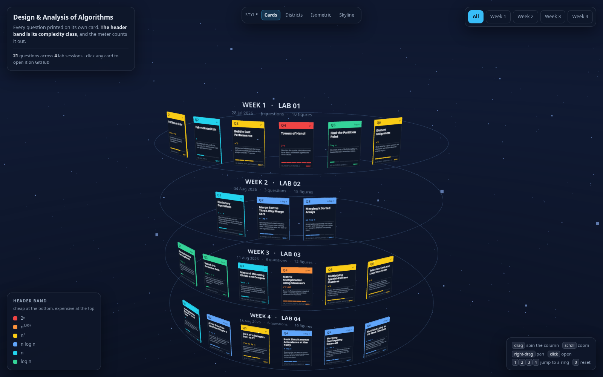
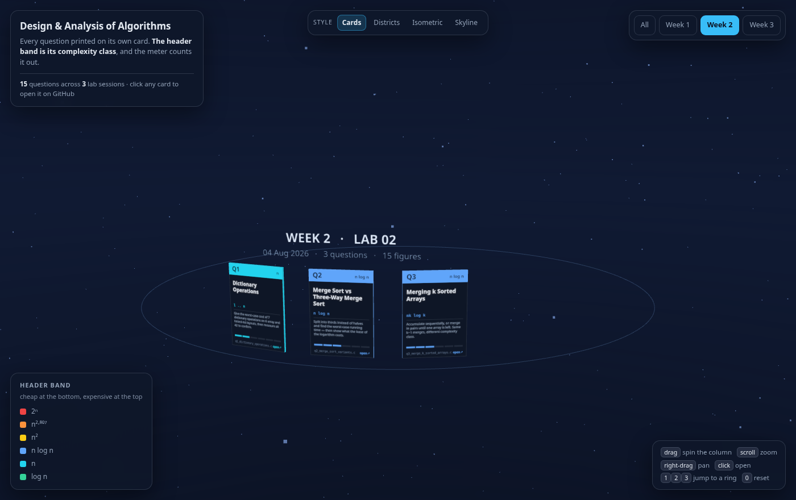

<h1 align="center">Design and Analysis of Algorithms</h1>

<p align="center">
  <strong>DAA Laboratory Assignments — IIIT Bhubaneswar</strong>
</p>

<p align="center">
  
  
  
  
  
</p>

---

## Overview

This repository is my running record of the Design and Analysis of Algorithms
Laboratory at IIIT Bhubaneswar. Every lab session gets its own folder, and each
question inside it gets a folder of its own containing the solution, its
documentation, and a sample test case.

DAA is less about getting a program to run and more about showing how it behaves
as the input grows. So most programs here do two jobs at once: they solve the
problem, and then they instrument themselves — counting comparisons, counting
moves, tabulating values across decades of `n` — so the growth can be shown
rather than asserted. Week 1 exports its measurements to CSV and commits a plot
beside the source; Week 2 commits its plots too, and additionally prints its
measurements as tables, each one normalised by the growth function it is supposed
to follow, so a flat column is the proof. Week 3 prints the solved recurrence as
a column of its own — `3n/2 − 2`, `n(n−1)/2`, `7^log₂n` — beside the measured
count, so the two columns can be read as an equality rather than an
approximation, and every count is printed only after the answer that produced it
has been checked against a brute-force reference.

**Every question has its own README** with the problem statement, approach,
complexity analysis, and worked sample. Start from the [Lab Index](#lab-index)
below.

| Field | Details |
|-------|---------|
| Name | Raghvendra Singh |
| Student ID | B125092 |
| Branch | Computer Science and Engineering (CSE-B) |
| Institute | IIIT Bhubaneswar |
| Course | Design and Analysis of Algorithms Laboratory |
| Semester | B.Tech 3rd Semester |
| Instructor | Dr. Ajaya Kumar Dash |

---

---

## Repository Structure

<a href="https://raw.githack.com/raghvendrasingh-01/Design-and-Analysis-of-Algorithms-Assignments/main/3d-preview/index.html">
  
</a>

<p align="center">
  <b><a href="https://raw.githack.com/raghvendrasingh-01/Design-and-Analysis-of-Algorithms-Assignments/main/3d-preview/index.html">↻ Open the interactive map</a></b> &nbsp;·&nbsp;
  drag to orbit &nbsp;·&nbsp; scroll to zoom &nbsp;·&nbsp;
  click a card to open that question
</p>

Every lab question is printed on its own card — number, title, cost, summary
and source file, legible straight from the scene rather than hidden behind a
tooltip. One ring of cards per lab session, stacked into a column you spin.
The header band is the question's complexity class, and the meter along the
bottom counts that class out of six, so the cheap questions and the expensive
ones sort themselves out at a glance.

Hovering lifts a card out of the ring so you can read it, and clicking opens
its folder on GitHub. The page carries a switcher for the other three styles,
so one file gets you all four.

<details>
<summary><b>Every file, as a conventional tree</b> — the map above is the shape;
this is the detail.</summary>

```text
Design-and-Analysis-of-Algorithms-Assignments/
│
├── README.md                                   # this file — overview and navigation
│
├── WEEK 1/
│   ├── 2026_Week1_DAA_Lab_01.pdf               # question paper
│   │
│   ├── Q1/                                     # Put Them in Order
│   │   ├── README.md
│   │   ├── q1_growth_order.c
│   │   ├── sample.txt
│   │   └── plots/                              # 7 plots of the 12 functions
│   │       ├── 1_overview_linear.png
│   │       ├── 2_group_a_sublinear.png
│   │       ├── 3_group_b_linear_quad.png
│   │       ├── 4_group_c_fast.png
│   │       ├── 5_all_loglog.png
│   │       ├── 6_decades_log10.png
│   │       └── 7_crossovers.png
│   │
│   ├── Q2/                                     # Fair vs Biased Coin
│   │   ├── README.md
│   │   ├── q2_coin_toss.c
│   │   ├── sample.txt
│   │   ├── coin_toss_analysis.csv              # generated by Q2
│   │   └── coin_toss_analysis.svg
│   │
│   ├── Q3/                                     # Bubble Sort Performance
│   │   ├── README.md
│   │   ├── q3_bubble_sort_performance_analysis.c
│   │   ├── sample.txt
│   │   ├── bubble_sort_analysis.csv            # generated by Q3
│   │   └── bubble_sort_analysis.svg
│   │
│   ├── Q4/                                     # Towers of Hanoi
│   │   ├── README.md
│   │   ├── q4_towers_of_hanoi.c
│   │   ├── sample.txt
│   │   ├── toh.csv                             # generated by Q4
│   │   └── toh.svg
│   │
│   ├── Q5/                                     # Find the Partition Point
│   │   ├── README.md
│   │   ├── q5_partition_point.c
│   │   └── sample.txt
│   │
│   └── Q6/                                     # Element Uniqueness
│       ├── README.md
│       ├── q6_element_uniqueness.c
│       └── sample.txt
│
├── WEEK 2/
│   ├── 2026_Week2_DAA_Lab_02.pdf               # question paper
│   │
│   ├── Q1/                                     # Dictionary Operations
│   │   ├── README.md
│   │   ├── q1_dictionary_operations.c          # all six structures, measurement, validation
│   │   ├── sample.txt
│   │   └── plots/                              # 6 plots of the 42 measured cells
│   │       ├── 1_all_operations.png
│   │       ├── 2_search.png
│   │       ├── 3_per_structure.png
│   │       ├── 4_complexity_table.png
│   │       ├── 5_cost_at_max_n.png
│   │       └── 6_doubling_ratio.png
│   │
│   ├── Q2/                                     # Merge Sort vs Three-Way Merge Sort
│   │   ├── README.md
│   │   ├── q2_merge_sort_variants.c
│   │   ├── sample.txt
│   │   └── plots/                              # 4 plots of the two variants
│   │       ├── 1_growth_comparisons.png
│   │       ├── 2_normalised_constants.png
│   │       ├── 3_base_of_logarithm.png
│   │       └── 4_tradeoff.png
│   │
│   └── Q3/                                     # Merging k Sorted Arrays
│       ├── README.md
│       ├── q3_merge_k_sorted_arrays.c
│       ├── sample.txt
│       └── plots/                              # 5 plots of the two methods
│           ├── 1_growth_moves.png
│           ├── 2_normalised_constants.png
│           ├── 3_speedup.png
│           ├── 4_sweep_n.png
│           └── 5_merge_tree_shape.png
│
└── WEEK 3/
    ├── 2026_Week3_DAA_Lab_03.pdf               # question paper
    │
    ├── Q1/                                     # Binary Search vs Ternary Search
    │   ├── README.md
    │   ├── q1_binary_vs_ternary_search.c
    │   ├── sample.txt
    │   └── plots/                              # binary and ternary, 2 plots
    │       ├── 1_comparisons_growth.png
    │       └── 2_cost_per_level_and_ratio.png
    │
    ├── Q2/                                     # Search the Defective Coin
    │   ├── README.md
    │   ├── q2_defective_coin.c
    │   ├── sample.txt
    │   └── plots/                              # the log3 bound, 2 plots
    │       ├── 1_weighings_growth.png
    │       └── 2_bound_margin.png
    │
    ├── Q3/                                     # Max and Min using Divide and Conquer
    │   ├── README.md
    │   ├── q3_max_min_divide_conquer.c
    │   ├── sample.txt
    │   └── plots/                              # the 3n/2 - 2 bound, 2 plots
    │       ├── 1_comparisons.png
    │       └── 2_saving.png
    │
    ├── Q4/                                     # Matrix Multiplication, Strassen's Method
    │   ├── README.md
    │   ├── q4_strassen_matrix_multiply.c
    │   ├── sample.txt
    │   └── plots/                              # multiplications, totals, crossover
    │       ├── 1_multiplications.png
    │       ├── 2_total_operations.png
    │       └── 3_crossover.png
    │
    ├── Q5/                                     # Multiplying Special-Pattern Matrices
    │   ├── README.md
    │   ├── q5_pattern_matrix_multiply.c
    │   ├── sample.txt
    │   └── plots/                              # n multiplications, 2 plots
    │       ├── 1_operations_growth.png
    │       └── 2_normalised_constant.png
    │
    └── Q6/                                     # Selection Sort and Loop Invariants
        ├── README.md
        ├── q6_selection_sort_invariant.c
        ├── sample.txt
        └── plots/                              # one panel: the three curves coincide
            └── 1_comparisons_identical.png
```

</details>

<details>
<summary><b>Running and publishing the map</b></summary>

Each style is one self-contained HTML file next to a single vendored copy of
three.js, so double-clicking is enough — no build step, no server, no network.

| | |
|---|---|
| Locally | open `3d-preview/index.html` |
| Published | enable **Settings → Pages → deploy from branch `main`, root**, then it serves at [`/3d-preview/index.html`](https://raghvendrasingh-01.github.io/Design-and-Analysis-of-Algorithms-Assignments/3d-preview/index.html) |
| Without configuring Pages | [raw.githack.com](https://raw.githack.com/raghvendrasingh-01/Design-and-Analysis-of-Algorithms-Assignments/main/3d-preview/index.html) serves it straight from the branch |

The hosted links above only answer once this directory has been pushed.

| File | Style |
|---|---|
| `3d-preview/index.html` | Cards — the index itself, printed on cards you spin |
| `3d-preview/districts.html` | Districts — one platform per lab session, one block per question |
| `3d-preview/iso.html` | Isometric — an orthographic diorama; count the cubes to read the cost |
| `3d-preview/skyline.html` | Skyline — the repository as a city at night |

Query parameters: `?week=2` opens straight to one lab session, `?still=1` skips
the intro animation and the idle drift (which is how the stills here were taken).

</details>

---

## Lab Index

| Lab | Topic | Date | Questions | Folder |
|-----|-------|------|-----------|--------|
| Lab 01 | Growth of functions, empirical analysis, recurrences | 28 Jul 2026 | 6 | [WEEK 1](WEEK%201) |
| Lab 02 | Data structure trade-offs, divide and conquer, the master theorem | 04 Aug 2026 | 3 | [WEEK 2](WEEK%202) |
| Lab 03 | Divide and conquer — search, matrix multiplication, loop invariants | 11 Aug 2026 | 6 | [WEEK 3](WEEK%203) |

Each session below links into the same scene, opened on that lab. The tables
repeat it as text, because a picture is no good for searching or for screen
readers.

### WEEK 1 — Lab 01

> Growth rates, randomised simulation, and counting the work an algorithm
> actually does.

<a href="https://raw.githack.com/raghvendrasingh-01/Design-and-Analysis-of-Algorithms-Assignments/main/3d-preview/index.html?week=1">
  
</a>

| # | Question | Description | Complexity | Docs |
|---|----------|-------------|------------|------|
| 1 | **Put Them in Order** | Arrange 12 given functions in increasing order of growth for sufficiently large `n`. | Θ(T·F² + T²·F) time, Θ(F·T) space | [README](WEEK%201/Q1/README.md) · [code](WEEK%201/Q1/q1_growth_order.c) |
| 2 | **Fair vs Biased Coin** | Simulate a coin toss, verify that P(HEAD) → 0.5, then compare a fair coin against biased ones. | Θ(n) time, Θ(1) space | [README](WEEK%201/Q2/README.md) · [code](WEEK%201/Q2/q2_coin_toss.c) |
| 3 | **Bubble Sort Performance** | Compare a bubble sort that stops early once sorted against one that always runs all `n−1` passes. | Ω(n) / O(n²) time, Θ(1) space | [README](WEEK%201/Q3/README.md) · [code](WEEK%201/Q3/q3_bubble_sort_performance_analysis.c) |
| 4 | **Towers of Hanoi** | Simulate the puzzle, tabulate moves for `n` discs, and match against the closed form. | Θ(2ⁿ) time, Θ(n) space | [README](WEEK%201/Q4/README.md) · [code](WEEK%201/Q4/q4_towers_of_hanoi.c) |
| 5 | **Find the Partition Point** | Given an array of 0s followed by 1s, locate the exact transition index. | Θ(log n) time, Θ(1) space | [README](WEEK%201/Q5/README.md) · [code](WEEK%201/Q5/q5_partition_point.c) |
| 6 | **Element Uniqueness** | Check whether `n` given numbers are all distinct, and reason about the cost for large `n`. | O(n²) time, Θ(1) space | [README](WEEK%201/Q6/README.md) · [code](WEEK%201/Q6/q6_element_uniqueness.c) |

### WEEK 2 — Lab 02

> Choosing a data structure by what it costs, and what changes — and what does not —
> when you split a problem into more than two pieces.

<a href="https://raw.githack.com/raghvendrasingh-01/Design-and-Analysis-of-Algorithms-Assignments/main/3d-preview/index.html?week=2">
  
</a>

| # | Question | Description | Complexity | Docs |
|---|----------|-------------|------------|------|
| 1 | **Dictionary Operations** | Give the worst-case cost of 7 dictionary operations on 6 array and linked-list layouts, then measure all 42 to confirm. | Θ(1) to Θ(n) per operation | [README](WEEK%202/Q1/README.md) · [code](WEEK%202/Q1/q1_dictionary_operations.c) |
| 2 | **Merge Sort vs Three-Way Merge Sort** | Split into thirds instead of halves and find the worst-case running time — then show what the base of the logarithm costs. | Θ(n log₃n) = Θ(n log n) | [README](WEEK%202/Q2/README.md) · [code](WEEK%202/Q2/q2_merge_sort_variants.c) |
| 3 | **Merging k Sorted Arrays** | Accumulate sequentially, or merge in pairs until one array is left. Same `k−1` merges, different complexity class. | Θ(nk²) vs Θ(nk log k) | [README](WEEK%202/Q3/README.md) · [code](WEEK%202/Q3/q3_merge_k_sorted_arrays.c) |

### WEEK 3 — Lab 03

> Splitting a problem and paying for the split: when a three-way division wins,
> when it loses, and what structure in the input is worth.

<a href="https://raw.githack.com/raghvendrasingh-01/Design-and-Analysis-of-Algorithms-Assignments/main/3d-preview/index.html?week=3">
  
</a>

| # | Question | Description | Complexity | Docs |
|---|----------|-------------|------------|------|
| 1 | **Binary Search vs Ternary Search** | Search a sorted list by halves and by thirds, then settle which is better by counting comparisons rather than levels. | `2⌈log₂n⌉` vs `4⌈log₃n⌉` — both Θ(log n), ternary 26% dearer | [README](WEEK%203/Q1/README.md) · [code](WEEK%203/Q1/q1_binary_vs_ternary_search.c) |
| 2 | **Search the Defective Coin** | One coin of `n` may be lighter, or none is. Find it with nothing but a balance scale, inside `log₂ n + c` weighings. | `⌈log₃n⌉ + 1` weighings = Θ(log n) | [README](WEEK%203/Q2/README.md) · [code](WEEK%203/Q2/q2_defective_coin.c) |
| 3 | **Max and Min using Divide and Conquer** | Find both extremes of an array within the `3n/2` comparison bound, and check the recursion against its unrolled twin. | `3n/2 − 2` comparisons, Θ(n) time | [README](WEEK%203/Q3/README.md) · [code](WEEK%203/Q3/q3_max_min_divide_conquer.c) |
| 4 | **Matrix Multiplication using Strassen's Method** | Seven half-size products instead of eight — and the eighteen block additions that buy them. | Θ(n^log₂7) = Θ(n²·⁸⁰⁷) | [README](WEEK%203/Q4/README.md) · [code](WEEK%203/Q4/q4_strassen_matrix_multiply.c) |
| 5 | **Multiplying Special-Pattern Matrices** | Blocks that repeat recursively collapse eight products into two, so a 256×256 product costs 256 multiplications. | Θ(n²) — exactly `3n² − 2n` operations | [README](WEEK%203/Q5/README.md) · [code](WEEK%203/Q5/q5_pattern_matrix_multiply.c) |
| 6 | **Selection Sort and Loop Invariants** | State the invariant, discharge initialisation, maintenance and termination, then show best case = worst case by measurement. | Θ(n²) in every case, `n−1` swaps | [README](WEEK%203/Q6/README.md) · [code](WEEK%203/Q6/q6_selection_sort_invariant.c) |

## Features

- **Self-documenting programs.** The analysis travels with the code. Week 1 and
  Week 2 solutions print their own time and space complexity before exiting;
  Week 3 closes instead with the recurrence it solved and the conclusion drawn
  from it — `T(n) = 2T(n/2) + 2 → 3n/2 − 2`, and so on for each question.
- **Empirical alongside asymptotic.** Programs that study growth measure it
  rather than assume it. Week 1 writes its measurements to CSV and commits the
  plot as SVG beside the source; Week 2 commits its plots as PNG and also prints
  the counts as a table, dividing each one by the growth function it should
  follow, so the claim stands or falls on whether that column stays flat. Week 3
  goes further and prints the exact closed form as a column of its own next to
  the measured count, turning the check into an equality between two columns
  rather than a ratio that merely settles.
- **Answers checked before counts are trusted.** Every Week 3 program validates
  its result against an independent reference and calls `exit(1)` on any
  disagreement — binary and ternary search against a linear scan, the coin
  search against every hiding place exhaustively, max–min three ways against one
  another, both matrix methods entry-by-entry against the naive triple loop, and
  selection sort's invariant asserted at initialisation, at every pass and at
  termination. A printed table is therefore evidence in itself: the numbers only
  appear because the algorithm was right at every size.
- **Verified samples.** Each question ships a `sample.txt` with input and output
  captured from an actual run, not written from memory.
- **Hand-written algorithms.** Every algorithm under study is implemented from
  scratch rather than delegated to a library routine, so the implementation is
  part of the answer.
- **No external dependencies.** The C standard library only — nothing to install
  beyond a compiler, and nothing to run after the program exits.
- **Consistent documentation.** Every question README follows the same structure:
  problem statement, approach, time complexity, space complexity, sample input,
  sample output, explanation, build and run, and files — plus a committed-artefacts
  section wherever a question ships generated data.

---

## Requirements

| Tool | Version | Purpose |
|------|---------|---------|
| GCC | any C99/C11-capable release | Compilation |
| C standard library | — | `stdio.h`, `stdlib.h`, `string.h`, `time.h`, `math.h`, `float.h` |

That is the whole list. The programs have no external dependencies — all three
weeks commit their plots as images, and Weeks 2 and 3 additionally print their
measurements as tables, so reading the repository requires nothing but a browser
and running it requires nothing but GCC.

Installing GCC, if it is not already present:

```bash
sudo apt update && sudo apt install build-essential      # Debian / Ubuntu
brew install gcc                                         # macOS
```

On **Windows**, use MinGW-w64 and append `.exe` to the output name.

A terminal with UTF-8 support is recommended — Week 1 Q1 to Q4 draw their ASCII
charts using block characters. The Week 2 and Week 3 programs print plain
ASCII-only tables, so they render anywhere.

---

## How to Use

Clone the repository:

```bash
git clone https://github.com/raghvendrasingh-01/Design-and-Analysis-of-Algorithms-Assignments.git
cd Design-and-Analysis-of-Algorithms-Assignments
```

Compile and run any question from its own folder:

```bash
cd "WEEK 1/Q4"
gcc -std=c11 -Wall -Wextra q4_towers_of_hanoi.c -o q4
./q4
```

**Q1 requires the math library** (`log`, `pow`, `sqrt`), and Q2 calls `fabs()`:

```bash
cd "WEEK 1/Q1"
gcc -std=c11 -Wall -Wextra q1_growth_order.c -o q1 -lm
./q1
```

Questions that read input can be driven non-interactively:

```bash
printf '10\n0 0 0 0 0 1 1 1 1 1\n' | ./q5     # Q5
printf '6\n10 25 3 47 8 19\n'       | ./q6     # Q6
printf '100000\n'                   | ./q2     # Q2 — tosses per coin
printf '12\n'                       | ./q3     # Q3 — array size
```

> **Heads up.** Week 1 Q2, Q3 and Q4 write their CSV into the *current working
> directory* under a fixed name — `coin_toss_analysis.csv`,
> `bubble_sort_analysis.csv` and `toh.csv`. Running them from inside their own
> folder overwrites the committed copies. To keep those files untouched, send the
> binary to a scratch directory and run it there:
>
> ```bash
> cd "WEEK 1/Q4"
> mkdir -p /tmp/daa
> gcc -Wall -Wextra q4_towers_of_hanoi.c -o /tmp/daa/q4
> cd /tmp/daa && ./q4
> ```
>
> Week 1 Q1, Q5 and Q6 write nothing to disk, and neither does any Week 2 or
> Week 3 question — they print their tables straight to the terminal. The Week 2
> and Week 3 plots were produced separately and committed; no program
> regenerates them.

**Week 2 Q1 is one file** — all six representations, the claim table, the
measurement loop and the validation.

```bash
cd "WEEK 2/Q1"
gcc -Wall -Wextra q1_dictionary_operations.c -o q1
./q1
```

**Week 2 Q2 and Q3 need the math library** for `log()`:

```bash
cd "WEEK 2/Q3"
gcc -Wall -Wextra q3_merge_k_sorted_arrays.c -o q3 -lm
./q3
```

Every Week 2 measurement is deterministic — the random inputs use a fixed seed — so
a rerun reproduces the committed `sample.txt` line for line.

**No Week 3 question reads input.** Each one runs a built-in sweep over `n` and
prints its table, so there is nothing to pipe in:

```bash
cd "WEEK 3/Q3"
gcc -Wall -Wextra q3_max_min_divide_conquer.c -o q3
./q3
```

**Week 3 Q1 and Q4 need the math library** — Q1 for `log2()` and `log()`, Q4 for
the `log₂7` exponent it prints:

```bash
cd "WEEK 3/Q4"
gcc -Wall -Wextra q4_strassen_matrix_multiply.c -o q4 -lm
./q4
```

Week 3 is deterministic too, and for a simpler reason: no program calls `srand()`,
so `rand()` runs from the standard default seed and every rerun reproduces the
committed `sample.txt` byte for byte. All six compile clean under
`-Wall -Wextra`.

Recommended flags while working:

```bash
gcc -std=c11 -Wall -Wextra -O2 file.c -o out -lm
```

---

## Topics Covered

**Analysis**

- [x] Asymptotic notation — Θ, O, Ω
- [x] Ordering functions by rate of growth
- [x] Polynomial vs superpolynomial vs exponential growth
- [x] Constant factors and crossover points
- [x] Best case, worst case, and why early exits do not change a bound
- [x] Counting primitive operations as a machine-independent cost model
- [x] Why the base of a logarithm vanishes from the class but not from the cost
- [x] Information-theoretic lower bounds — `log₂(n!)`, `log₂[(kn)!/(n!)^k]`, and
      the `3n/2 − 2` bound on finding both extremes
- [x] Doubling ratios as an empirical test of complexity class
- [x] Loop invariants — initialisation, maintenance, termination
- [x] Exact closed forms versus asymptotic bounds, and when a count can be
      confirmed as an identity rather than a trend
- [x] Why asymptotically better is not better at every size — measuring where the
      crossover has yet to happen

**Algorithms**

- [x] Merge sort (hand-written, stable, comparator-driven)
- [x] Three-way and k-way merge sort
- [x] Merging k sorted arrays — sequential against pairwise
- [x] Bubble sort and its early-termination variant
- [x] Selection sort, and why its best case is no better than its worst
- [x] Binary search / partition point
- [x] Ternary search, and why extra intervals cost more than they save
- [x] Searching with a three-outcome oracle — the balance scale
- [x] Simultaneous maximum and minimum in `3n/2 − 2` comparisons
- [x] Strassen's matrix multiplication — seven products instead of eight
- [x] Multiplying block-circulant matrices in `Θ(n²)`
- [x] Brute-force pairwise comparison
- [x] Recursion and divide and conquer

**Data Structures**

- [x] Dictionary / ADT operation costs — sorted and unsorted, array and linked
- [x] Why back pointers make deletion `Θ(1)`
- [x] Why binary search needs random access
- [x] Matrices as recursive quadrant blocks, and structure that shrinks the
      problem — `n` distinct entries mean `n` multiplications

**Recurrences and Randomisation**

- [x] Solving `T(n) = 2T(n−1) + 1`
- [x] Solving `T(n) = 2T(n/2) + 2` to the exact `3n/2 − 2`
- [x] Recurrences on a three-way split — `T(n/3) + 1` and `T(n/3) + 4`
- [x] Verifying a closed form against simulation
- [x] Monte Carlo simulation and the law of large numbers
- [x] Biased sampling
- [x] Master theorem — case 1 on `7T(n/2) + Θ(n²)`, case 2 on `2T(n/2) + Θ(n)`
      and `3T(n/3) + Θ(n)`, case 3 on `2T(n/2) + Θ(n²)`
- [x] Constructing adversarial worst-case inputs
- [ ] Amortised analysis

---

## Repository Conventions

- One folder per lab session, named `WEEK <n>`, containing the question paper and
  one subfolder per question.
- One folder per question, named `Q<number>`, containing the source, a `README.md`,
  a `sample.txt`, and any generated artefacts.
- Sources are named `q<number>_<short_description>.c` — the file name describes the
  problem, not just its number. One question, one source file.
- Every program closes with its own analysis — Weeks 1 and 2 print the time and
  space complexity, Week 3 prints the recurrence it solved and the conclusion
  that follows.
- Growth data is shown, never asserted. Week 1 writes a CSV and commits a
  hand-written `.svg` of the same name; Week 2 commits its plots under `plots/`
  and prints the measured counts as a table alongside a column normalised by the
  growth function under test; Week 3 keeps that layout and adds the exact closed
  form as a column of its own. Neither Week 2 nor Week 3 leaves anything behind
  on disk when it runs.
- Where a program can check its own answer it does, and aborts on a mismatch, so
  a table that prints at all is a table from a correct run.

---

## Contributing

This is a personal coursework record, so pull requests that add solutions are not
expected. Corrections are welcome — if you spot an error in an analysis, a broken
link, or a bug in a program, please open an issue describing the problem and which
file it affects.

---

## License

Coursework, published for reference and learning. Feel free to read, run and learn
from it; please do not submit it as your own.

---

<p align="center">
  Maintained by <strong>Raghvendra Singh</strong> · B125092 · CSE-B, IIIT Bhubaneswar
</p>
