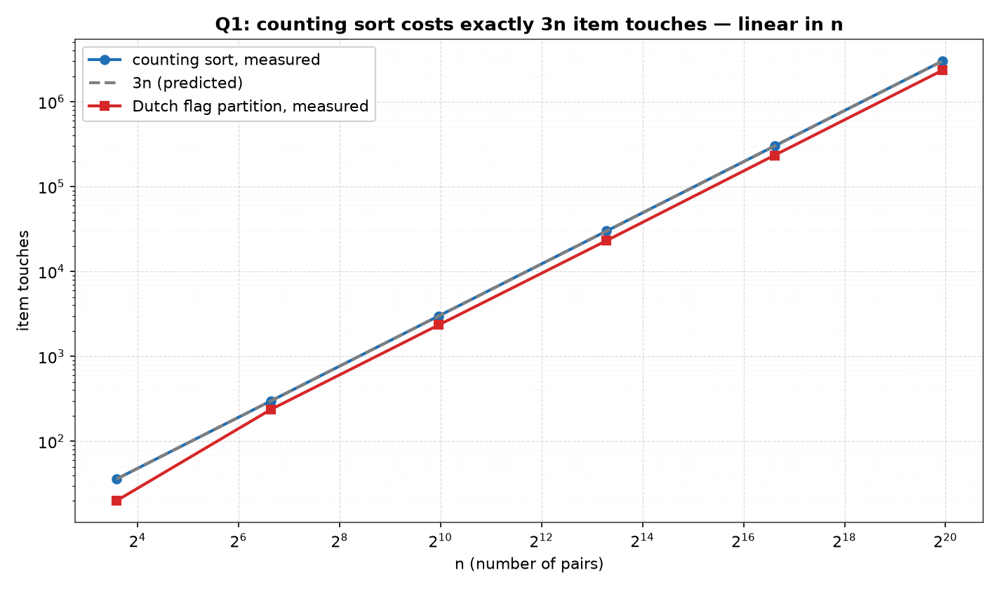
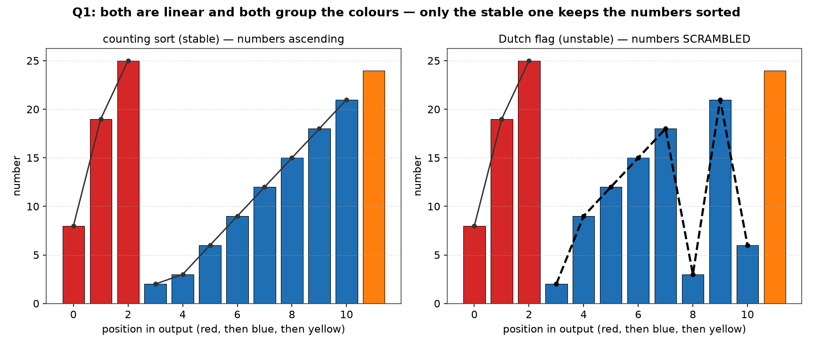

# Q1 — Sorting Pairs by Colour in Linear Time

> Given `n` pairs (number, colour) with colour ∈ {red, blue, yellow}, already
> sorted by number, sort them by colour — all reds before all blues before all
> yellows — in `O(n)`, keeping the numbers sorted inside each colour.

| | |
|---|---|
| **Source** | [`q1_three_colour_stable_sort.c`](q1_three_colour_stable_sort.c) |
| **Sample** | [`sample.txt`](sample.txt) |
| **Input** | None — built-in sweep over n |
| **Build** | `gcc -Wall -Wextra q1_three_colour_stable_sort.c -o q1` |
| **Output** | Printed to the terminal |

---

## Problem Statement

We are given `n` pairs of items, where the first item is a number and the second
is one of three colours (red, blue, or yellow). The items are **already sorted by
number**. Give an `O(n)` algorithm to sort the items by colour — all reds before
all blues before all yellows — **such that the numbers for identical colours stay
sorted**. By choosing a proper input representation, write a C program to
validate the algorithm.

The required bound is `O(n)`: linear in the number of pairs, with no `log n`
factor anywhere.

The input representation chosen here is an array of `struct { int num; char col; }`
with `col` drawn from the string `"RBY"`, which is also the required block order.
Storing the colour as a single character rather than a string is what makes the
key readable in constant time and usable as an array index.

---

## The Analysis

### Why a comparison sort is the wrong instrument

The reflex answer is "sort by colour with your favourite `O(n log n)` sort", and
the reflex objection is "you cannot beat `Ω(n log n)`". Both are wrong here, and
it is worth being precise about why.

The `Ω(n log n)` bound is a decision-tree argument. A comparison sort learns about
its input only through the yes/no outcomes of pairwise key comparisons; a binary
tree of height `h` has at most `2ʰ` leaves; and to sort an unrestricted key it must
be able to reach `n!` distinct output permutations. Hence:

```
comparison sort, unrestricted key:   h ≥ log₂(n!)  = Θ(n log n)
this problem, 3-valued key:          h ≥ log₂(3ⁿ) = n·log₂3 ≈ 1.585n
```

Two separate things break the bound. First, the *information* content of the
answer is only linear: the output is determined entirely by the length-`n` string
of colours, and there are `3ⁿ` such strings, so `n log₂3 ≈ 1.585n` bits suffice —
already a linear quantity, so no `n log n` obstruction exists even
information-theoretically. Second, and more decisively, the whole key can be
*read* in `O(1)` and used directly as an array index, which is an operation the
comparison model does not contain. The lower bound counts comparison outcomes;
we are not making comparisons.

Reading every item is obviously necessary, so `Ω(n)` holds, and the algorithm
below matches it. `Θ(n)` is optimal.

### Counting sort on key(colour)

`countingSort()` is two passes over the array plus a three-entry prefix step:

```
pass 1:  for each item      cnt[key(col)]++          n reads
prefix:  pos[0] = 0
         pos[1] = cnt[0]
         pos[2] = cnt[0] + cnt[1]                    1 addition, O(1)
pass 2:  for each item      out[pos[key(col)]++] = item
                                                     n reads + n writes
-----------------------------------------------------------------------
total:   3n item touches + O(1) bookkeeping
         comparisons between numbers: 0
```

`key()` maps `'R' → 0`, `'B' → 1`, `'Y' → 2` in constant time, so the tally is
three integers regardless of `n`. The prefix sums turn those counts into the
starting offset of each colour's block in the output. Pass 2 then places every
item at its block's next free slot and advances that slot.

That is `Θ(n)` time and `Θ(n)` extra space for the output array, with **zero**
comparisons between numbers — the numbers are never inspected by the sorter at
all. The program's `cOps` counter increments once per read and once per write, so
it should read exactly `3n`, and the table prints `3n` beside it for direct
comparison.

### Stability is the crux

A sort is **stable** when items with equal keys appear in the output in the same
relative order they had in the input. Here "equal keys" means "same colour", so
stability says: two reds come out in their input order, two blues come out in
their input order, and so on.

Pass 2 walks the input strictly left to right, and for each item it *appends* to
the end of that colour's block — `pos[k]` only ever increases, and an item is
never moved once written. So if item `i` precedes item `j` and both are red, then
`i` is written to a red slot before `j` is, at a strictly smaller offset. Same
colour ⇒ input order preserved. The scan is stable by construction.

Now apply the hypothesis the problem hands us. **The input order *is* the numeric
order.** Therefore "same-coloured items keep their input order" is literally the
same statement as "the numbers for identical colours stay sorted". The second
requirement of the question is not a separate task needing separate work — it is
discharged by stability alone, at no extra cost, in the same single pass that does
the grouping. Nothing in the algorithm compares, or even looks at, `num`.

This is the entire point of the question: an algorithm can be linear and still
wrong, and the requirement that survives is stability.

### The Dutch-national-flag contrast

`dutchFlag()` is the classic in-place three-way partition: a `lo` boundary below
which everything is red, a `hi` boundary above which everything is yellow, and a
`mid` cursor. Each step reads one item and either swaps it down to `lo`, leaves it
(blue), or swaps it up to `hi`. Its cost:

```
iterations:  exactly n         (every step does mid++ or hi--)
reads:       n
writes:      2 per red or yellow (a swap), 0 per blue
uniform mix: n + 2·(2n/3) = 7n/3 ≈ 2.333n item touches
```

So DNF is also `Θ(n)`, also groups the three colours correctly, and needs only
`O(1)` extra space. On the stated bound it is not merely competitive — it is
cheaper by this program's accounting.

And it is **wrong for this question**, because it is not stable. A swap moves an
item across an arbitrary distance to wherever the boundary currently sits, with no
regard for what was already there. Two reds far apart in the input can be
reordered relative to each other; a blue sitting at `mid` can be displaced by an
item swapped in from the far end. The colour blocks come out right; the numbers
inside them come out shuffled.

That is why the question says "such that the numbers for identical colours stay
sorted". **The clause exists precisely to rule out the Dutch-national-flag
partition.** Linearity was never the difficulty — two different linear algorithms
solve the grouping, and only one of them answers the question. The program
measures both and *asserts* that DNF fails the within-colour ordering check from
`n = 100` upward, aborting the whole run if DNF ever accidentally comes out
ordered. (The threshold is `n = 100` because on a tiny instance a random input
could plausibly survive the partition in order, and an assertion that can fail by
luck is not an assertion.)

### The space trade-off, stated honestly

| | Time | Extra space | Groups colours | Stable |
|---|---|---|---|---|
| Counting sort | `Θ(n)`, 3n touches | `Θ(n)` output array | yes | **yes** |
| Dutch flag | `Θ(n)`, ≈7n/3 touches | `O(1)` | yes | no |

Counting sort cannot write into the input array: doing so would clobber items not
yet read. It needs a separate `out` array of `n` items. DNF needs three indices.
**Stability is bought with `Θ(n)` space**, and for this question that is the right
purchase, because the `O(1)`-space alternative does not produce a correct answer.
(The program allocates a third array `d` only so that the same input can be fed to
both algorithms; that copy is measurement scaffolding, not an algorithmic cost.)

### How the run validates itself

Counting operations proves nothing about correctness, so every size is checked
before any number is printed:

- **`grouped()`** verifies the colour blocks are in `R`, `B`, `Y` order by
  comparing `rnk()` of adjacent items. `rnk()` derives its rank by locating the
  character in the `ORDER` string (`strchr(ORDER, c) - ORDER`) rather than reusing
  the sorter's `key()`. This matters: if `key()` encoded a wrong convention, a
  checker that shared `key()` would be wrong in exactly the same way and would
  cheerfully approve the wrong output. Reading the rank off the specification
  string instead makes the check independent of the implementation.
- **`ordered()`** verifies the numbers strictly ascend between adjacent
  same-colour items. Because `grouped()` has already established that each colour
  occupies one contiguous block, adjacent same-colour pairs cover every pair
  within a block, so this local test is equivalent to the global property.
- **`fingerprint()`** computes, per colour, the triple `(count, sum, xor)` of the
  numbers, and the input and output fingerprints are compared with `memcmp`.
  Matching counts and sums and xors per colour means nothing was invented, lost,
  duplicated or recoloured: the output is a permutation of the input with the
  colour assignment untouched. Sum alone could be fooled by an offsetting pair of
  errors; xor alone is blind to duplication; together with the count they pin the
  multiset down for any error this code could plausibly make.

Counting sort must satisfy all three. DNF must satisfy `grouped()` and the
fingerprint but must **fail** `ordered()` for `n ≥ 100`. Any violation prints
`MISMATCH …` and calls `exit(1)`, so the table below only exists because every
assertion held at all six sizes.

---

## Sample Output

```
$ gcc -Wall -Wextra q1_three_colour_stable_sort.c -o q1
$ ./q1

The n = 12 instance in full:
input (sorted by num)      2B 3B 6B 8R 9B 12B 15B 18B 19R 21B 24Y 25R
counting sort (stable)     8R 19R 25R 2B 3B 6B 9B 12B 15B 18B 21B 24Y
dutch flag (unstable)      8R 19R 25R 2B 9B 12B 15B 18B 3B 21B 6B 24Y

=====================================================
 THREE-COLOUR SORT: LINEAR IS EASY, STABLE IS THE POINT
=====================================================
--------------------------------------------------------------------------
        n   count ops          3n    flag ops   ops/n cs stable dnf stable
--------------------------------------------------------------------------
       12          36          36          20    3.00      PASS      FAIL
      100         300         300         238    3.00      PASS      FAIL
     1000        3000        3000        2352    3.00      PASS      FAIL
    10000       30000       30000       23144    3.00      PASS      FAIL
   100000      300000      300000      233494    3.00      PASS      FAIL
  1000000     3000000     3000000     2332156    3.00      PASS      FAIL

The count column equals 3n exactly and ops/n is flat, so the sort
is Theta(n); a comparison sort would cost Omega(n log n) for nothing
on a 3-valued key.  Both algorithms are linear, but only the stable
scan keeps the numbers ascending inside a colour - linearity alone
was never the difficulty.
```

### Reading the output

**`count ops` equals the `3n` column exactly at every size** — 36, 300, 3000,
30000, 300000, 3000000 against 36, 300, 3000, 30000, 300000, 3000000. Not
approximately, and not up to a constant: identically, across an 83333× range of
`n`. This is the `n` reads of pass 1 plus the `n` reads and `n` writes of pass 2,
with the three prefix assignments not counted as item touches. The derivation is
confirmed as an exact identity rather than an asymptotic claim, which is the
strongest thing an operation count can say. Note also that the counter is
independent of the *colour mix* — it is `3n` whatever the input looks like, because
every item costs the same three touches regardless of which bucket it lands in.

**`ops/n` is flat at 3.00 across five orders of magnitude.** Since `count ops` is
exactly `3n`, this column is `3.00` by arithmetic necessity, and its value is as a
visual null hypothesis: a cost of `n log₂ n` would show up here as a column
growing by `log₂10 ≈ 3.32` with every decade of `n`, so roughly 3.6 at `n = 12`
rising past 19.9 at `n = 1000000`. It does not move at all. `Θ(n)`, with the constant made explicit.

**`flag ops` is *lower* than `3n`, and that is accounting, not superiority.** The
column reads 20, 238, 2352, 23144, 233494, 2332156, which per item is 1.67, 2.38,
2.35, 2.31, 2.33, 2.33 — climbing from the `n = 12` value and then settling near
`7/3 ≈ 2.333`. It climbs rather than starting flat because the small instance is a
small sample: only 4 of its 12 items are non-blue (three reds and one yellow),
where a uniform mix would give about 8, and only non-blue items pay for a swap.
Both algorithms are `Θ(n)`; the constant differs because a blue item costs DNF one
read and no writes, giving `n + 2·(2n/3) = 7n/3` rather than `3n`. Measured
`2332156 / 1000000 = 2.332` against the predicted `2.333`. A ~22% smaller constant
on a linear cost buys nothing here, since the cheaper algorithm produces the wrong
answer.

**`dnf stable` reads FAIL at every size, and the `n = 12` dump shows exactly
how.** The Dutch flag output is `8R 19R 25R 2B 9B 12B 15B 18B 3B 21B 6B 24Y`: the
colours are correctly grouped `R…R B…B Y`, and the fingerprint check confirms it
is a permutation of the input, so DNF is not "broken" in any ordinary sense. But
its blue block reads 2, 9, 12, 15, 18, **3**, 21, **6** — two descents, because 3B
and 6B were swapped up out of the way early and never came back. The stable output
on the line above has the same blue block as 2, 3, 6, 9, 12, 15, 18, 21: ascending
throughout, exactly the input order of the blues. (DNF's red block, `8R 19R 25R`,
happens to come out ascending here; with only three reds that is luck, not a
property, and precisely why the assertion is only enforced from `n = 100`.)

**`cs stable` reads PASS because the program never got the chance to print
anything else.** That column is a literal `"PASS"` in the print statement, which
sounds like cheating and is not: reaching the print statement at all requires
`grouped()`, `ordered()` and the per-colour `(count, sum, xor)` fingerprint match
to have held at every one of the six sizes, since any failure calls `exit(1)`
before the header is written. The column is therefore a consequence of the
program having survived, not an independent assertion — the check happened
earlier, in `measure()`, and the printed table is the receipt. The numbers in the
sample are also reproducible: `rand()` is left unseeded, so recompiling with the
documented build line and rerunning yields this output byte for byte.

---

## Figures

Both figures are generated by [`../make_plots.py`](../make_plots.py), which
compiles this program, runs it, and plots the table it prints. Nothing is
transcribed by hand, so no figure can disagree with the measured counts.

### Linearity



The measured curve and the predicted `3n` line are indistinguishable — they
coincide at all six sizes, which is why only one of them reads clearly. The Dutch
flag partition sits just below, on the same slope: it is linear too, at about
`2.33n` touches on this input. On a log-log axis a straight line of slope 1 *is*
linearity, and both are straight. **Linearity was never the hard part.**

### Stability



The `n = 12` instance, both outputs drawn as bars in output order. Colours come
out grouped R-then-B-then-Y in *both* panels, so grouping does not separate the
two algorithms. The overlaid trend line does. Within the blue block the stable
scan rises monotonically — 2, 3, 6, 9, 12, 15, 18, 21 — while the Dutch flag
partition gives 2, 9, 12, 15, 18, 3, 21, 6: it climbs, drops from 18 to 3, climbs
to 21, then drops to 6. That line is drawn dashed and heavier precisely because a
descent was detected in it.

Those two descents are the broken property (b), and they are the entire content
of the question. Note also what the red block shows: it happens to be ascending
in both panels (8, 19, 25). A single colour coming out ordered is luck, not
stability — which is why `measure()` asserts the *whole* output is unordered from
`n = 100` up rather than trusting a small case.

The panel titles are computed from the plotted data, not hard-coded, so the word
`SCRAMBLED` appears only when a within-colour descent is genuinely present.

---

## Files

| File | Description |
|------|-------------|
| [`q1_three_colour_stable_sort.c`](q1_three_colour_stable_sort.c) | Solution source |
| [`sample.txt`](sample.txt) | Sample build/run output |
| [`plots/1_linearity.png`](plots/1_linearity.png) | Measured touches against the `3n` prediction |
| [`plots/2_stability.png`](plots/2_stability.png) | The `n = 12` instance: stable versus unstable |
