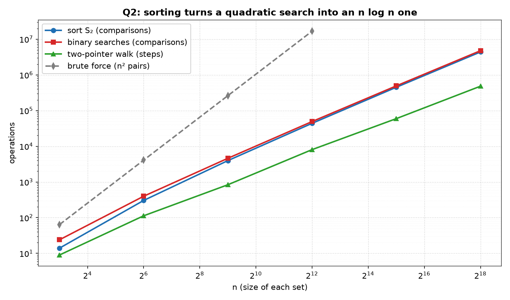
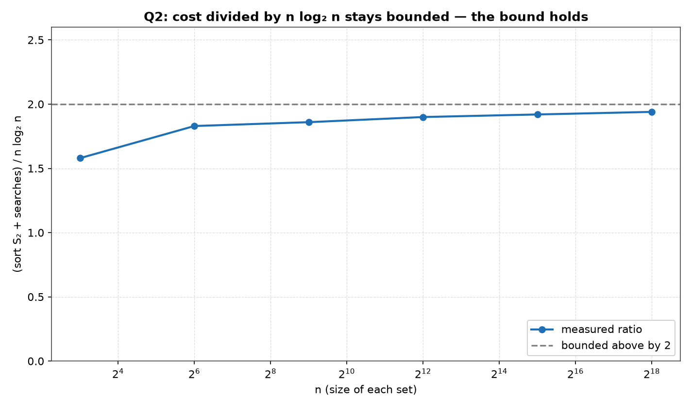

# Q2 — A Pair from Two Sets Summing to x

> Given two sets `S1` and `S2` (each of size `n`) and a number `x`, describe an
> `O(n log n)` algorithm for finding whether there exists a pair of elements, one
> from `S1` and one from `S2`, that add up to `x`. Validate the algorithm in C.

| | |
|---|---|
| **Source** | [`q2_pair_sum_two_sets.c`](q2_pair_sum_two_sets.c) |
| **Sample** | [`sample.txt`](sample.txt) |
| **Input** | None — built-in sweep over n |
| **Build** | `gcc -Wall -Wextra q2_pair_sum_two_sets.c -o q2 -lm` |
| **Output** | Printed to the terminal |

---

## Problem Statement

Let `S1` and `S2` be two sets, each of `n` elements, and let `x` be a target
number. Decide whether there is an `a ∈ S1` and a `b ∈ S2` with `a + b = x`.

The required bound is `O(n log n)` — strictly better than examining every pair.
By choosing a proper input representation, write a C program to validate the
algorithm.

---

## The Analysis

### The naive approach — Θ(n²)

Nothing about the problem forbids testing every candidate directly:

```
for each a in S1:
    for each b in S2:
        if a + b == x: return YES
return NO
```

There are exactly `n · n` ordered pairs `(a, b)`, and in the "no" case every one
of them is formed and tested, so the cost is `Θ(n²)` — an unconditional
`Θ(n²)`, not merely `O(n²)`, because no early exit is possible when the answer is
NO. This is the reference implementation `brute()` in the source, and it is the
thing that must be beaten.

The two sets arrive in arbitrary order, and that is the only reason the naive
method is forced to look everywhere: an unordered set gives no way to predict
where a particular value lives. **Sorting is what buys the improvement.** Once a
set is sorted, the position of a value becomes deducible in `log₂ n` probes
instead of `n`, and one `Θ(n log n)` investment is amortised over all `n`
queries.

### Algorithm A — sort S2, then binary search the residual

If `a + b = x` then `b = x − a`. So `a` is half of a solution exactly when the
*residual* `x − a` is present in `S2`. That reduces the problem to `n`
membership queries, and membership in a sorted array is a binary search.

```
sort S2                          O(n log n)
for each a in S1:                n iterations
    if binarySearch(S2, x − a):  O(log n) each
        return YES
return NO
```

The cost separates cleanly into the one-off sort and the query phase:

```
T(n) = O(n log n)  +  n · O(log n)
     = O(n log n)  +  O(n log n)
     = O(n log n)
```

Both halves are `Θ(n log n)`, so neither dominates the other — a point the
measured table confirms directly. Note that `S1` is never sorted; it is only
enumerated, and enumeration order is irrelevant. This is `algoA()`, driven by
`findIdx()`.

### Algorithm B — sort both, then a two-pointer walk

Sorting `S1` as well permits the search phase to drop from `Θ(n log n)` to
`Θ(n)`. Index `i` starts at the **low** end of the sorted `S1` and `j` at the
**high** end of the sorted `S2`:

```
i = 0, j = n − 1
while i < n and j ≥ 0:
    s = s1[i] + s2[j]
    if s == x: return YES
    if s <  x: i++          # sum too small — need a larger a
    else:      j--          # sum too large — need a smaller b
return NO
```

### Why the walk cannot skip a solution

The correctness argument is the whole content of the algorithm, so it is worth
stating explicitly. The loop maintains this invariant:

**Invariant.** No solution uses any of `s1[0..i−1]`, and none uses any of
`s2[j+1..n−1]`.

It holds trivially at the start, when both discarded ranges are empty. Each step
preserves it because each step discards a candidate that *provably cannot be part
of any solution*:

- **Case `s1[i] + s2[j] < x`.** Because `S2` is sorted ascending and `j` is its
  highest live index, `s2[j]` is the **largest** value still available in `S2`.
  So for every live `k ≤ j`, `s1[i] + s2[k] ≤ s1[i] + s2[j] < x`. The element
  `s1[i]` therefore cannot reach `x` with `s2[j]` **or with anything smaller** —
  it is exhausted against the entire remaining set, and `i++` discards it
  soundly.

- **Case `s1[i] + s2[j] > x`.** Symmetrically, `s1[i]` is the **smallest** live
  value in `S1`, so for every live `k ≥ i`, `s1[k] + s2[j] ≥ s1[i] + s2[j] > x`.
  No remaining element of `S1` can pair with `s2[j]`, so `j--` is sound.

In both cases the discarded element was shown to belong to no solution
whatsoever, so the invariant survives and **no solution is ever skipped**. When
the loop exits, one side has been retired entirely; by the invariant every
element retired was innocent, so the answer NO is correct.

### The step bound — at most 2n − 1 steps

Every iteration either returns, or executes exactly one of `i++` / `j--`. Each
of those retires one element from one side, permanently. There are `n + n = 2n`
elements in total, and the loop cannot run once `i` reaches `n` or `j` falls
below `0` — so the final retirement of one side ends it:

```
steps ≤ (n − 1) + (n − 1) + 1 = 2n − 1
```

Hence the total for B:

```
T(n) = O(n log n)   (sort S1)
     + O(n log n)   (sort S2)
     + O(n)         (the walk, ≤ 2n − 1 steps)
     = O(n log n)
```

This `2n − 1` claim is not left as prose: the program **checks it at runtime**
in `measure()`, aborting if the counted `walkOps` for the worst-case run exceeds
`2n − 1`. That is the run the bound is tightest on — no early exit is possible —
so verifying it there is what matters.

### A versus B — where the work actually goes

Both algorithms are `O(n log n)`, but the balance between their phases differs.
In **B** the sort genuinely dominates: the two sorts together outweigh the `Θ(n)`
walk by 3.3× at `n = 8`, rising to 18.2× at `n = 262144`. In **A** it does not —
A's query phase is also `Θ(n log n)`, and on these counts it is the *larger* of
the two halves at every measured size, exceeding `sort S2` by 71% at `n = 8` and
by 8.5% at `n = 262144` as the ratio converges towards parity. B does strictly
less post-sort work, but pays for a second sort to get it. Which effect wins is
an empirical question, and the table answers it with real numbers rather than a
guess. Adding the printed columns at `n = 262144`:

```
A = sort S2 + searches      = 4386572 + 4760715            = 9147287
B = sort S1 + sort S2 + walk = 4387258 + 4386572 + 482166   = 9255996
```

The walk really is dramatically cheaper than the searches — `482166` steps
against `4760715` comparisons, a factor of about 9.9, saving `4278549`
operations. But the second sort costs `4387258`, which is *more* than the
saving. B therefore ends up **1.2% more expensive than A** at the largest size,
`108709` operations worse, and that deficit is exactly the second sort minus the
walk's saving (`4387258 − 4278549 = 108709`). The two sort columns are within
`686` of each other at that size, confirming that a second sort of the same `n`
costs essentially the same as the first — which is precisely why B cannot come
out ahead. Asymptotically the two are the same `Θ(n log n)`; on these counts A is
narrowly cheaper, and B's advantage is confined to the phase after sorting.

### Why two distinct sets remove the "same element twice" subtlety

The classic single-array two-sum has an awkward corner: searching one array for
`x − a` can return the index of `a` itself. If `x = 2a` and `a` occurs only once,
that index collision reports a spurious solution, since a valid answer needs two
*different* positions. Guarding it needs an explicit `i ≠ j` test, a scan for a
second occurrence, or a search restricted to the positions lying after the one
already used.

Here that cannot arise. `a` is drawn from `S1` and `b` from `S2` — two separate
containers — so an index returned by the search into `S2` is never the index of
the `S1` element that generated the query. The two indices live in different
arrays and cannot collide by construction. Even `a == b` in **value** is a
perfectly legal answer: `a` and `b` are then two distinct elements that happen to
be equal, one from each set. The same holds for the walk, where `i` indexes `S1`
and `j` indexes `S2` and the two never refer to one object. No guard is needed in
either algorithm.

Q3 of the same lab is the single-array form of this corner, at general `k`. There
all `k` elements come from one set `S`, so a whole-array search really can return
a position already chosen, and the fix is to confine each search to the suffix
lying strictly after the last index used — the third of the three guards listed
above. The two accounts describe the same requirement — the chosen *positions*
must be distinct, not the values — met there by restricting the searched range
and here by the input representation itself. Structurally Q3's algorithm is
Algorithm A generalised from a pair to `k`: one sort, then a binary search for
the residual once the other `k−1` elements are fixed. If you read only one of the
two, read them together.

### The validation strategy

Counts are meaningless unless the algorithms are correct, so `check()` gates
every reported number behind four independent agreements, and a single failure
calls `exit(1)`:

1. **A agrees with B** — `ra != rb` aborts. Two structurally different
   algorithms, one binary-searching and one walking.
2. **Both agree with the answer known by construction** — each call passes the
   `expect` it was designed to produce.
3. **Both agree with brute force** — `brute()` over all `n²` pairs runs whenever
   `n ≤ BFMAX` (4096). Beyond that `n²` is unaffordable and the table prints
   `-` in the `brute n^2` column rather than pretending.
4. **Any reported pair is re-verified** — `a + b != x || c + d != x` aborts, so a
   returned pair is re-added and must actually come to `x`. A right answer for
   the wrong reason is caught.

Four cases are run at each size: the guaranteed "no", a real pair
`s1[n/3] + s2[2n/3]`, and the two boundary cases `s1s[0] + s2s[0]` and
`s1s[n-1] + s2s[n-1]`. The last two are the extremes of the walk — the minimum
possible sum forces `j` down the whole of `S2`, and the maximum forces `i` up the
whole of `S1` — and each is the unique pair achieving that sum. Together with the
runtime `≤ 2n − 1` assertion, this exercises both ends of B's index range.

### The guaranteed-no construction, and why it is the worst case

`fill()` builds element `i` from the block `[off + 8i, off + 8i + 6]` as
`off + 8i + 2·(rand() % 4)`, then Fisher–Yates shuffles. Three properties
follow. Blocks are disjoint, so **no two elements collide** and the arrays are
genuine sets. The shuffle leaves the input in pseudo-random order, so the sort
faces **real work** rather than an already-sorted array. And with `off` of `0`
and `4` and a step of `8`, every generated value is **even**.

The measured target is `s1[0] + s2[0] + 1` — the sum of two even numbers plus
one, hence **odd**. Since `even + even = even` for every pair, no pair can
possibly sum to an odd `x`. The answer is NO by parity, with no dependence on
which values were drawn.

This is deliberately the **worst case**, which is why the counters are taken
around it:

- Nothing is found, so `algoA` never returns early: all `n` binary searches run,
  and each runs to **full depth** because a failing search only terminates when
  `lo > hi`, i.e. after the interval is reduced to nothing.
- The walk never hits `sum == x`, so it takes **no early exit** and runs until a
  side is exhausted — the longest walk the input admits.

`searchOps` and `walkOps` are zeroed immediately before this call and captured
immediately after, so the printed columns are worst-case figures, not averages
diluted by lucky early hits. Since `rand()` is never seeded with `srand()`, the
sequence is fixed and the whole table is reproducible run to run.

---

## Sample Output

```
=====================================================
 A PAIR FROM S1 AND S2 SUMMING TO x : O(n log n)
=====================================================
---------------------------------------------------------------------------
       n    sort S1    sort S2 search cmps walk steps    brute n^2   A/nlgn
---------------------------------------------------------------------------
       8         16         14          24          9           64     1.58
      64        305        304         399        113         4096     1.83
     512       3988       3969        4608        837       262144     1.86
    4096      43952      43987       49282       8062     16777216     1.90
   32768     449984     450056      491520      59494            -     1.92
  262144    4387258    4386572     4760715     482166            -     1.94

The A/nlgn column - sort S2 plus the searches - stays inside
1.5-2.0 while n grows 32768x, so A is Theta(n log n), the bound
asked for, and its two halves cost about the same.  B buys a second
sort for a walk of 2n - 1 steps; brute force's n^2 dwarfs them all.
```

### Reading the output

**The `A/nlgn` column climbs — 1.58, 1.83, 1.86, 1.90, 1.92, 1.94 — it is not
flat, and that is still exactly what `Θ(n log n)` predicts.** Across a 32768×
range of `n` the ratio rises by a factor of only 1.23, and it is visibly
converging on a ceiling of 2 from below rather than running away. The reason is a
lower-order linear term: a good comparison sort costs about `n log₂ n − n`
comparisons, not `n log₂ n` exactly, so the sort's share is `1 − 1/log₂ n` and
the total is

```
A / (n log₂ n)  ≈  2 − 1/log₂ n   →  2
```

Evaluating `2 − 1/log₂ n` gives 1.67, 1.83, 1.89, 1.92, 1.93, 1.94 against the
measured 1.58, 1.83, 1.86, 1.90, 1.92, 1.94 — indistinguishable at the top end
and loose only at `n = 8`, where the `n log₂ n − n` estimate predicts 16
comparisons for the sort but `qsort` used only 14, so the asymptotic model has no
force at that size. A ratio approaching a finite constant is the signature of
the bound. Were the cost secretly `Θ(n²)`, this column would grow like
`n / log₂ n`, a factor of about 5461 over the same range instead of 1.23.

**`search cmps` divided by `n` reproduces `log₂ n` to within 4%.** The measured
quotients are 3.00, 6.23, 9.00, 12.03, 15.00, 18.16 against a `log₂ n` of 3, 6,
9, 12, 15, 18 — and at `n = 8`, `512` and `32768` the agreement is exact
(`24 = 8 × 3`, `4608 = 512 × 9`, `491520 = 32768 × 15`). The loosest size is
`n = 64`, where 6.23 runs 3.9% above 6. The deviation is never negative: with `n`
a power of two a failing search costs either `log₂ n` or `log₂ n + 1` probes
depending on where the residual falls, so the quotient is pinned into
`[log₂ n, log₂ n + 1]`. At the three exact sizes every residual happened to land
in the shallower region; at the other three a minority needed the extra probe
(at `n = 262144`, 42123 of the 262144 searches went 19 deep rather than 18).
This is the query phase measured in isolation, and it confirms the
`n · O(log n)` factorisation directly: `n` searches, each `Θ(log n)` probes deep,
because every search fails and so runs to the bottom.

**`walk steps` sits below `2n − 1` at every size, and the program checks it
rather than trusting it.** The pairs are 9 against 15, 113 against 127, 837
against 1023, 8062 against 8191, 59494 against 65535, and 482166 against 524287.
The slack is not monotone — the step count runs at 60%, 89%, 82%, 98%, 91% and
92% of the limit, fluctuating with where the shuffled values happen to fall — but
it never once exceeds it, and `measure()` aborts the run if it does. The column
also grows linearly — `walk steps / n` stays between 1.1 and 2.0 — while
`search cmps` grows like `n log n`: at `n = 262144` the walk is about 9.9×
cheaper, which is B's genuine post-sort advantage.

**The two sort columns are near-identical from `n = 64` up, which is what makes
B's trade a losing one.** They read 305 against 304, 3988 against 3969, 43952
against 43987, 449984 against 450056 and 4387258 against 4386572 — the widest of
those five gaps is under 0.5%, and at the largest size it is 686 in 4.4 million.
Only `n = 8` is loose, at 16 against 14: a difference of 2, which is 14% of the
smaller count, because at eight elements the exact comparison count turns on the
particular permutation and the asymptotics have no force — the same row the
`A/nlgn` estimate above misses, and for the same reason. From `n = 64` on,
sorting the second set costs essentially the same as sorting the first, so B pays
4387258 to save 4278549 on the walk and comes out 108709 behind. The `A/nlgn`
column tracks only `sort S2 + searches`, so B's total must be read by summing the
printed columns; done that way, A is narrowly the cheaper of the two here.

**The `brute n^2` column shows what sorting actually bought, and the `-` marks
where the check was skipped rather than faked.** At `n = 4096` — the largest size
brute force still runs, since `BFMAX` is 4096 — it costs 16777216 pair tests
against A's 93269 operations, a factor of 180. At the two larger sizes it prints
`-`: `262144²` is over 68 billion, so the exhaustive cross-check is genuinely
unaffordable and is honestly omitted. Every number in the four count columns —
`sort S1`, `sort S2`, `search cmps` and `walk steps` — and the `A/nlgn` ratio
derived from two of them was nevertheless printed only because A and B agreed
with each other, agreed with the parity-guaranteed answer, agreed with brute
force wherever it ran, and had each reported pair re-added to `x`.

---

## Figures

Both figures are generated by [`../make_plots.py`](../make_plots.py), which
compiles this program, runs it, and plots the table it prints — so the curves are
the measured counts, not a redrawing of the asymptotics.

### Where the work goes



Four series on a log-log axis. The three costs that this solution actually pays —
sorting `S₂`, the binary searches, and the two-pointer walk — climb on a slope
barely above 1, the signature of `n log n`. Brute force is the grey dashed line on
a visibly steeper slope, and it stops at `n = 4096`: beyond that the `n²` pair
count is no longer affordable to run, which is itself the argument. At that last
shared size brute force is already examining 16 777 216 pairs against roughly
93 000 comparisons for sort-plus-search.

The walk is the cheapest series by a wide margin — 482 166 steps at `n = 262144`,
against 4 760 715 search comparisons. That gap is not an asymptotic difference;
both are `O(n log n)` overall once the sorts are counted. It is that the walk does
one pass with a constant per-step cost, whereas the searches pay a `log n` factor
per element.

### The bound



`(sort S₂ + searches) / n log₂ n`, the same quantity the program's `A/nlgn`
column reports. It rises — 1.58, 1.83, 1.86, 1.90, 1.92, 1.94 — but the
increments shrink at every step and the curve stays under 2 while `n` grows from
8 to 262 144, a factor of 2¹⁵. **A rising ratio is not a contradiction of the
bound**: `O(n log n)` constrains the ratio to stay bounded, not to stay flat, and a
ratio converging to a constant near 2 is exactly what the bound asserts. Had the
true cost been quadratic, this curve would grow like `n / log n` and leave the
frame.

---

## Files

| File | Description |
|------|-------------|
| [`q2_pair_sum_two_sets.c`](q2_pair_sum_two_sets.c) | Solution source |
| [`sample.txt`](sample.txt) | Sample build/run output |
| [`plots/1_growth.png`](plots/1_growth.png) | Sort, search and walk against the `n²` baseline |
| [`plots/2_ratio.png`](plots/2_ratio.png) | The `n log₂ n` ratio, bounded below 2 |
