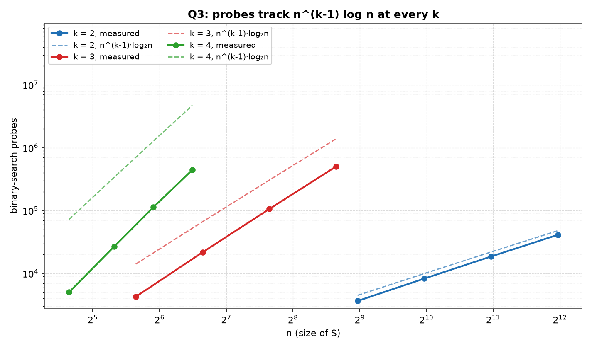
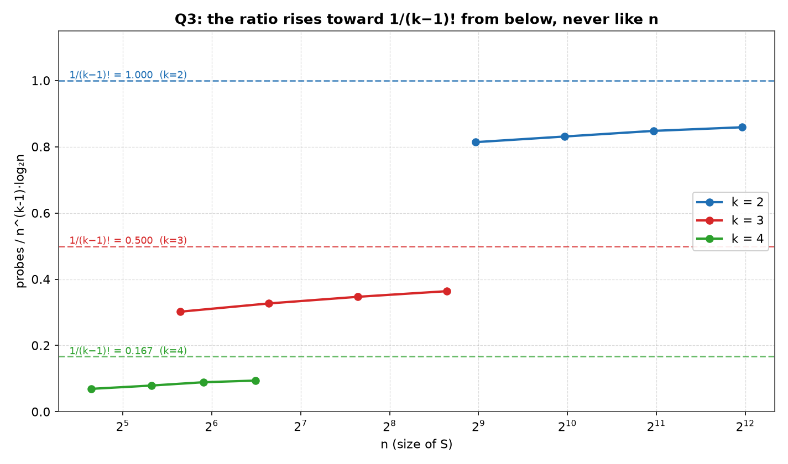
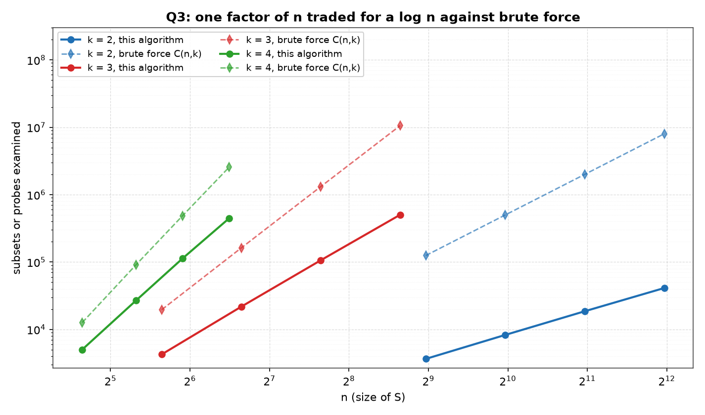

# Q3 — Do k of n Integers Sum to T?

> Given a set `S` of `n` integers and an integer `T`, test whether `k` of the
> integers in `S` add up to `T`, in `O(n^(k−1) log n)` time. Choose a proper
> input representation and write a C program to validate the algorithm.

| | |
|---|---|
| **Source** | [`q3_k_sum_subset.c`](q3_k_sum_subset.c) |
| **Sample** | [`sample.txt`](sample.txt) |
| **Input** | None — built-in sweep over n |
| **Build** | `gcc -Wall -Wextra q3_k_sum_subset.c -o q3 -lm` |
| **Output** | Printed to the terminal |

---

## Problem Statement

Given a set `S` of `n` integers and an integer `T`, give an `O(n^(k−1) log n)`
algorithm to test whether `k` of the integers in `S` add up to `T`. By choosing
the proper input representation, write a program in C to validate the algorithm.

The `k` integers must be `k` *different* members of `S` — one element may not be
counted twice to reach the target. The required bound is `O(n^(k−1) log n)`, and
`k` is treated as a fixed constant of the problem, not as part of the input size.

---

## The Analysis

### The naive baseline — Θ(nᵏ)

The definition itself suggests an algorithm: examine every `k`-element subset of
`S` and add it up. There are

```
C(n, k) = n(n−1)(n−2)···(n−k+1) / k!  =  Θ(nᵏ)
```

such subsets, and each takes `Θ(k) = Θ(1)` work to sum, so the total is
`Θ(nᵏ)`. The target bound `O(n^(k−1) log n)` is smaller by a factor of
`n / log n`. So the whole problem is a single trade: **give up one full factor
of `n` and pay a `log n` for it.**

The insight is that the last element of the subset never needs to be *guessed*.
Once `k−1` of the `k` elements are fixed, the `k`-th one is completely
determined — it must equal the residual `T − (the k−1 chosen values)`. Asking
whether a specific value is present in a set is a *lookup*, not a search over
possibilities, and on sorted data a lookup costs `log n`, not `n`.

### The algorithm — sort once, then enumerate k−1 and search for the k-th

The proper input representation is a **sorted array**. Sorting is what turns
"is this value in `S`?" from a linear scan into a binary search, and it is paid
for exactly once:

```
kSum(S, n, k, T):
    sort S                                              # once, O(n log n)
    for every strictly increasing tuple i₁ < i₂ < ... < i_{k−1}:
        residual = T − (s[i₁] + s[i₂] + ... + s[i_{k−1}])
        j = binarySearch(s, i_{k−1}+1, n−1, residual)    # the SUFFIX only
        if j ≥ 0:
            return YES with indices (i₁, ..., i_{k−1}, j)
    return NO
```

Two details carry all the weight, and each gets its own subsection below: the
tuples are **strictly increasing**, and the binary search is confined to the
**suffix** `s[i_{k−1}+1 .. n−1]` rather than the whole array. In the source these
appear as the loop bound `for (int i = start; i <= n - k + depth; i++)` with the
recursive call passing `i + 1` as the next `start`, and as the search call
`bsearchRange(a, start, n - 1, T - sum)`. The recursion in `search()` is only
`k−1` levels deep, never `k`: at `depth == k − 1` it stops looping and searches
instead.

### Completeness — no subset is missed, and none is examined twice

Take any `k`-element subset of `S` that sums to `T`. Because `S` is sorted and
its elements sit at known positions, that subset has **exactly one**
representation as a strictly increasing index tuple

```
j₁ < j₂ < ... < j_{k−1} < j_k
```

Now: the enumeration walks over *every* strictly increasing `(k−1)`-tuple, so in
particular it will at some point enumerate `(j₁, ..., j_{k−1})`. At that moment
the residual computed is precisely `s[j_k]`, and the range searched is
`s[j_{k−1}+1 .. n−1]`. Since `j_k > j_{k−1}`, index `j_k` lies inside that
range, so the binary search finds it (or finds another index holding the same
value, which is an equally valid witness). Hence the subset is reported.

The converse direction is what rules out double work. Each subset is reachable
by only that one tuple — the tuple must be the first `k−1` of its sorted
indices, since any other `(k−1)`-subset of `{j₁..j_k}` would leave a residual
whose index does not lie strictly after the last chosen one. So the mapping
between `k`-subsets and (tuple, search hit) pairs is one-to-one:

```
every k-subset  →  exactly one increasing (k−1)-tuple + one suffix position
```

Nothing is skipped, and nothing is enumerated twice. That is exactly why the
factor `1/(k−1)!` shows up in the count below rather than a redundant `(k−1)!`
of repeated work.

This argument is testable rather than merely plausible. The program's counter is
incremented once per `(k−1)`-tuple, at the point where the recursion bottoms out
into a search, so the count it reports is a direct measurement of the
combinatorial claim: the tuples column should read exactly `C(n−1, k−1)`, with
no slack in either direction. A count above it would mean some tuple was
enumerated twice; a count below it would mean some tuple was skipped.

### Distinctness — why the search must be over the suffix, not the array

This is the subtle part of the problem, and it is where a plausible-looking
implementation goes silently wrong.

Suppose the binary search ran over the **whole** array `s[0 .. n−1]` instead of
the suffix. It would still find the residual whenever the residual is present —
completeness would survive. But it could return an index that is **already in
the enumerated tuple**. Concretely, with `k = 2`, `S = {..., 7, ...}` and
`T = 14`: enumerate `i₁` at the position of `7`, residual `= 14 − 7 = 7`, and a
whole-array search happily returns that very same position. The program would
report "yes, two elements of `S` sum to 14" on the strength of counting the
single element `7` twice. The question asks for `k` of the integers in `S`,
which forbids this.

Restricting the search to `s[i_{k−1}+1 .. n−1]` fixes it structurally rather
than by a test after the fact:

```
chosen positions:  i₁ < i₂ < ... < i_{k−1}        all ≤ i_{k−1}
searched range:    i_{k−1}+1 ... n−1              all >  i_{k−1}
                   ────────────────────────────────────────────
                   the two sets are disjoint by construction
```

Every already-used position is `≤ i_{k−1}`; every candidate position is
`> i_{k−1}`. So the returned index cannot be one of the `k−1` already committed,
and the `k` indices are distinct automatically. The same restriction that
guarantees distinctness is the one that guarantees each subset is counted once —
one design decision, both properties.

Note that this forbids *reusing a position*, not *duplicate values*: if `S` has
two separate elements both equal to `7`, they occupy two positions and the pair
is legitimately reported. The `fuzz()` routine deliberately generates arrays
with repeated values to exercise this distinction.

Q2 of the same lab is the `k = 2` case with the two elements drawn from two
different sets, and there the collision cannot arise at all: one index belongs to
`S1` and the other to `S2`, so no search can return a position already used and
no suffix restriction is needed. The single-array form here is what forces the
restriction — the same corner, removed by the input representation there and by
the searched range here, in both cases making the *positions* distinct rather
than the values.

### The cost — O(n^(k−1) log n)

Counting the increasing `(k−1)`-tuples whose last index leaves at least one
position of suffix behind it:

```
number of tuples  =  C(n−1, k−1)
                  =  (n−1)(n−2)···(n−k+1) / (k−1)!
                  ≈  n^(k−1) / (k−1)!
                  =  O(n^(k−1))
```

Each tuple costs one binary search over a range of length at most `n`, so
`O(log n)`, plus `O(1)` arithmetic for the residual. Adding the one-off sort:

```
T(n) = O(n log n)          sort, once
     + C(n−1, k−1) · O(log n)   enumerate + search
     = O(n log n) + O(n^(k−1) log n)
     = O(n^(k−1) log n)     for k ≥ 2
```

For `k ≥ 3` the term `n^(k−1) log n` strictly dominates `n log n`; at `k = 2` the
two are exactly equal, so the sort is absorbed into the same bound rather than
exceeding it. Either way the required bound is met. Space is `O(n)` for the array
plus `O(k)` for the recursion and the witness indices.

### Reading the ratio column honestly

The `ratio` column is `probes / (n^(k−1) · log₂ n)`. It does **not** sit flat.
Within each fixed `k` it **climbs slowly**, and it climbs toward that `k`'s own
limit `1/(k−1)!` — a different ceiling for each block, and equal to 1 only for
`k = 2`:

```
k = 2:  0.814 → 0.831 → 0.848 → 0.859      limit 1/1! = 1.0
k = 3:  0.302 → 0.327 → 0.347 → 0.364      limit 1/2! = 0.5
k = 4:  0.069 → 0.079 → 0.089 → 0.094      limit 1/3! = 0.167
```

Two effects explain both the level and the climb.

The **`1/(k−1)!` factor** is the level. The denominator uses the raw power
`n^(k−1)`, which counts *all* `(k−1)`-tuples including every reordering. The
algorithm enumerates only the *increasing* ones, and there are
`C(n−1, k−1) ≈ n^(k−1)/(k−1)!` of those. So the ratio is scaled down by
`1/(k−1)!` — dividing by 1 at `k = 2`, by 2 at `k = 3`, by 6 at `k = 4`, which
is precisely the ordering of the three blocks in the table.

The **shorter suffixes** explain why each block sits below its limit and rises
toward it. The denominator charges `log₂ n` per tuple, but the actual search
range is the suffix `s[i_{k−1}+1 .. n−1]`, whose length averages well under `n`;
a search over a range of length `m` costs about `log₂ m < log₂ n`. Two further
finite-`n` effects push the same way: `C(n−1, k−1)` is smaller than
`n^(k−1)/(k−1)!` by lower-order terms that matter most at small `n`, and the
`log₂ n` per tuple is only reached asymptotically. All of these shortfalls
shrink as `n` grows, so the ratio rises toward its constant *from below*.

What matters for the bound is the shape, not the value:

```
ratio bounded above, and away from 0   ⟺   probes = Θ(n^(k−1) log n)
ratio itself growing like n            ⟹   the bound is refuted
```

A ratio creeping from 0.069 to 0.094 while `n` more than triples from 25 to 90
is a bounded ratio, not a growing one — if the true cost were `n^k log n` the
`k = 4` column would have risen by roughly the same factor as `n`, from 0.069
to something near 0.25, and it plainly does not. The bound is confirmed; the
column is honestly a climbing one, and it climbs to a ceiling.

### Validation strategy

The program never trusts its own answer. Four independent checks run, and any
failure calls `exit(1)` rather than printing a table:

**Brute-force differential.** `brute()` recurses a full `k` levels deep over all
`C(n, k)` subsets — the `Θ(nᵏ)` reference algorithm — and its verdict must match
`search()`'s on every instance. Its subset count is printed as the `C(n,k) bf`
column, so the naive cost being avoided is visible alongside the cost paid.

**Witness re-verification.** A returned "yes" is not accepted on the function's
word. `check()` walks the `k` returned indices, aborts if any is not strictly
greater than its predecessor (so the distinctness argument above is enforced on
the actual output, not just reasoned about), and re-adds the `k` values to
confirm they really total `T`.

**A guaranteed-unreachable target, by divisibility.** `fill()` builds every
element as a multiple of 10, so *any* `k` of them sum to `0 mod 10`, whereas
`T + 5 ≡ 5 mod 10`. No `k`-subset can reach it — this is a proof about the
instance, not a hopeful guess that no solution exists. It is also the worst case:
nothing is found, so neither enumeration can exit early and both run to
completion. That is why the table's counters are measured on this target.

**A randomised differential fuzz — and why it is the check that matters.** 3000
random draws, `n` from 2 to 13 and `k` from 2 to 4, with values in
`[−10, 10]` so that **duplicates and negatives both occur**. Draws with `k > n`
are skipped, leaving 2764 instances actually tested on this run; each is tested
against *every* target `T` from −30 to 30 and cross-checked against brute force.
This is necessary because the two crafted targets in `measure()` are structurally
blind to an enumeration off-by-one: the reachable target is built from elements at
interior positions `(i+1)n/(k+1)`, so it would still be found by a search that
skipped the first or last index, and the unreachable target stays unreachable
even for an *incomplete* search — a truncated enumeration returns the same "no"
for the wrong reason. Only sweeping every target over small instances, where
brute force can enumerate the ground truth exhaustively, actually pins
completeness down. The fuzz runs after the measurement sweep so the table's
`rand()` stream is untouched by it.

---

## Sample Output

```
=====================================================
 k OF n INTEGERS SUMMING TO T : SORT ONCE, THEN SEARCH
=====================================================
------------------------------------------------------------------------------
   k      n       probes       tuples    n^(k-1)lg n    ratio     C(n,k) bf
------------------------------------------------------------------------------
   2    500         3650          499           4483    0.814        124750
   2   1000         8281          999           9966    0.831        499500
   2   2000        18599         1999          21932    0.848       1999000
   2   4000        41119         3999          47863    0.859       7998000
   3     50         4260         1176          14110    0.302         19600
   3    100        21719         4851          66439    0.327        161700
   3    200       106032        19701         305754    0.347       1313400
   3    400       503098        79401        1383017    0.364      10586800
   4     25         5023         2024          72560    0.069         12650
   4     40        26950         9139         340603    0.079         91390
   4     60       113243        32509        1275888    0.089        487635
   4     90       445363       113564        4732561    0.094       2555190

For each fixed k the ratio holds one constant scale as n grows, rising
towards 1/(k-1)! from below - only increasing tuples are enumerated and the
suffixes are shorter than n - never trending like n, so the probes are
Theta(n^(k-1) log n).  Against the naive C(n,k) column one factor of n is
traded for a log n: the k-th element is found by search, not a loop.
```

### Reading the output

**The tuples column is exactly `C(n−1, k−1)`, at every row.** `499` for
`k = 2, n = 500`; `1176` for `k = 3, n = 50`; `2024` for `k = 4, n = 25`; and
`113564 = C(89, 3)` at the largest `k = 4` size. These are exact equalities, not
close fits. Since the counter ticks once per enumerated `(k−1)`-tuple, this is
direct evidence that the enumeration visits each increasing tuple once and skips
none — the completeness and no-double-counting claims, measured.

**The ratio column climbs within each `k`, and climbs toward `1/(k−1)!` from
below.** `k = 2` runs `0.814 → 0.859` under a ceiling of `1.0`; `k = 3` runs
`0.302 → 0.364` under `0.5`; `k = 4` runs `0.069 → 0.094` under `0.167`. Each
block therefore rises toward its own `1/(k−1)!` limit rather than toward one
universal constant, for the reasons derived above, and a ratio that stays
bounded rather than constant is exactly what `Θ(n^(k−1) log n)` asserts.

**Probes per tuple stay logarithmic, which is where the `log n` in the bound is
visible.** At `k = 2, n = 4000` the row reads 41119 probes for 3999 tuples,
about 10.3 probes each, against `log₂ 4000 ≈ 11.97` — a little under, exactly as
the suffix argument predicts. At `k = 4, n = 90`, 445363 probes over 113564
tuples is about 3.9 each against `log₂ 90 ≈ 6.49`; the shortfall is larger here
because with three indices already committed the remaining suffix is typically a
small tail of the array. In both cases the per-tuple cost is a logarithm of a
range length, never a linear scan.

**The `C(n,k) bf` column shows the factor of `n` that was traded away.** At
`k = 2, n = 4000` brute force examines 7998000 subsets where the algorithm makes
41119 probes — a factor of about 195. That is `n / log₂ n ≈ 334` scaled by the
`1/k!` sitting in `C(n,k)` (a factor of 2 here) and divided back by the sub-1
ratio: `334 × 0.5 / 0.859 ≈ 195`. At `k = 3, n = 400` it is 10586800 against
503098, a factor of about 21, and at `k = 4, n = 90` it is 2555190 against
445363, about 5.7. The gap widens with `n` at fixed `k` — 34 → 60 → 107 → 195
across the `k = 2` block — which is what "one factor of `n` for a `log n`"
looks like in measured counts.

**Every row printed is a row that passed all four checks.** The table is emitted
only after all twelve `(k, n)` pairs agreed with brute force on both the
reachable and the divisibility-unreachable target, every witness re-verified as
strictly increasing and summing to `T`, and the 2764 fuzz instances drawn (of
3000 attempts, the rest skipped for `k > n`) swept across all 61 targets each
matched brute force. Any single disagreement would have exited before printing,
so the counts are not merely measurements — they are measurements taken from runs
already known to be correct.

---

## Figures

All three figures are generated by [`../make_plots.py`](../make_plots.py), which
compiles this program, runs it, and plots the twelve rows it prints.

### Probes against the predicted shape



One solid series per `k` (measured probes) with its `n^(k−1)·log₂n` prediction
dashed in the same colour. Each solid line runs *parallel* to its own dashed
partner and below it — the slopes match while the constants do not, which is
precisely what `Θ(n^(k−1) log n)` claims. The three families also sit at visibly
different slopes: `k = 2` is shallowest, `k = 4` steepest. Note the `x`-ranges
differ deliberately: `k = 4` is measured only to `n = 90` because its cost grows
as `n³ log n`, so 90 already costs 445 363 probes.

### The ratio, read honestly



Probes divided by `n^(k−1)·log₂n`. Every series **rises** with `n` — and that is
consistent with the bound rather than evidence against it. The dashed horizontal
lines mark `1/(k−1)!`: 1.000, 0.500, 0.167. Each family approaches its own line
from below and never crosses it, because only *increasing* tuples are enumerated:
`C(n−1, k−1) ≈ n^(k−1)/(k−1)!`, and the searched suffixes are shorter than `n`.

So the right question is not "is the ratio flat" but "does it head for a
constant." At `k = 3` it moves 0.302 → 0.327 → 0.347 → 0.364 against a limit of
0.5, in shrinking steps. A cost secretly one factor of `n` larger would send these
curves off the top of the frame instead.

### What the log n buys



Measured probes against the `C(n, k)` subsets brute force examines, per `k`. The
dashed brute-force line is steeper than its solid partner in every colour — one
factor of `n` traded for a `log n`, which is the whole design. At `k = 4, n = 90`
that is 445 363 probes against 2 555 190 subsets; at `k = 2, n = 4000`, 41 119
against 7 998 000. The gap widens with `n` at fixed `k`, as a difference in
exponent must.

---

## Files

| File | Description |
|------|-------------|
| [`q3_k_sum_subset.c`](q3_k_sum_subset.c) | Solution source |
| [`sample.txt`](sample.txt) | Sample build/run output |
| [`plots/1_probes.png`](plots/1_probes.png) | Measured probes against `n^(k−1)·log₂n`, per `k` |
| [`plots/2_ratio.png`](plots/2_ratio.png) | The ratio approaching `1/(k−1)!` from below |
| [`plots/3_saving.png`](plots/3_saving.png) | Probes against brute force's `C(n, k)` |
