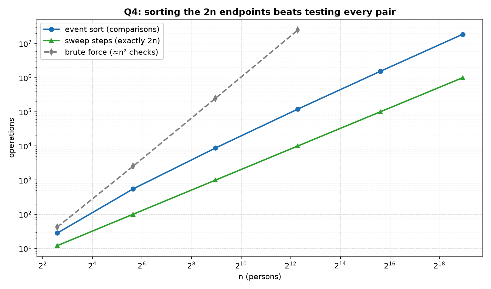
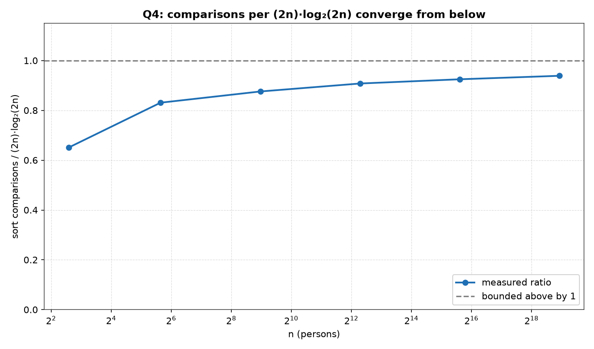
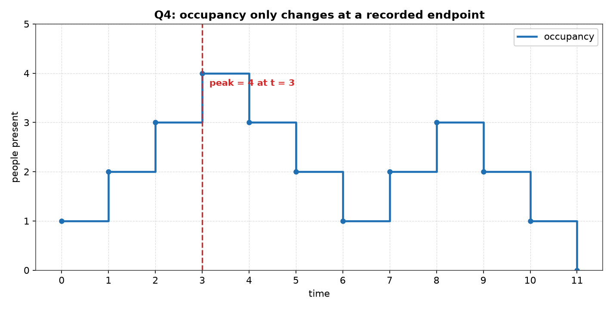

# Q4 — Peak Simultaneous Attendance at the Party

> A camera at the door records the entry time `a_i` and exit time `b_i` (with
> `b_i > a_i`) of each of the `n` guests `p_i`. In `O(n log n)`, find the time at
> which the most people were simultaneously present. All `2n` times are distinct.

| | |
|---|---|
| **Source** | [`q4_party_peak_occupancy.c`](q4_party_peak_occupancy.c) |
| **Sample** | [`sample.txt`](sample.txt) |
| **Input** | None — built-in sweep over n |
| **Build** | `gcc -Wall -Wextra q4_party_peak_occupancy.c -o q4 -lm` |
| **Output** | Printed to the terminal |

---

## Problem Statement

A camera at the door tracks the entry time `a_i` and the exit time `b_i`
(assume `b_i > a_i`) for each of the `n` persons `p_i` attending a party. Give
an **O(n log n)** algorithm that analyses this data to determine the time when
the most people were simultaneously present at the party. Assume that all entry
and exit times are distinct (no ties). By choosing the proper input
representation, write a program in C to validate the algorithm.

The required bound is `O(n log n)` time. Note that the question asks for a
*time*, not merely a count — the algorithm must report a witness instant, not
just the peak size.

---

## The Analysis

### The observation the whole solution rests on: only 2n instants matter

The question reads as if it were about a continuum. Time is dense; between any
two instants there are infinitely many more, and "the time when the most people
were present" appears to range over all of them. It does not, and seeing why is
the entire problem.

Let `f(t)` be the number of guests present at time `t`, that is the number of
indices `i` with `a_i ≤ t < b_i`. Take any two consecutive recorded endpoints
`t_k < t_{k+1}` from the sorted list of all `2n` times. On the whole open
stretch between them, **no guest arrives and no guest leaves** — if one had,
that arrival or departure would itself be a recorded endpoint lying strictly
between `t_k` and `t_{k+1}`, contradicting the fact that they are consecutive.
So every membership test `a_i ≤ t < b_i` returns the same verdict throughout
`[t_k, t_{k+1})`, and therefore:

```
f is constant on [t_k, t_{k+1})  for every consecutive pair of endpoints
```

`f` is a step function whose only breakpoints are the `2n` recorded times. Its
maximum over the continuum is therefore attained at one of those `2n` instants,
and examining them is not an approximation of the continuous question — it is
the continuous question, answered exactly. This collapses an uncountable search
space to `2n` candidates, which is what makes an `O(n log n)` bound even
conceivable. Everything below is bookkeeping on top of this one fact.

### The algorithm: 2n signed events, one sort, one sweep

Discard the pairing between an arrival and its matching departure — the count
`f(t)` does not care which guest is which, only how many are inside. Each guest
`p_i` is therefore split into two independent **events**:

```
(a_i, +1)     an arrival: occupancy rises by one at a_i
(b_i, −1)     a departure: occupancy falls by one at b_i
```

That is `2n` events. Sort them by time, then walk them left to right carrying a
running total `cur`, and record the largest value `cur` ever reaches together
with the time at which it happened:

```
ALGORITHM PeakOccupancy(a[1..n], b[1..n]):
    E ← { (a_i, +1) : i } ∪ { (b_i, −1) : i }      # 2n events      O(n)
    sort E by time                                                  O(n log n)
    cur ← 0; best ← 0; bestT ← 0
    for each event (t, d) in E in sorted order:                     O(n)
        cur ← cur + d                       # cur = f(t) after this event
        if cur > best:  best ← cur;  bestT ← t
    return (best, bestT)
```

The invariant is that after consuming every event with time `≤ t`, `cur` equals
`f(t)` exactly: each guest present at `t` has contributed its `+1` (since
`a_i ≤ t`) and not yet its `−1` (since `t < b_i`), and each guest not present
has contributed either nothing or a cancelling `+1, −1` pair. So the running
maximum over the `2n` steps is the maximum of `f` over its `2n` breakpoints,
which by the previous subsection is the global maximum.

```
T(n) = O(n)          building the 2n events
     + O(n log n)    sorting 2n keys
     + O(n)          the sweep, one step per event
     = O(n log n)    dominated entirely by the sort
```

The sort is the only super-linear component, so it alone sets the bound. The
lower bound matches for comparison-based approaches, making this `Θ(n log n)`.
In the code this is `peakOccupancy()`: `buildEvents()`, one `qsort()` call, and
a single `for` loop.

### Why no tie-breaking rule is needed here — and what "no ties" buys

The comparator in the source is a single subtraction:

```c
static int cmpEvent(const void *x, const void *y) {
    const Event *p = x, *q = y;
    sortCmps++; return p->t - q->t;
}
```

It orders by time and by nothing else, with no secondary key on the sign `d`.
That is legitimate **precisely because** the lab sheet grants that all `2n`
times are distinct. Distinctness means the time field is already a unique key:
the sorted order is total, no two events compete for a position, and the answer
does not depend on any arbitrary choice. The "no ties" assumption is not
cosmetic tidiness — it is what removes a genuine decision from the problem.

The program does not merely hope its random data honours that assumption; it
enforces it by construction. `makeGuests()` Fisher–Yates shuffles the
permutation `0 … 2n−1`, pairs adjacent entries, and keeps the smaller of each
pair as `a`, so each of the `2n` endpoints is used exactly once and `a_i < b_i`
holds automatically.

**Contrast this with Q6 of the same lab** (`q6_max_overlap_point.c`, the maximum
overlap point of a set of intervals). The two questions are nearly the same
sweep, and they differ at exactly this point. Q6's intervals are **closed**,
`[l_i, r_i]`, and its endpoints **may coincide**: `[10, 40]` and `[40, 90]` both
contain `40`, so the true depth at `40` is `2`. Sorting by coordinate alone
leaves the order of the `−1` closing `40` and the `+1` opening `40` undefined,
and if the `−1` is consumed first the running sum reads `1` at the very
coordinate being reported — an answer that is simply wrong. Q6 therefore *must*
carry the rule "at equal coordinates, every `+1` before every `−1`", and its
comparator has a second key to enforce it. Q4 needs no such rule. If you read
only one of the two, read them together: the tie rule is the whole difference.

### The half-open convention [a_i, b_i)

A guest is counted from their entry time up to but not including their exit
time. The `−1` takes effect *at* `b_i`, so a guest is not among those present at
their own moment of departure:

```
present(i, t)  ⟺  a_i ≤ t < b_i
```

This is the natural reading of "simultaneously present". Someone walking out of
the door at `b_i` is leaving, not attending; counting them at `b_i` would let
two people who never overlapped — one departing exactly as the other arrives —
be reported as simultaneously present. The half-open reading also makes the
sweep's arithmetic honest: at any endpoint `t`, the events applied so far are
exactly the ones whose effect has already begun.

### Why the peak is always attained at an arrival time

`cur` changes only at events, and only ever *increases* at a `+1`. So whenever
`cur` reaches a value strictly larger than anything seen before, the event just
consumed must have been a `+1`, that is an **arrival**. A departure can never
set a new maximum — it lowers the count.

```
cur increases only at +1 events
⟹ every new running maximum is set immediately after some arrival a_i
⟹ the peak is attained at an arrival time, and holds until the next event
```

Two things follow. First, the `bestT` the sweep reports is always some `a_i`.
Second, the brute-force validator need only test the `n` arrival times, not all
`2n` endpoints — which is exactly what it does.

### Validation: an O(n²) recount, and the subtlety about the witness

Every size up to `BFMAX = 5000` is checked against an independent quadratic
reference in `validate()`. `occupancyAt(p, n, t)` scans all `n` guests and
counts those with `a_i ≤ t < b_i`; the reference maximum is obtained by calling
it at each of the `n` arrival times:

```
ref = max over i of occupancyAt(a_i)        n calls × n tests = O(n²)
```

Sizes above `BFMAX` print `-` in the `bfChecks` column rather than a number,
because the quadratic reference would want on the order of `2.5 × 10⁹` and
`2.5 × 10¹¹` containment tests at `n = 50 000` and `n = 500 000`.

The subtlety is that the two halves of the answer must be asserted
**differently**:

```
peak COUNT  — unique, so require ref == best exactly
peak TIME   — need NOT be unique, so requiring bestT == refT would be wrong
```

The maximum value of `f` is a single well-defined number, so the sweep's count
and the brute force's count must agree exactly, and any discrepancy is a bug.
The *time* at which it occurs need not be unique: several disjoint arrival times
can all attain the same peak occupancy, and both methods are then free to return
any of them. Demanding equality of the reported times would be asserting a
property the problem does not have, and the test would fail on correct code
whenever the peak is tied.

So the program asserts the right thing instead. It re-counts occupancy at the
sweep's own reported time and demands that this equal the peak:

```c
int i, c, ref = 0, here = occupancyAt(p, n, when);
for (i = 0; i < n; i++) if ((c = occupancyAt(p, n, p[i].a)) > ref) ref = c;
if (ref != best || here != best) { ... exit(1); }
```

`ref == best` says the sweep found the correct *value*; `here == best` says the
*time* it reported is a legitimate **witness** for that value — an instant at
which that many guests really were present, verified by a method that shares no
code with the sweep. Together these are exactly the specification: the right
peak, and a time that genuinely achieves it. This is the correct assertion
because "is a witness" is the strongest claim that holds for every valid answer,
whereas "is *the* witness" holds only for inputs with a unique peak instant.

### The bfChecks column is measured, not computed

`bfChecks` is a counter incremented inside `occupancyAt()` at the containment
test itself, once per guest examined — not a printed `n²` formula. It therefore
reports real work done, and its value is a check on the validator rather than a
restatement of it. The total comes to

```
n arrival times × n guests  +  1 recount × n guests  =  n² + n
```

and the printed column bears this out exactly: `42 = 36 + 6`,
`2550 = 2500 + 50`, `250500 = 250000 + 500`, `25005000 = 25000000 + 5000`. The
extra `+ n` is the single witness recount, so the column visibly contains the
cost of the witness check described above.

### Reading the ratio column honestly

The last column is `sortCmps / ((2n) · log₂(2n))`, the measured comparison count
against the textbook comparison bound for sorting `m = 2n` keys. It reads

```
0.651 → 0.831 → 0.876 → 0.908 → 0.925 → 0.939
```

This column **climbs**; it is not flat, and calling it flat would be dishonest.
It rises in ever smaller steps — `+0.180`, `+0.045`, `+0.032`, `+0.017`,
`+0.014` — approaching `1` **from below**. The reason is the linear correction
term that any real merge sort carries: glibc's `qsort` performs about
`m log₂ m − c·m` comparisons for a constant `c ≈ 1.23`, so

```
ratio ≈ (m log₂ m − c·m) / (m log₂ m) = 1 − c / log₂ m
```

which increases towards `1` as `m` grows, and does so more and more slowly
because `log₂ m` itself grows slowly. Substituting `c = 1.23` predicts
`0.657, 0.815, 0.877, 0.907, 0.926, 0.938` against the measured
`0.651, 0.831, 0.876, 0.908, 0.925, 0.939` — the four rows from `n = 500`
upwards agree to within `0.001`, while the two smallest rows are the visible
outliers: `n = 50` at `0.831` against a predicted `0.815`, and `n = 6` at
`0.651` against a predicted `0.657`. That is unsurprising at sizes where a
single input permutation is the whole sample.

What `O(n log n)` requires is not a constant ratio but a **bounded** one. The
ratio stays below `1` at every size while rising with diminishing increments, so
the measured cost is bounded above by a constant multiple of `n log n`, and the
matching `Ω(n log n)` comparison lower bound makes the sort — and hence the whole
algorithm — `Θ(n log n)`.

---

## Sample Output

```
$ gcc -Wall -Wextra q4_party_peak_occupancy.c -o q4 -lm
$ ./q4

worked example (n = 6), guests as half-open [a,b) : p1[0,5) p2[1,4) p3[2,9) p4[3,6) p5[7,11) p6[8,10)
  time      0   1   2   3   4   5   6   7   8   9  10  11
  delta     1   1   1   1  -1  -1  -1   1   1  -1  -1  -1
  count     1   2   3   4   3   2   1   2   3   2   1   0
  peak = 4 guests, first attained at t = 3

=====================================================
 PEAK SIMULTANEOUS ATTENDANCE BY SORTING THE ENDPOINTS
=====================================================
------------------------------------------------------------------
      n    sortCmps  sweep 2n    peak    peak t    bfChecks  ratio
------------------------------------------------------------------
      6          28        12       3         2          42  0.651
     50         552       100      36        55        2550  0.831
    500        8734      1000     265       548      250500  0.876
   5000      120605     10000    2523      5082    25005000  0.908
  50000     1536615    100000   24925     50176           -  0.925
 500000    18706611   1000000  250189    503762           -  0.939

The ratio of sort comparisons to (2n)*log2(2n) climbs in ever
smaller steps, 0.18 down to 0.014, so it converges and the sort -
hence the whole algorithm - is Theta(n log n); the sweep column is
exactly 2n.  Only the 2n endpoints matter, not the times between.

```

### Reading the output

**The worked example is the step function laid out in full, and it can be
checked by hand.** Six guests over the endpoints `0 … 11` produce twelve events;
the `delta` row shows four `+1`s in a row as `p1 … p4` arrive at `0, 1, 2, 3`,
then three `−1`s as they start leaving, then `+1 +1` for `p5` and `p6`. The
`count` row is the running total: it climbs `1 2 3 4`, drains to `1` at `t = 6`,
rises again to `3` at `t = 8`, and closes at `0` at `t = 11` — the party is
empty once the last guest leaves, which is the arithmetic check that every `+1`
was matched. The peak of `4` is first attained at `t = 3`, an **arrival** time,
as the theory says it must be. Note also that `count` reads `0` at `t = 11` and
not `1`: `p5[7,11)` is not counted at its own exit time, which is the half-open
convention visible in a single printed digit.

**The `sweep 2n` column is exactly `2n` at every row, with no slack.** It reads
`12, 100, 1000, 10000, 100000, 1000000` against `n = 6, 50, 500, 5000, 50000,
500000` — one sweep step per event, six sizes, no exceptions. This is the
linear half of the algorithm behaving as an exact identity rather than an
asymptotic claim, and it is the direct measurement of the central observation:
the work after sorting is proportional to the number of *endpoints*, entirely
independent of how far apart the times are or how many instants lie between
them.

**The `bfChecks` column is `n² + n`, and the `+ n` is the witness recount.** It
reads `42, 2550, 250500, 25005000`, which are `6² + 6`, `50² + 50`, `500² + 500`
and `5000² + 5000`. Because the counter is incremented at the containment test
and never derived from a formula, this confirms the quadratic reference really
did scan all `n` guests at each of the `n` arrival times, plus once more at the
sweep's reported time. The last two rows print `-` rather than a number: at
`n = 50 000` and `n = 500 000` the reference is deliberately skipped, so the
`peak` and `peak t` on those rows are the sweep's unvalidated output and are
labelled as such by the dash rather than quietly presented as checked.

**The `peak` column sits close to `n/2`, which is what the input construction
predicts.** With `2n` distinct endpoints matched at random into `n` pairs, a
given guest's interval straddles a mid-region instant about half the time, so
occupancy near the middle should be about `n/2` plus a fluctuation of order
`√n`. The large rows hug that prediction tightly — `2523` at `n = 5000`,
`24925` at `n = 50 000`, `250189` at `n = 500 000`, deviating from half by
`+0.9%`, `−0.3%` and `+0.08%` — while the small rows are noisy, most visibly
`36` at `n = 50`, well above `25`. Consistently, `peak t` lands near the middle
of the `0 … 2n−1` endpoint range (`548` of `1000`, `5082` of `10000`, `503762`
of `1000000`), which is where a random matching makes occupancy highest; the
`n = 6` row, at `t = 2`, is simply too small for that tendency to show.

**The `ratio` column climbs from `0.651` to `0.939` and never reaches `1`.** The
increments shrink monotonically — `0.180, 0.045, 0.032, 0.017, 0.014` — so the
column is converging from below rather than drifting upward without limit. It is
the `1 − c/log₂(2n)` shape of a real merge sort's linear correction term, and a
ratio that stays bounded is exactly what `O(n log n)` asserts. The program's own
closing note makes the same reading, quoting the first and last steps as `0.18`
down to `0.014`.

---

## Figures

All three figures are generated by [`../make_plots.py`](../make_plots.py), which
compiles this program, runs it, and plots what it prints.

### Where the work goes



The event sort against the sweep and against brute force, log-log. The sweep is
the flattest line and is *exactly* `2n` at every size — 12, 100, 1000, 10 000,
100 000, 1 000 000 — because the sweep visits each of the `2n` events once and
does constant work there. The sort is the dominant term, and brute force stops at
`n = 5000`, where it is already making 25 005 000 checks against 120 605 sort
comparisons. Beyond that the `n²` validator is unaffordable, which the table
records as `-` rather than quietly omitting.

### The bound



Sort comparisons divided by `(2n)·log₂(2n)`. The curve climbs — 0.651, 0.831,
0.876, 0.908, 0.925, 0.939 — but in ever-smaller steps (0.18 down to 0.014) and
stays under 1 throughout. **Convergence, not flatness, is what the bound
requires.** The `2n` inside the logarithm matters: the sorted array is the event
array, and it has two entries per guest, so `n log n` on guests would be the wrong
denominator.

### Occupancy is a step function



The `n = 6` worked example the program prints in full, drawn as a step function
from its own `time` / `count` rows. The staircase is flat between endpoints and
jumps only *at* them, which is the observation the entire solution rests on: the
maximum of a function that only changes at `2n` known instants can be found by
examining those instants alone, never the continuum between.

Here the peak is 4 guests, first attained at `t = 3`, marked by the dashed red
line. Occupancy returns to 3 immediately after and later rises to 3 again around
`t = 8` without ever matching 4 — so the peak is a strict maximum, and reporting
the *first* time it is attained is a real choice, not a formality.

One caution when reading this against the table: the worked example is a separate
draw from the `n = 6` table row, so their `peak` and `peak t` values differ (4 at
`t = 3` here, 3 at `t = 2` in the table). Both are correct for their own instance.

---

## Files

| File | Description |
|------|-------------|
| [`q4_party_peak_occupancy.c`](q4_party_peak_occupancy.c) | Solution source: event construction, sort, sweep, and the O(n²) validator |
| [`sample.txt`](sample.txt) | Committed build/run output |
| [`plots/1_growth.png`](plots/1_growth.png) | Sort and sweep against the `n²` baseline |
| [`plots/2_ratio.png`](plots/2_ratio.png) | The `(2n)·log₂(2n)` ratio, converging below 1 |
| [`plots/3_worked_example.png`](plots/3_worked_example.png) | Occupancy as a step function, peak marked |
