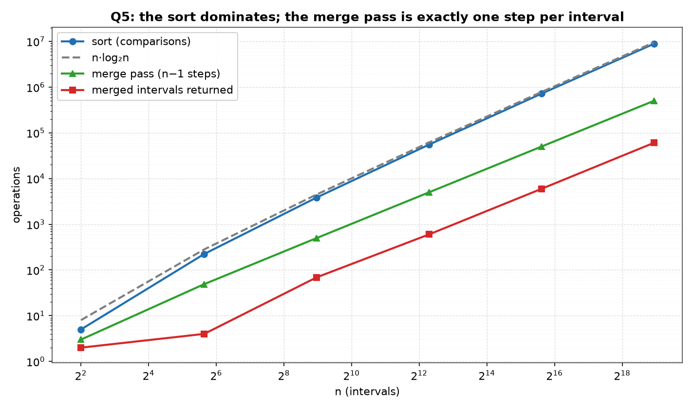
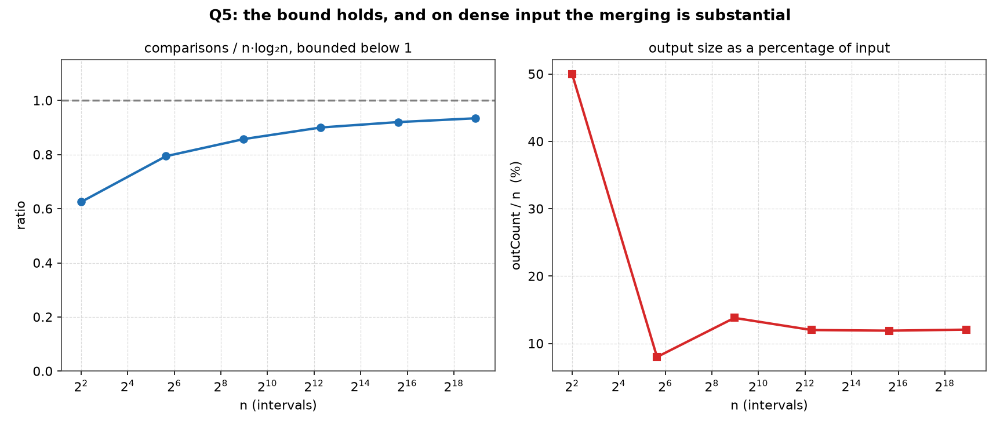
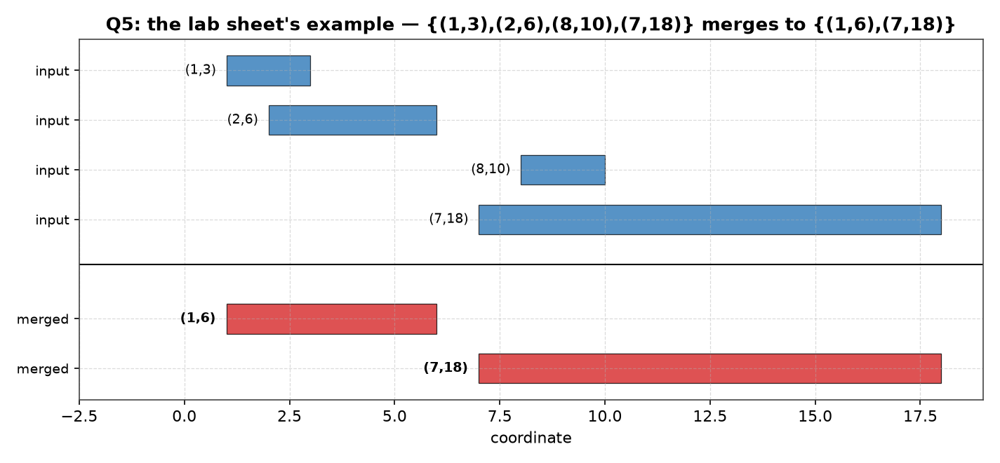

# Q5 — Merging Overlapping Intervals

> Given a list `I` of `n` intervals as `(xᵢ, yᵢ)` pairs, return the list with the
> overlapping intervals merged — for `I = {(1,3),(2,6),(8,10),(7,18)}` the answer
> is `{(1,6),(7,18)}` — in worst-case `O(n log n)` time.

| | |
|---|---|
| **Source** | [`q5_merge_intervals.c`](q5_merge_intervals.c) |
| **Sample** | [`sample.txt`](sample.txt) |
| **Input** | None — built-in sweep over n |
| **Build** | `gcc -Wall -Wextra q5_merge_intervals.c -o q5 -lm` |
| **Output** | Printed to the terminal |

---

## Problem Statement

Given a list `I` of `n` intervals, specified as `(xᵢ, yᵢ)` pairs, return a list
where the overlapping intervals are merged. For `I = {(1,3),(2,6),(8,10),(7,18)}`
the output should be `{(1,6),(7,18)}`. The algorithm must run in worst-case
`O(n log n)` time. By choosing a suitable input and output representation, write a
program in C to validate the algorithm.

The representation chosen here is `struct { int x, y; }` — an array of `n` of them
on input, in arbitrary order, and an array of `k ≤ n` of them on output, in
ascending order of left endpoint. The merge function returns `k`, so the caller
learns both the blocks and how many there are. Because the output is a list of the
same type as the input, the routine is idempotent: feeding its own output back in
returns it unchanged.

---

## The Analysis

### The algorithm — sort by left endpoint, then one pass

```
MergeIntervals(I[0..n−1]):                        # precondition: n ≥ 1
    sort I ascending by x, ties broken by y       # O(n log n)
    (lo, hi) = (I[0].x, I[0].y)                   # the open block
    for i = 1 .. n−1:                             # Θ(n) iterations
        if I[i].x ≤ hi:                           # overlaps or touches
            hi = max(hi, I[i].y)                  # absorb into the block
        else:
            emit (lo, hi)                         # block closed for good
            (lo, hi) = (I[i].x, I[i].y)           # open a fresh one
    emit (lo, hi)                                 # the last block
```

Two phases, and the costs do not interact:

```
T(n) = sort(n)      + sweep(n)
     = O(n log n)   + Θ(n)
     = O(n log n)
```

The sweep does **exactly `n − 1`** left-endpoint comparisons — one per loop
iteration, whichever branch is taken — and each iteration does `O(1)` work
besides. So the sort dominates and the total is `O(n log n)`. Extra space is the
`k ≤ n` output slots; the sort permutes the input array itself rather than copying
it, and the sweep holds one interval of state.

`max(hi, I[i].y)` is written in the source as `if (in[i].y > cur.y) cur.y =
in[i].y;`. That guard is not decoration — see the walkthrough below.

### Why sorting by left endpoint makes one pass suffice

The sort is not there to make the *output* sorted; it is there to make a single
pass **correct**. The argument is short and it is the whole content of the
question.

Suppose the intervals have been arranged so that `x₀ ≤ x₁ ≤ … ≤ xₙ₋₁`, and the
sweep currently holds an open block `(lo, hi)` built out of some prefix of them.
An interval `(x, y)` intersects `(lo, hi)` only if `x ≤ hi` — if it started to the
right of `hi` there is nothing to share, since `lo ≤ hi < x`. Now let `I[i]` be
the **first** interval in the sorted order with `xᵢ > hi`. Every interval after it
has `xⱼ ≥ xᵢ > hi` as well, because the list is in `x` order. Therefore:

```
xᵢ > hi   ⇒   xⱼ > hi  for all j ≥ i   ⇒   no later interval can touch (lo, hi)
```

The block is provably finished. That single fact is the licence to emit it at once
and never look at it again, and it is what makes the pass linear: each interval is
examined once, joins the current block or starts the next, and is never revisited.
Without the sort, an interval arriving late could reopen an already-closed block,
and the natural repair — rescanning the emitted blocks for something to extend, or
repeatedly sweeping until nothing changes — costs `Θ(n²)` in the worst case. The
`O(n log n)` spent on the sort is what buys the `Θ(n)` pass.

Note also that `hi` never decreases while a block is open, so the test `x ≤ hi`
compares against the furthest right edge seen so far in this block, not merely
against the previous interval's right edge. This is why a chain of intervals that
pairwise overlap only with their neighbours still collapses into one block.

### Walking the lab sheet's own example

`I = {(1,3), (2,6), (8,10), (7,18)}`. Sorting by left endpoint (ties on the right,
so the order is total and reproducible) rearranges it to:

```
(1,3)  (2,6)  (7,18)  (8,10)
```

Note that the sheet's input is *not* in sorted order — `(8,10)` precedes `(7,18)`
— which is exactly the case the sort exists to handle. The sweep then runs:

```
block = (1,3)                       open on the first interval
(2,6) :  2 ≤ 3   overlap   hi = max(3, 6)  = 6    block = (1,6)
(7,18):  7 > 6   gap       emit (1,6)            block = (7,18)
(8,10):  8 ≤ 18  overlap   hi = max(18, 10) = 18  block = (7,18)
end   :                    emit (7,18)
```

Output `{(1,6), (7,18)}`, which is the sheet's stated answer. Three comparisons of
left endpoints for four intervals, as promised.

The third step is the trap. `(8,10)` lies **wholly inside** `(7,18)`: it overlaps,
so the merge branch is taken, but the block must not shrink. An implementation
that writes `cur.y = in[i].y` unconditionally instead of taking the maximum
produces `(7,10)` and an output of `{(1,6),(7,10)}` — a plausible-looking answer
that silently loses the points from 10 to 18. The sheet's own example is chosen to
expose precisely this bug, so the program asserts the expected `{(1,6),(7,18)}`
before anything else runs and calls `exit(1)` on any deviation. The same bug is
caught independently by validation property (b) below, since the input interval
`(7,18)` would then not be contained in any output interval.

### The touching convention

The sheet does not say what happens to intervals that abut without overlapping, so
the program fixes a convention and states it: the test is `x ≤ hi`, **not**
`x < hi`, so touching counts as overlapping and `(1,3)` with `(3,7)` merges into
`(1,7)`. Reading the pairs as closed real intervals `[x, y]`, this is the correct
reading — they genuinely share the point 3, and their union is connected.

The convention propagates into the validator, which must agree with it: two
adjacent output blocks are required to satisfy `out[i].x > out[i−1].y`, a strict
inequality, because any pair that merely touched would have been merged. Under the
other convention (`x < hi`), `{(1,3),(3,7)}` would be left as two blocks and the
same checker would reject them. The two halves of the program are consistent about
one choice rather than each quietly assuming its own.

### Where the worst-case bound actually comes from

This deserves to be said plainly, because the measured table cannot say it. The
inputs generated by `measure()` are **random** — `n` intervals with left endpoints
uniform over a span of `4n` and lengths uniform on `0..16`. Random rows demonstrate
typical behaviour and nothing else. No row of the table is a worst case, and no
number of such rows could establish a worst-case bound.

The `O(n log n)` claim therefore rests on two things, only one of which is
measured:

- **The sweep:** `Θ(n)` unconditionally, for every input, by construction — the
  loop runs `n − 1` times and does constant work per iteration. Nothing
  data-dependent happens here at all.
- **The sort:** `O(n log n)` *by the library's contract*. The program delegates to
  `qsort`, and the bound is inherited, not proved here.

The program's own closing prose makes this caveat — "the worst case comes from
qsort's contract, not from these rows, which are all random" — and this document
will not overstate it either. Anyone wanting a bound that depends on nothing
external can substitute merge sort or heap sort, both `O(n log n)` in the worst
case with no probabilistic caveat, and the sweep would not change by a line.

What the random rows *do* show is that the constant is small and the shape is
right. The measured comparison counts track

```
n log₂ n − 1.26 n
```

to within a quarter of a percent from `n = 500` upward. That is the familiar shape
of an efficient comparison sort's *average* count on random input: the leading
`n log₂ n` term minus a linear correction, with `1.26` being the standard
average-case constant quoted for merge sort. Against the table's own printed
`n·log₂(n)` column that shape predicts a ratio of

```
sortCmps / (n log₂ n)  ≈  1 − 1.26 / log₂ n
```

which is *not* a constant: it climbs towards 1 from below as `n` grows, slowly,
because `log₂ n` grows slowly. This is why the ratio column rises rather than
sitting flat, and it is entirely consistent with `O(n log n)`. A ratio against
`n log₂ n` that converges to a constant `≤ 1` — even if it approaches it from far
below — is the signature of a genuinely `n log n` cost. A ratio that grew without
bound would not be.

### Validating the output: three independent properties

Comparison counters say nothing about correctness, so `validate()` checks three
separate properties at every size, before any number is printed, and any failure
prints `MISMATCH …` and calls `exit(1)`.

**(a) The output is sorted, pairwise disjoint, and non-touching.** For every
`i ≥ 1`, `out[i].x > out[i−1].y`. This is the structural post-condition: a valid
answer is a set of maximal blocks, and under the touching convention above,
"maximal" means consecutive blocks must be separated by a genuine gap.

**(b) Every input interval lies inside exactly one output interval.** The check is
linear, not quadratic: `in[]` was sorted in place by `mergeIntervals`, so a single
cursor `j` advances monotonically past output blocks that end before the current
input begins, and then `out[j].x ≤ in[i].x` and `in[i].y ≤ out[j].y` are asserted.
"Exactly one" comes free from (a) — the output blocks are disjoint, so containment
in one rules out the others. This is the property that catches under-merging and
dropped intervals, including the `cur.y = in[i].y` bug described above.

**(c) Point-set equality.** A boolean array is marked once from the input and once
from the output, and the two must agree at every coordinate. This is the check that
matters, because **(a) and (b) together still do not rule out over-merging.** Take
input `{(1,3),(4,7)}` and an implementation that wrongly emits the single block
`(1,7)`. Property (a) has nothing to compare — there is only one output block.
Property (b) is satisfied — both inputs sit comfortably inside `(1,7)`. Yet the
answer is wrong: the gap between 3 and 4 has been swallowed. Comparing the covered
point sets catches over- and under-merging alike, because it compares what the
answer *means* rather than how it is shaped.

One refinement is needed to make (c) sharp on integer coordinates. If the array
were indexed by the coordinates themselves, `{(1,3),(4,7)}` and `(1,7)` would mark
the same *integers* 1..7 and the check would pass on a wrong answer. The program
therefore indexes **doubled** coordinates, so each odd slot represents the gap
between two consecutive integers: the input never marks slot `7` (the point 3.5),
the over-merged output does, and the mismatch is reported. A lost mark, conversely,
means a dropped interval.

(c) costs one byte per half-coordinate, so it only runs while the span is small
enough to index an array — the guard is `cmax > COVMAX` with `COVMAX = 250000` and
`cmax = 4n + 16`. It therefore runs at `n = 4, 50, 500, 5000, 50000` and is skipped
at `n = 500000`, where (a) and (b) still run. This is a memory trade-off honestly
made, not a hole: the strongest check covers five of the six sizes, and the two
structural checks cover all six.

---

## Sample Output

```
$ gcc -Wall -Wextra q5_merge_intervals.c -o q5 -lm
$ ./q5

lab sheet example (n = 4)
  input  : (1,3) (2,6) (8,10) (7,18)
  output : (1,6) (7,18)
  sortCmps = 4, mergeSteps = 3, outCount = 2

=====================================================
 MERGING OVERLAPPING INTERVALS: SORT THEN ONE PASS
=====================================================
----------------------------------------------------------------------------
       n     sortCmps      n*log2(n)    ratio   mergeSteps   outCount
----------------------------------------------------------------------------
       4            5              8    0.625            3          2
      50          224            282    0.794           49          4
     500         3844           4483    0.857          499         69
    5000        55269          61439    0.900         4999        600
   50000       718231         780482    0.920        49999       5952
  500000      8836953        9465784    0.934       499999      60291

The sortCmps / n*log2(n) ratio climbs from 0.63 and settles just
under 0.94, staying bounded below 1 at every size, so the sort - and
hence the algorithm - is O(n log n); the worst case comes from
qsort's contract, not from these rows, which are all random.  The
sweep compares one endpoint per interval, so mergeSteps is n-1 by
construction and Theta(n), and outCount far below n shows merging.
```

### Reading the output

**The example block reproduces the sheet's answer exactly, and its cost is the
`n − 1` the derivation predicts.** The output line reads `(1,6) (7,18)` for the
input `(1,3) (2,6) (8,10) (7,18)`, with `outCount = 2` and `mergeSteps = 3` for
`n = 4`. Reaching that line at all required the hard-coded assertion on
`{(1,6),(7,18)}` to pass, so the acceptance test is not merely displayed, it is
enforced. The `(8,10)`-inside-`(7,18)` step is the one being tested: an
implementation that assigned the incoming right endpoint unconditionally would
print `(7,10)` here and abort.

**`sortCmps` reads 4 for the example but 5 for the `n = 4` table row, and both are
correct.** Same `n`, different data: the example's four fixed intervals happen to
be resolvable in four comparisons, while the random quadruple in the table needs
five. The information-theoretic floor for sorting 4 items is `⌈log₂ 4!⌉ = ⌈4.58⌉ =
5` comparisons in the **worst** case, so 5 is the most that can be needed and 4 is
achievable on a favourable arrangement — the two figures straddle the bound rather
than contradicting each other. It is also a reminder that a single small row is a
sample, not a bound.

**The ratio column climbs monotonically — 0.625, 0.794, 0.857, 0.900, 0.920,
0.934 — and that climb is expected, not a warning sign.** It is not flat and this
document will not call it flat. The increments shrink at every step (0.169, 0.063,
0.043, 0.020, 0.014), which is the fingerprint of `1 − 1.26/log₂ n` approaching 1
from below: the measured counts sit very close to `n log₂ n − 1.26n`, so dividing
by the printed `n·log₂(n)` column leaves a slowly rising residue rather than a
constant. Working the prediction against the measurements: 0.777 vs 0.794 at
`n = 50`, 0.859 vs 0.857 at 500, 0.897 vs 0.900 at 5000, 0.919 vs 0.920 at 50000,
0.933 vs 0.934 at 500000 — agreement to a few parts in a thousand once `n` is past
the small-sample rows. The column stays below 1 at every size across a 125000×
range of `n`, so the leading term is `n log₂ n` with a constant under one. A
`Θ(n²)` cost would show this column multiplying by roughly `10/log₂10 ≈ 3` per
decade instead; it does not move like that at all.

**`mergeSteps` is exactly `n − 1` at every row — 3, 49, 499, 4999, 49999, 499999 —
which is an identity, not a measurement.** The counter is incremented once per loop
iteration and the loop runs from 1 to `n − 1` regardless of the data, so this
column is `Θ(n)` for every possible input, worst case included. It is worth
noticing what this column rules out: the linear pass is data-independent, so the
only place the algorithm's cost can vary at all is inside the sort. That is why the
honest caveat above lands entirely on `qsort` and nowhere else.

**`outCount` sits far below `n` at every size, and its ratio to `n` is stable near
12%** — 69/500 = 13.8%, 600/5000 = 12.0%, 5952/50000 = 11.9%, 60291/500000 =
12.1%. This confirms the generator is doing its job: heavy merging is actually
happening, so the merge branch is being exercised rather than the fall-through. The
stability of the fraction is by design, since the span scales as `4n` and the mean
length is 8, holding the density fixed as `n` grows; a rough clumping estimate for
that density is `e^(−λμ) = e^(−2) ≈ 13.5%` of intervals starting a new block, and
the measured 12.1% falls slightly below it, consistent with touching counting as
overlap and so merging a few extra chains. The small rows wander from the trend —
`n = 50` collapses to just 4 blocks and `n = 4` to 2 — which is sampling noise at
those sizes, not a different regime.

**No `MISMATCH` line appears anywhere in the output, which is the point of the
run.** Every one of properties (a), (b) and (c) held at every size checked, and any
violation would have terminated the program before the table header was written —
so the table exists only because the answers were verified first. `rand()` is left
unseeded, so recompiling with the documented build line and rerunning reproduces
these figures byte for byte; the build itself is clean under `-Wall -Wextra`.

---

## Figures

All three figures are generated by [`../make_plots.py`](../make_plots.py), which
compiles this program, runs it, and plots the table it prints.

### Where the work goes



Four series, log-log. The sort tracks `n·log₂n` closely and is the dominant term.
The merge pass is the flatter green line and is exactly `n − 1` steps at every
size — 3, 49, 499, 4999, 49 999, 499 999 — because the single pass compares one
endpoint per interval after the first. **The pass is linear; the sort is what
makes the algorithm `n log n`.** The red series is the number of intervals
actually returned, and it sits an order of magnitude lower: on this dense input
most intervals merge away.

### The bound, and how much merging happens



*Left:* sort comparisons divided by `n·log₂n` — 0.625, 0.794, 0.857, 0.900,
0.920, 0.934. Rising, in shrinking steps, capped below 1. That is convergence to a
constant, which is what the bound asserts; a flat line was never the requirement.

*Right:* output size as a percentage of input. It falls steeply and then settles
near 12% — 50%, 8%, 13.8%, 12.0%, 11.9%, 12.1%. The non-monotonic start is
small-sample noise: at `n = 4` two of a random four intervals happened to merge,
giving exactly 50%, and at `n = 50` only four intervals survived. From `n = 500` on
the generator's density is what fixes the ratio, so it flattens. (That `n = 4` row
is a random instance drawn with `span = 4n`, not the lab sheet's example below —
they both reduce to two intervals, but that is a coincidence.) The plateau is
worth noting: **the output is not a constant size and not `n` either** — it is a
stable fraction of `n` for input of a fixed density, so the algorithm's cost cannot
be charged to its output.

### The lab sheet's own example



`{(1,3), (2,6), (8,10), (7,18)}` above the line, the merged result below.
`(1,3)` and `(2,6)` overlap and become `(1,6)`; `(8,10)` is swallowed whole by
`(7,18)`, which is the containment case rather than a partial overlap. Note the
input is drawn in the order given, *unsorted* — `(8,10)` precedes `(7,18)` — which
is exactly why sorting by left endpoint comes first: the containment is only
obvious once `(7,18)` is known to start earlier.

The two output intervals do not touch (6 < 7), so no further merging is possible,
matching the claim in the analysis that the routine is idempotent.

---

## Files

| File | Description |
|------|-------------|
| [`q5_merge_intervals.c`](q5_merge_intervals.c) | Solution source |
| [`sample.txt`](sample.txt) | Sample build/run output |
| [`plots/1_growth.png`](plots/1_growth.png) | Sort, merge pass and output size against `n·log₂n` |
| [`plots/2_ratio_and_compression.png`](plots/2_ratio_and_compression.png) | The bound, and output size as a fraction of input |
| [`plots/3_worked_example.png`](plots/3_worked_example.png) | The lab sheet's four intervals, before and after |
