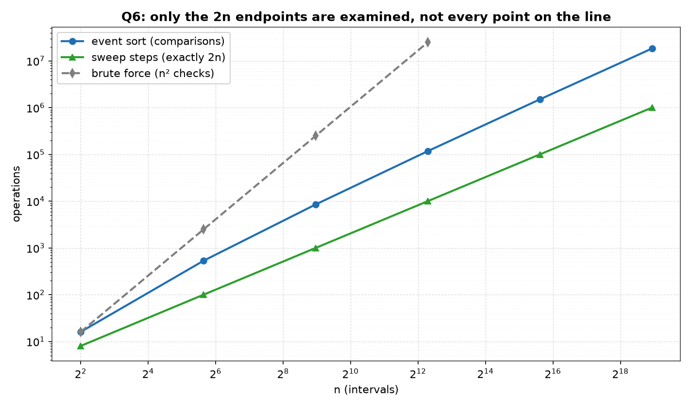
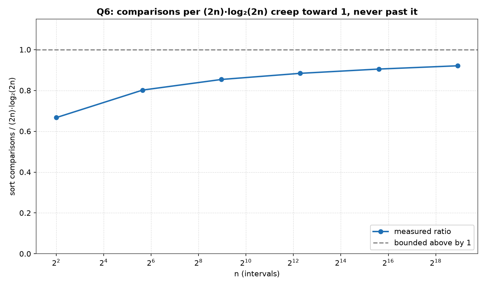
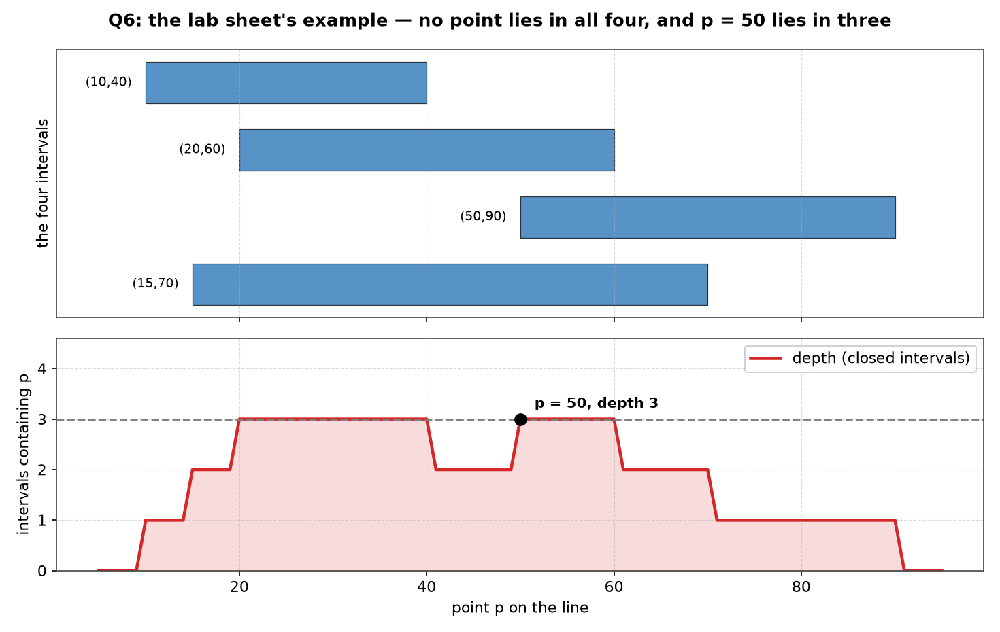

# Q6 — The Point Lying in the Most Intervals

> Given `n` intervals on a line, the i-th being `(l_i, r_i)`, find a point `p`
> contained in the largest number of them, in `O(n log n)`. An endpoint counts
> as being in its interval, so the intervals are **closed**: `[l_i, r_i]`.

| | |
|---|---|
| **Source** | [`q6_max_overlap_point.c`](q6_max_overlap_point.c) |
| **Sample** | [`sample.txt`](sample.txt) |
| **Input** | None — built-in sweep over n |
| **Build** | `gcc -Wall -Wextra q6_max_overlap_point.c -o q6 -lm` |
| **Output** | Printed to the terminal |

---

## Problem Statement

You are given a set `S` of `n` intervals on a line, the i-th described by its
left and right endpoints `(l_i, r_i)`. Give an **`O(n log n)`** algorithm to
identify a point `p` on the line that is in the largest number of intervals.

For `S = {(10,40), (20,60), (50,90), (15,70)}` no point exists in all four
intervals, but `p = 50` is an example of a point in three. An endpoint counts
as being in its interval. Choose a suitable input and output representation
and write a C program to validate the algorithm.

---

## The Analysis

### The event sweep

The line is continuous, but the *depth* — the number of intervals containing
a point — is a step function that can only change where an interval opens or
closes. So only the `2n` endpoints need be examined. Each interval
`[l_i, r_i]` is turned into two events:

```
(l_i, +1)      an interval opens here
(r_i, −1)      an interval closes here
```

Sort the `2n` events by coordinate and walk them left to right, keeping a
running sum `cur`. What `cur` holds has to be stated one coordinate group at
a time, because several events can share a coordinate. Write `a` for the
number of intervals opening at `x` and `b` for the number closing there:

```
entering x        cur = #{ i : l_i < x ≤ r_i }
after the a +1s   cur = that + a = depth(x)        ← the group's peak
after the b −1s   cur = the depth just to the right of x
```

So `cur` is **not** the depth at `x` after every event at `x`: after a `−1` at
a coordinate that also carries a `+1` it already reads the depth to the right,
which is smaller. What is true is that the group's peak — the value after the
last `+1` of the group — is exactly `depth(x)`, and a peak is precisely what a
running maximum captures. That is why `best` is the true maximum depth even
though `cur` is not always a depth, and why the coordinate stored alongside it
is always the coordinate of some `+1`. It is also the whole reason the
`+1`-before-`−1` ordering of the next section is not cosmetic: it is what puts
the group's peak at `depth(x)` instead of at `depth(x) − b`.

```
build 2n events                        Θ(n)
qsort the 2n events by coordinate      Θ(n log n)   ← dominates
sweep, cur += d, compare cur to best   Θ(n)
────────────────────────────────────────────────────
T(n) = Θ(n log n) + Θ(n) = Θ(n log n)
```

With `m = 2n` keys the sort costs `Θ(m log₂ m)` comparisons, and

```
m log₂ m = 2n log₂(2n) = 2n (log₂ n + 1) = Θ(n log n)
```

so doubling the number of items to `2n` is absorbed into the constant.

The `Θ` on the sort is earned by the implementation, not by the textbook lower
bound. `Ω(m log m)` for comparison sorting is a worst-case statement over
inputs and says nothing about the cost of one particular sort on one
particular input — insertion sort finishes an already-sorted array in `O(m)`,
and a run-detecting merge sort does too. What makes this program
`Θ(n log n)` on *every* input is that glibc's `qsort` is a merge sort here
(verified: it preserves the order of equal keys on a 100000-element scratch
input), and a merge sort spends `Θ(m log m)` comparisons on any input at all —
never more than `m log₂ m`, and roughly half that at its cheapest. A scratch
build handed 100000 already-sorted keys, the best case there is, still charges
`0.49 · m log₂ m` comparisons. The sweep is a separate exact `2n` steps, no
more and no fewer.

That is `Θ` for the algorithm as chosen, not a lower bound on the problem, and
the difference matters here: the generated coordinates are integers in
`[0, 2n)`, so a counting sweep over `2n` buckets would solve exactly these
instances in `O(n)`. The lab asks for `O(n log n)`, and the comparison sweep
delivers it. The program counts both halves directly — `sortCmps` is
incremented once per call to the comparator, `sweepSteps` once per event
consumed.

### The tie rule — +1 before −1, and why it is the crux

Two events can share a coordinate. The whole correctness of this question sits
in how that tie is broken, because the lab sheet says *an endpoint counts as
being in its interval*. The intervals are closed, so a point that is the right
endpoint of one interval and the left endpoint of another lies in **both**.

Take the concrete pair the program tests, `[10,40]` and `[40,90]`. The point
40 is in both, so the depth at 40 is 2. Sorting with `+1` before `−1` at an
equal coordinate:

```
(10,+1) (40,+1) (40,−1) (90,−1)
cur  =     1       2       1       0
best =     1       2  ← p = 40, depth 2   ✓ correct
```

The third column is the invariant above in miniature: `cur = 1` there is not
the depth at 40, it is the depth just to the right of 40. The group's peak,
2, has already been banked into `best` by the preceding `+1`.

Sorting the other way, `−1` before `+1`, the closing event is subtracted
before the opening event is added and the two intervals are never
simultaneously counted:

```
(10,+1) (40,−1) (40,+1) (90,−1)
cur  =     1       0       1       0
best =     1  ← p = 10, depth 1                ✗ wrong
```

The comparator therefore orders by coordinate first and by *descending* delta
second:

```c
if (p->x != q->x) return (p->x < q->x) ? -1 : 1;
return q->d - p->d;                             /* +1 sorts before -1 */
```

With `p->d = +1` and `q->d = −1` the second line returns `−2`, putting the
opening event first. This is not left to inspection. `example()` runs the pair
`{{10,40},{40,90}}` and asserts both the depth and the witness:

```c
if (best != 2 || p != 40)
    { printf("MISMATCH: closed intervals at 40 give depth 2\n"); exit(1); }
```

Reversing the second key in a scratch copy compiled under `/tmp` makes the run
fail rather than quietly print a smaller answer: the shared-endpoint line
reads `depth 1 at p = 10`, the brute-force cross-check in `validate()` fires
with `MISMATCH n=2: sweep 1 at p=10, brute 2 at p=40, recount 1`, and the
process exits with status 1. A comparator written the wrong way cannot survive
a run.

### The contrast with Q4 of the same lab

[Q4](../Q4/README.md) (`q4_party_peak_occupancy.c`) is the same sweep over the
same event structure, and yet its convention is the opposite. It has no tie
rule at all: its comparator is a bare `return p->t - q->t`, ordering by time
and nothing else. There the guests' arrival and departure times are all
**distinct**, so no two events ever share a key and the comparator never has
to decide; and the interval is **half-open**, `[arrive, depart)`, because a
guest who leaves at time `t` is not at the party at time `t`. A departure must
*not* count.

Here the endpoints do collide. The generator draws `l_i` from a span of `2n`
and adds a length drawn below `min(span, 64)` — so lengths are at most 63 —
and from `n = 50` upward every size carries coordinates where a `+1` and a
`−1` meet, so the rule actually bites. The committed program never prints how
often; an instrumented scratch build that counts coordinates carrying both a
`+1` and a `−1` reports 9 of them at `n = 50`, rising to 157372 at
`n = 500000`. By the sheet's own wording an endpoint *does* count, so every
one of those coordinates has to be resolved `+1` first. At `n = 4` the only
coincidence is two `+1`s at the same point, where the ordering is immaterial;
the rule is exercised there by the hand-built `[10,40] [40,90]` pair instead.
The two questions look interchangeable and differ precisely in this one rule,
which is why both can sit on the same sheet without being duplicates.

### Why the witness can always be taken to be a left endpoint

This is a fact about the intervals alone, and it is worth proving without any
reference to the sweep, because the sweep is the thing under test. Let `p` be
any point of depth `d ≥ 1`, and let

```
l = max{ l_i : l_i ≤ p ≤ r_i }
```

be the rightmost left endpoint among the intervals containing `p`. Every such
interval satisfies `l_i ≤ l ≤ p ≤ r_i`, so it contains `l` as well. Hence
`depth(l) ≥ d`, and the maximum depth is attained at some left endpoint. Two
consequences follow:

- A brute force need only test the `n` left endpoints, not every integer on
  the line. If the deepest of those `n` candidates has depth `k`, then no
  point anywhere on the line has depth `k+1`. Since the argument above never
  mentions a running sum, this is a genuine second derivation of the answer
  rather than a restatement of the sweep.
- The sweep inherits the same fact: `cur` only ever *rises* at a `+1` event,
  that is, at some `l_i`, so the coordinate it records is automatically one of
  those left endpoints. The depth there holds rightwards until the next event,
  which is why reporting the bare coordinate is a complete answer — no
  interval of validity need be printed with it.

The code notes that `e[0]` is necessarily a `+1` event, so the very first
sweep step sets a witness and `best ≥ 1` for any non-empty input.

### The validation

Nothing is printed until it has been re-derived a second way. `validate()`
calls `depthAt()` — a plain `l_j ≤ p ≤ r_j` count over all `n` intervals —
once for each of the `n` left-endpoint candidates:

```
n candidates × n containment tests = n² checks,  O(n²)
```

Two conditions must both hold, or the program prints a `MISMATCH` line naming
`n`, both points and both depths, and calls `exit(1)`:

1. the brute-force maximum equals the sweep's `best`, which is the claim that
   the sweep found the true optimum; and
2. re-counting the sweep's own reported `p` from scratch gives `best` again,
   which is the claim that `p` is a genuine witness and not merely a
   coordinate with the right number attached.

Because `O(n²)` is unaffordable at the largest sizes, only the *first* of
those two conditions is skipped above `BFMAX = 5000`, and the `bfChecks`
column prints `-` for those rows. The second condition is not skipped:
`validate()` initialises `bm` to `best` when `br == 0`, which makes the
optimality test vacuous, but the recount `depthAt(s, n, p) != best` sits
outside that guard and still runs at every size. So the two largest sizes
retain a genuine `O(n)` check that the reported `p` really has the reported
depth — corrupting `p` by one at `n = 50000` in a scratch copy under `/tmp`
aborts with `MISMATCH n=50000: sweep 33 at p=44858, brute 33 at p=44858,
recount 32`. What the `-` concedes is narrower than it looks: at those two
sizes `p` is confirmed to be a witness of that depth, but its *optimality* —
that no other point is deeper — rests on the rule being verified at the four
smaller sizes and on the two hand-checked examples. Those `n` recount tests
are not added to `bfChecks`, since `bf` is latched before the condition is
evaluated, so the column stays an exact `n²` where it prints a number.

---

## Sample Output

```
lab sheet example (n = 4)
  S = (10,40) (20,60) (50,90) (15,70)
  deepest point p = 20, depth there = 3
  p = 50 has depth 3, and no point on the line has depth 4
  shared endpoint (10,40) (40,90) -> depth 2 at p = 40

=====================================================
 POINT LYING IN THE MOST CLOSED INTERVALS: EVENT SWEEP
=====================================================
------------------------------------------------------------------
      n    sortCmps  sweep 2n   depth         p    bfChecks  ratio
------------------------------------------------------------------
      4          16         8       3         2          16  0.667
     50         533       100      20        97        2500  0.802
    500        8509      1000      28       355      250000  0.854
   5000      117462     10000      30       118    25000000  0.884
  50000     1503874    100000      33     44857           -  0.905
 500000    18356223   1000000      37    863681           -  0.921

The sortCmps/(2n)log2(2n) ratio holds inside 0.67..0.92, creeping
towards 1 as the merge sort's linear -m term amortises away but never
past it, so the sort is Theta(n log n) and the sweep exactly 2n.  Only
the 2n endpoints matter, and +1 before -1 at a tie keeps [l,r] closed.
```

### Reading the output

**The lab sheet's example resolves exactly as the sheet says, but through a
different witness.** The program prints `deepest point p = 20, depth there =
3` — not `p = 50`. Both are correct: the optimum is not unique, and the sweep
reports the *first* coordinate at which the depth reaches 3, which is 20
(`[10,40]`, `[15,70]` and `[20,60]` all contain it). The sheet's own
suggestion is then checked separately, and the next line reads `p = 50 has
depth 3, and no point on the line has depth 4`. The second half of that
sentence is the sheet's claim that no point lies in all four intervals, and it
is earned rather than asserted: the brute force maximised over all four left
endpoints and found 3, which by the left-endpoint lemma rules out 4 everywhere
on the line.

**The shared-endpoint line is the tie rule under test.** `shared endpoint
(10,40) (40,90) -> depth 2 at p = 40` is the one printed line that a
comparator ordering `−1` before `+1` cannot produce; such a build reports
depth 1 at p = 10 and aborts. Its presence in the committed output is evidence
that the closed-interval convention was implemented, not just described.

**The `sweep 2n` column is exactly `2n` at every size** — 8, 100, 1000, 10000,
100000, 1000000 against n of 4, 50, 500, 5000, 50000, 500000. The sweep is a
single pass over the event array with no lookahead and no restart, so its cost
is an exact identity rather than an asymptotic statement, and it confirms that
the `Θ(n log n)` in the total comes entirely from the sort.

**The ratio column climbs — it does not sit flat.** It reads 0.667, 0.802,
0.854, 0.884, 0.905, 0.921: monotonically increasing across a 125000× range in
`n`, and still rising by 0.016 between the last two rows, so nothing has
levelled off. The shape is what `sortCmps / ((2n) log₂(2n))` should do for a
merge sort carrying a linear correction term. Writing the count as
`m log₂ m − c·m`, the form [Q4](../Q4/README.md) uses, and solving
`c = (1 − ratio) · log₂ m` from this program's own printed column gives

```
1.00, 1.31, 1.46, 1.54, 1.57, 1.58
```

so `c ≈ 1.57` fits the three largest rows, and the quotient rises because
`c / log₂ m` shrinks. Q4 fits `c ≈ 1.23` for the same library sort, and the
gap is not noise: this program hands `qsort` an array that is already
partly ordered, since the events are built pairwise as `(l_i, +1), (r_i, −1)`
with `l_i ≤ r_i`, giving `n` ascending runs of length 2 for the merge to
exploit. Shuffling the same `2n` events before sorting, in a scratch copy,
drops `c` back to about 1.25 — Q4's figure — at every size from `n = 500` up.
What `O(n log n)` requires is not a flat ratio but a **bounded** one, and the
ceiling is not merely empirical: a merge sort's comparison count never exceeds
`m log₂ m`, so the quotient is below 1 by construction and the column is a
check on the implementation rather than the proof of the bound. A ratio that
grew without limit would falsify the bound; one that rises monotonically and
stays under 1 across the whole range is consistent with it.

**`bfChecks` is `n²` where it runs, and the two methods agree on `depth`
everywhere it does.** The column reads 16, 2500, 250000, 25000000 — precisely
`4²`, `50²`, `500²`, `5000²`, the `n` candidates times the `n` containment
tests each — and then `-` at n = 50000 and n = 500000, where the `O(n²)` check
is skipped above `BFMAX = 5000`. Every figure in the top four rows was printed
only because the sweep and the brute force returned the same maximum and the
reported `p` survived being re-counted; in the bottom two rows only the
recount ran, the brute-force maximum having been skipped. The `depth` column
those checks certify reads 3, 20, 28, 30, 33, 37, and its first row belongs to
a different regime from the rest: lengths are drawn below `min(span, 64)`
against a span of `2n`, so from `n = 50` up the cap is 64, lengths are at most
63, and the expected depth at a random point is about `n · 32 / (2n) = 16` —
bounded in `n`, with only the maximum over more and more sample points
creeping upward through 20, 28, 30, 33, 37. At `n = 4` the span is 8, so the
cap is the span itself, lengths are at most 7, and the expected depth is
nearer 2, which is why that row reads 3 rather than something near 16.

---

## Figures

All three figures are generated by [`../make_plots.py`](../make_plots.py), which
compiles this program, runs it, and plots what it prints — and which refuses to
draw anything if the program reports a `MISMATCH`.

### Where the work goes



The event sort against the sweep and brute force, log-log. The sweep is exactly
`2n` at every size — 8, 100, 1000, 10 000, 100 000, 1 000 000 — and the sort
dominates. Brute force stops at `n = 5000` (25 000 000 checks against 117 462 sort
comparisons); past that the table prints `-` rather than pretending the check ran.

The title is the real claim: the line is continuous and there are infinitely many
candidate points `p`, yet only `2n` of them are ever examined. Everything rests on
the depth function changing only at an endpoint.

### The bound



Sort comparisons over `(2n)·log₂(2n)`: 0.667, 0.802, 0.854, 0.884, 0.905, 0.921.
Rising in shrinking steps, never reaching 1 — convergence to a constant, which is
what `Θ(n log n)` asserts. As in Q4, the `2n` inside the logarithm is deliberate:
the array being sorted holds two events per interval.

### The lab sheet's own example



*Top:* the four intervals `(10,40)`, `(20,60)`, `(50,90)`, `(15,70)`, drawn in the
order given. *Bottom:* the depth function computed over the whole line, for
**closed** intervals.

The figure settles the question the naive reading gets wrong. The four intervals
pairwise overlap in places, but the depth curve never reaches 4 — it tops out at 3
across `[20, 40]` and again across `[50, 60]`, dipping back to 2 on `[41, 49]`
between them. So there is no point common to all four, and the answer is 3 with
`p = 50` a valid witness (marked). That the maximum is attained on two separate
plateaus is why the program reports *a* witness rather than *the* witness.

The closed-interval convention is visible here and is the crux of the tie rule: at
`x = 40` the depth still counts `(10,40)`, and at `x = 50` it already counts
`(50,90)`. That is why the comparator must place `+1` before `−1` at equal
coordinates — with the opposite order the sweep would miss the point where one
interval ends exactly where another begins. The depth curve in this figure is
computed independently of the sweep, by testing `l ≤ x ≤ r` directly on a grid, so
it is a check on the sweep rather than a redrawing of it.

---

## Files

| File | Description |
|------|-------------|
| [`q6_max_overlap_point.c`](q6_max_overlap_point.c) | Solution source — event sweep, tie rule, brute-force cross-check |
| [`sample.txt`](sample.txt) | Committed build/run output |
| [`plots/1_growth.png`](plots/1_growth.png) | Sort and sweep against the `n²` baseline |
| [`plots/2_ratio.png`](plots/2_ratio.png) | The `(2n)·log₂(2n)` ratio, converging below 1 |
| [`plots/3_worked_example.png`](plots/3_worked_example.png) | The four intervals and their depth function |
