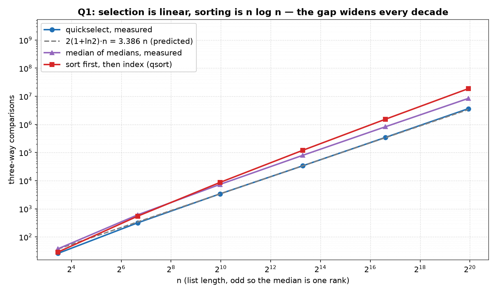
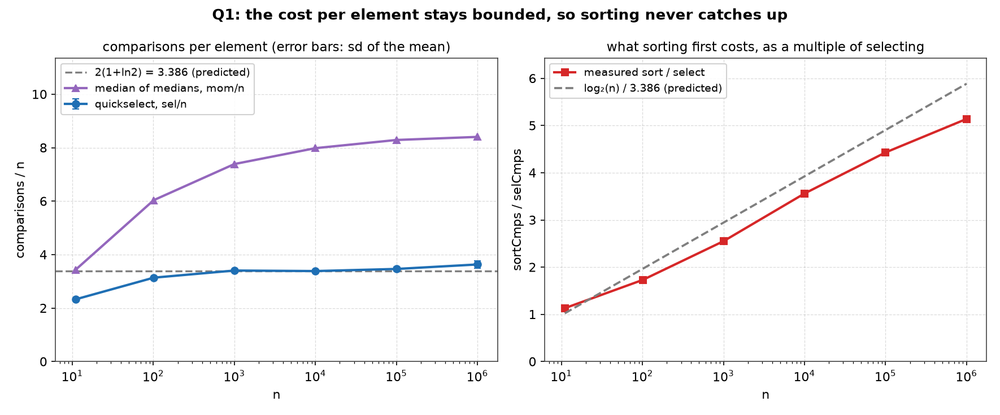

# Q1 — The Median Without Sorting

> Find the median of a list of `N` numbers **without sorting the list**, and do the
> complexity analysis of the algorithm. For `{7,12,3,9,21,5,18,1,14}` the answer is
> `9`; for `{4,8,15,16,23,42}` it is `15.5`.

| | |
|---|---|
| **Source** | [`q1_median_without_sorting.c`](q1_median_without_sorting.c) |
| **Sample** | [`sample.txt`](sample.txt) |
| **Input** | None — two worked examples, then a built-in sweep over n |
| **Build** | `gcc -Wall -Wextra q1_median_without_sorting.c -o q1 -lm` |
| **Output** | Printed to the terminal |

---

## Problem Statement

Find the median of a list of `N` numbers without sorting the list. Do the
complexity analysis of your algorithm.

The input representation is a plain `int` array of length `n`, in arbitrary order.
The median is returned as a `double`, not an `int`, because the two parities are
genuinely different problems: for odd `n` the median *is* one of the elements —
rank `⌈n/2⌉` — while for even `n` it is the mean of the two middle elements and
need not be an element of the list at all. `{4,8,15,16,23,42}` has median `15.5`,
which appears nowhere in the input. A routine that returned `int` would have to
either round or restrict itself to odd `n`; this one handles both and the sample
output shows one example of each.

"Without sorting" is treated as a real constraint rather than a figure of speech.
The program never calls a sort on the path that produces its answer, and it
*proves* it did not sort by printing, at every size, the percentage of positions
whose contents are not their sorted value — the `moved%` column. A sort is compiled
in, but only as a referee and a yardstick: it answers the same question
independently so the two can be required to agree, and its comparison count gives
the `Θ(n log n)` figure the linear method is being measured against.

---

## The Analysis

### The algorithm — quickselect with a three-way partition

Selection is quicksort with one recursive call deleted. Partition around a pivot,
see which side of the split the wanted rank falls on, and *discard the other side
entirely* instead of sorting it.

```
QuickSelect(a[0..n−1], k):                    # k is a 0-based rank
    (lo, hi) = (0, n−1)
    while lo < hi:
        p = a[ uniform random index in lo..hi ]        # the pivot value
        (lt, gt) = Partition3(a, lo, hi, p)   # a[lo..lt−1] < p = a[lt..gt] < a[gt+1..hi]
        if    k < lt:  hi = lt − 1            # rank is in the left block
        elif  k > gt:  lo = gt + 1            # rank is in the right block
        else:          return p               # rank is inside the equal block
    return a[lo]

Partition3(a, lo, hi, p):                     # Dutch national flag
    (lt, i, gt) = (lo, lo, hi)
    while i ≤ gt:
        compare a[i] with p                   # ONE three-way comparison
        if   a[i] < p:  swap(a, lt++, i++)
        elif a[i] > p:  swap(a, i, gt--)
        else:           i++
    return (lt, gt)
```

`Median(a, n)` then calls `QuickSelect(a, n, n/2)` once. For odd `n` that rank is
the median and the routine is finished. For even `n` the second middle is obtained
without a second selection — see below.

Two properties of `Partition3` carry the whole analysis:

- **It makes exactly `hi − lo + 1` three-way comparisons.** The window `i..gt`
  shrinks by exactly one on every branch of the loop, so the loop body runs once
  per element of `a[lo..hi]` and compares once. There is no data-dependent
  comparison count inside a single partition.
- **The equal block is never recursed into.** Elements equal to the pivot are
  placed and finished. On an all-equal window the loop ends with `lt = lo` and
  `gt = hi`, so the very first call resolves the whole problem.

The loop form matters too: `QuickSelect` is written as a `while` rather than a
recursion, so the stack does not grow even on the worst possible sequence of
pivots.

### Cost: `E[C] = 2(1 + ln 2)·n ≈ 3.386 n`

Because each partition costs one comparison per surviving element, the total is
the sum of the window sizes:

```
C = |window₁| + |window₂| + |window₃| + …
```

A uniformly random pivot leaves, in expectation, half the window:

```
T(n) = T(n/2) + n        ⇒   T(n) = n + n/2 + n/4 + … = 2n
```

so selection is linear on the average, with the sum of a geometric series where
quicksort has a sum of `log n` full levels. The `2n` from that sketch is a lower
bound on the truth, because "half the window" is optimistic — the *expected* new
window is `3/4` of the old, not `1/2`. The exact average, for selecting rank `k`
out of `n` with uniformly random pivots, is

```
C(n, k) = 2( n + k·ln(n/k) + (n−k)·ln(n/(n−k)) )
```

which is worth reading at its ends and its middle. At `k = 1` or `k = n` it
collapses to `2n`: finding a minimum by selection costs about twice a linear scan,
which pays for the partitioning it does not need. It is symmetric in
`k ↔ n+1−k`, as it must be. And it is **largest at the median**, `k = n/2`:

```
C(n, n/2) = 2( n + (n/2)·ln 2 + (n/2)·ln 2 ) = 2(1 + ln 2)·n ≈ 3.386 n
```

So the median is the most expensive rank to select, and `3.386 n` is the number
the growth table is testing against. The full `C(n,k)` curve is the subject of
[Q2](../Q2), which sweeps `k` across the whole range and measures it column by
column; here only its peak is needed.

**Space is `O(1)`.** The partition is in place, the loop replaces the recursion,
and the only extra storage is a handful of indices. The input array is permuted —
which is the price of `O(1)` space, and is why the program copies the array before
handing it to the referee.

### Even `n` without a second selection

For even `n` the median is `(a₍ₙ/₂₎ + a₍ₙ/₂₊₁₎)/2` in 1-based ranks. The obvious
implementation runs quickselect twice and pays `2 × 3.386n`. That is not
necessary, and the reason is the partition invariant.

When `QuickSelect(a, n, k)` returns, every element at a position below `lo` is
`≤` every element from `lo` on, and `k` lies in `[lt, gt]` of the final call.
Therefore `a[0 .. k−1]` holds **exactly the `k` smallest elements** of the list,
in some order: positions `0 .. lt−1` were partitioned strictly below the pivot,
and positions `lt .. k−1`, if any, hold copies of the pivot itself, which is the
`k+1`'th smallest value. So the lower middle — the `k`'th smallest, `k = n/2` —
is the **maximum of a block the algorithm has already isolated**, and a single
scan of `a[0 .. k−1]` finds it:

```
down = a[0]
for i = 1 .. n/2 − 1:  if a[i] > down: down = a[i]      # exactly n/2 − 1 comparisons
return (down + up) / 2
```

That is `n/2 − 1` further comparisons, deterministically — no pivots, no variance,
no second selection. The measured surcharge at `n = 100000` is `0.49999 n`, which
is `(50000 − 1)/100000` exactly. Both middles come out of one pass, and the
program prints the two halves separately so the split is visible rather than
asserted.

### The worst case, and the two ways of dealing with it

Quickselect's expected cost is linear; its **worst case is `Θ(n²)`**. If every
pivot is the largest remaining element the window shrinks by one per round and the
comparison count is `n + (n−1) + … = n(n+1)/2`. Choosing the pivot uniformly at
random makes that outcome vanishingly unlikely — but *unlikely* is not *impossible*,
and no amount of measurement can promote one to the other.

There is an algorithm with no such caveat, and it is measured here in the same
table so the price of the guarantee is visible: **median of medians** (BFPRT).
Split the window into groups of five, sort each group, take the median of each,
select the median of those `n/5` medians recursively, and partition around it.

```
MomSelect(a[lo..hi], k):
    while hi − lo + 1 > 5:
        for each group of 5 in a[lo..hi]:  insertion-sort it, collect its median
        p = MomSelect(medians, ⌊(m−1)/2⌋)             # recurse on n/5 medians
        (lt, gt) = Partition3(a, lo, hi, p)
        narrow (lo, hi) towards k, or return p
    insertion-sort the ≤ 5 survivors and index
```

At least half of the `n/5` group medians are `≤ p`, and each of those groups
contributes three elements `≤` its own median, so at least `3n/10` elements are
`≤ p`; the same argument bounds the other side. The surviving window is therefore
at most `7n/10`, giving

```
T(n) ≤ T(n/5) + T(7n/10) + cn
```

and because `1/5 + 7/10 = 9/10 < 1` this solves to `Θ(n)` — in the **worst case**,
with no probability attached. Only the `n/5` branch recurses in the code; the
`7n/10` branch is the loop, so the stack depth is `log₅ n`.

The constant is much larger, and the table shows how much. It is not enough to
say "larger" — a reader is entitled to ask whether `mom/n` is really bounded or
whether it hides a `log n`. The program answers that with the increments: `mom/n`
per decade rises by `+2.60 +1.35 +0.59 +0.31 +0.11`, a step that is **shrinking
towards zero**. A hidden `log₂ n` factor would add a *fixed* `log₂ 10 = 3.32` at
every decade. The measured steps are not merely smaller than that, they are
collapsing, which is what convergence to a constant looks like from below.

### The trap: two-way partitioning and duplicate keys

The textbook Lomuto partition uses a strict `<` and puts elements equal to the
pivot on one side. On distinct keys this is fine and slightly cheaper per element.
On a list where **every key is equal** it is a disaster: the comparison `a[j] < p`
is false for all `j`, nothing moves, the pivot ends at position `lo`, and the
window shrinks by exactly one element per round. Selecting the median then costs

```
n + (n−1) + … + n/2  ≈  3n²/8
```

The program measures exactly this, at `n = 10000`, rank 5000: **37502499**
comparisons for the two-way partition against **10000** for the three-way one, a
factor of 3750. And `3n²/8 = 37500000` at that `n`, so the measurement lands on
the closed form to five significant figures. The three-way version needs one pass
and no recursion at all, because the equal block is the answer.

This is the single most important implementation decision in the program, and it
is not an optimisation: without it the "linear-time" algorithm is quadratic on
input as ordinary as a column of repeated values. The distinct-key row shows what
the insurance costs — 61949 against 28375, so the three-way partition is *cheaper*
here as well, because on random distinct data it also benefits from resolving the
pivot's own position immediately.

### What the measured rows can and cannot establish

The rows in the growth table are **random shuffles**, and the honest reading of
them is narrow:

- They **can** show that the cost per element does not grow with `n`. That is the
  `Θ(n)` claim, and it is exactly what a table spanning five decades is good for.
- They **cannot** establish the worst case. No random row is a worst case, and a
  thousand random rows are still not one. The `Θ(n²)` worst case of quickselect is
  a fact about the algorithm derived above, not something the table refutes.
- They **cannot** demonstrate three-digit agreement with `3.386` either, and this
  document will not claim it. Each row therefore prints its own standard error so
  the reader can judge the precision instead of trusting a bare mean.

The one bound here that holds for *every* input is the median-of-medians `Θ(n)`,
and it is proved above rather than measured.

### Validating the answers: three independent checks

No comparison count means anything unless the answers are right, so every number
below is produced only after these have passed. Any failure prints
`MISMATCH …` and calls `exit(1)`.

**(a) An exact expected answer, with no reference sort in the loop.** Each
measured run uses a random permutation of `1..n`, whose median is `(n+1)/2`
*exactly* — for odd `n` an integer, for even `n` a half-integer that can only come
out right if **both** middles are right. Every one of the thousands of runs is
checked against that closed form. This is what makes the verification free: the
referee sort runs once per size as a yardstick, never as the source of truth.

**(b) Three methods, forced to agree, on duplicate-heavy data.** `smallCheck()`
runs every `n` from 1 to 40, forty random instances each — 1600 in all — with keys
drawn from `0 .. n/2+1` so ties are the rule rather than the exception, and
requires quickselect, median-of-medians and the reference sort to return the same
value. This is where `n = 1`, `n = 2`, both parities, all-equal windows and
pivot-equal-to-answer cases are covered; the growth table's large random rows would
never reach any of them.

**(c) A compliance check, because the question is about *not* sorting.**
`moved%` is the percentage of positions that do **not** hold their sorted value
after the median has been found. It rises from 38.5% at `n = 11` to 99.995% at
`n = 1000001`, and the worked example prints the array after selection so the
disorder can be inspected by eye. A program that quietly sorted would print a
`moved%` of zero, and this column is the only thing in the output that would
notice.

---

## Sample Output

```
$ gcc -Wall -Wextra q1_median_without_sorting.c -o q1 -lm
$ ./q1

worked example, odd n = 9
  input   : 7 12 3 9 21 5 18 1 14
  sorted  : 1 3 5 7 9 12 14 18 21   (for reference only)
  median  : 9.0
  after   : 1 3 5 7 9 12 18 14 21
            only rank 4 is in place; the rest is still unsorted

worked example, even n = 6
  input   : 4 8 15 16 23 42
  median  : 15.5   = (15 + 16) / 2, both middles from one pass

cross-check: 1600 duplicate-heavy instances at n = 1..40, all three agree

duplicate keys, n = 10000, selecting rank 5000
  keys           two-way cmps   three-way cmps      ratio
  all distinct          61949            28375       2.18
  all equal          37502499            10000    3750.25

=========================================================
 THE MEDIAN WITHOUT SORTING: SELECTION IN LINEAR TIME
=========================================================
--------------------------------------------------------------------------
       n  runs    selCmps  sel/n     +-  mom/n   sortCmps sort/sel  moved%
--------------------------------------------------------------------------
      11  4000         26  2.328  0.012  3.437         29     1.13  38.505
     101  4000        317  3.138  0.015  6.037        547     1.73  85.079
    1001  2000       3409  3.405  0.023  7.389       8695     2.55  97.572
   10001   800      33851  3.385  0.033  7.983     120404     3.56  99.668
  100001   200     346403  3.464  0.068  8.289    1536128     4.43  99.956
 1000001    50    3631657  3.632  0.131  8.404   18675343     5.14  99.995
+- is the standard deviation of the mean of sel/n over the runs;
one run has a spread of about 1.05n, so it shrinks as 1/sqrt(runs).

even n = 100000, mean of 200 runs: the upper middle costs
     3.273n and the lower one a further n/2 - 1 = 0.49999n exactly,
     the maximum of the block the partition has already isolated
     below it -- 3.773n in all, and still only one selection.

mom/n rises per decade by +2.60 +1.35 +0.59 +0.31 +0.11,
     a step that shrinks toward zero; a hidden log2 n factor
     would instead add a fixed 3.32 every decade.

T(n) = T(n/2) + n on the average pivot  ->  E[C] = 2(1+ln2)n
     ~ 3.386n, and sel/n stays inside a band around that value
     across five decades instead of growing: the median costs
     Theta(n), no order statistic other than rank n/2 is ever
     computed, and moved% shows the list left unsorted.
T(n) <= T(n/5) + T(7n/10) + cn  ->  Theta(n) worst case for the
     median-of-medians pivot, at a constant a few times larger,
     which is the price of never being unlucky.
Sorting first would cost Theta(n log n), so sort/sel grows like
     log2(n)/3.386: 1.13 at n = 11, 5.14 at n = 1000001, and the gap
     widens by a further factor of log2(10) with every decade.
The two-way partition is the trap: with a strict < it makes
     3n^2/8 comparisons on equal keys (37502499 at n = 10000,
     against 10000 for the three-way one), so duplicates alone
     turn the linear algorithm quadratic.
```

### Reading the output

**The odd example's `after` line is the proof that nothing was sorted.** The input
`7 12 3 9 21 5 18 1 14` leaves the array as `1 3 5 7 9 12 18 14 21`. Rank 4
(0-based) holds `9`, the median, and it is in its final place — that is the one
guarantee selection makes. Everything else is not: `18` sits before `14` at
positions 6 and 7. The array is *partially* ordered around the median, which is
exactly what a partition-based selection leaves behind, and it is visibly not the
sorted sequence printed above it for reference.

**The even example returns `15.5`, a value that is not in the list.** `{4, 8, 15,
16, 23, 42}` has middles 15 and 16. This is the case that forces the `double`
return type, and it is answered with one selection plus a `n/2 − 1` scan rather
than two selections.

**1600 cross-checked instances is where correctness actually lives.** Every `n`
from 1 to 40, forty instances each, keys deliberately drawn from a small range so
that ties dominate — and quickselect, median-of-medians and `qsort` return the same
value on all of them. The table below it measures cost and proves nothing about
correctness; this line does the opposite.

**The duplicate-key block is the sharpest number in the output: 37502499 against
10000.** Two-way and three-way partitioning select the same rank from the same
all-equal list of 10000 keys, and the two-way version needs 3750 times as many
comparisons. The closed form for that failure is `3n²/8 = 37500000`, so the
measured 37502499 is on it to five figures — the quadratic behaviour is not a
constant-factor slowdown, it is a different complexity class, reached by input with
no adversarial structure at all. On distinct keys the same comparison reads 61949
against 28375, so the three-way partition is not even paying for its insurance
here.

**`sel/n` does not grow across five decades — 2.328, 3.138, 3.405, 3.385, 3.464,
3.632 — and that, not agreement to three digits, is the `Θ(n)` claim.** The
predicted constant is `2(1+ln 2) = 3.386`. The two small rows sit below it because
`C(n,k)` is asymptotic and a list of 11 elements has no room for a logarithm to
mean anything. Of the four large rows, `n = 1001` and `n = 10001` land on the
prediction (3.405 and 3.385, within one standard error of 0.023 and 0.033), while
`n = 100001` reads 1.1 standard errors high and `n = 1000001` reads 1.9 standard
errors high on only 50 runs. That last row is the noisiest in the table and it is
reported as such rather than rounded into agreement. What no row shows is *growth*:
a `Θ(n log n)` cost would multiply this column by `log₂ 10 = 3.32` per decade,
turning 2.328 into something past 300 by the bottom row.

**The `+-` column is why the previous paragraph can be written at all.** A single
run of quickselect has a spread of about `1.05n`, so a mean over `runs` runs has a
standard error near `1.05/√runs` — 0.017 at 4000 runs, 0.148 at 50. The printed
values (0.012 … 0.131) track that, and they are what turns "3.632 is a bit high"
into "3.632 is 1.9 standard errors high", which is a statement a reader can check.

**The even-`n` line splits `3.773n` into `3.273n + 0.49999n`, and the second term
is exact.** `n/2 − 1` at `n = 100000` is 49999, and `0.49999 n` is that number
divided by `n` with no rounding at all — the lower-middle scan is deterministic,
so it contributes no variance and needs no averaging. The upper middle costs
`3.273n`, and the total for an even-`n` median is therefore about 11% more than
for an odd one, not double.

**`mom/n` climbs to 8.404 and its increments collapse: `+2.60 +1.35 +0.59 +0.31
+0.11`.** Median-of-medians is the algorithm with the worst-case guarantee, and it
costs about 2.3× quickselect at the top of the table. The shrinking increments are
the evidence that this is a constant and not a `log n` in disguise — the `log₂ 10 =
3.32` a hidden logarithm would add every decade is larger than the *first* step and
thirty times the last.

**`sort/sel` rises from 1.13 to 5.14, so sorting loses further ground at every
decade.** The prediction is `log₂(n)/3.386`, which runs 1.02, 1.97, 2.94, 3.92,
4.91, 5.89 — above the measured values throughout, for two reasons that both work
in the same direction: `qsort` beats `n log₂ n` by about 6% on random input
(18675343 against 19931569 at the last row), and `sel/n` reads high in the last
rows. The measured column therefore climbs by about 0.80 per decade rather than the
predicted 0.98. The *shape* is what matters and it is not in doubt: the ratio grows
without bound, because one column is `Θ(n)` and the other is `Θ(n log n)`.

**`moved%` reaches 99.995%, which is the "without sorting" requirement made
measurable.** After the median of a million-element list has been found, essentially
no element is where a sort would have put it. The column also explains why it starts
low: at `n = 11`, 38.5% is four or five positions, because a short list is nearly
sorted by accident once its median is in place.

**No `MISMATCH` line appears anywhere, and that is the point of the run.** The
table exists only because every answer was verified first. `rand()` is left
unseeded, so recompiling with the documented build line reproduces these figures
byte for byte; the build is clean under `-Wall -Wextra`.

---

## Figures

Both figures are generated by [`../make_plots.py`](../make_plots.py), which
compiles this program, runs it, and plots the table it prints.

### Linear against `n log n`, over five decades



Log-log, so a straight line is a power law and the slope is the exponent. All four
series look parallel at this scale — which is the honest way to show it, because
`n` and `n log n` differ by a factor that grows only logarithmically. The
information is in the *gaps*: quickselect (blue) sits on the dashed `3.386 n`
prediction the whole way, and the red sorting curve pulls steadily further above
it — a factor of 1.13 at `n = 11` and 5.14 at `n = 1000001`. Median-of-medians
(purple) runs between them, parallel to the blue line rather than to the red one,
which is the visual form of "also `Θ(n)`, worse constant".

### The constants, which is where the argument actually is



*Left:* comparisons per element, with error bars showing the standard deviation of
each mean. Dividing by `n` is what makes a linear cost legible: **the blue curve
flattens against the dashed `3.386` line instead of climbing.** The last point sits
about 1.9 error bars high on 50 runs, which the error bars are there to disclose.
The purple `mom/n` curve is the same claim for median-of-medians, and its visible
flattening — steps of `+2.60` down to `+0.11` — is what distinguishes a converging
constant from a logarithm: a `log n` factor would draw a straight rising line on
this log-`x` axis, evenly spaced per decade, which is precisely what the red curve
does in [Q4's build figure](../Q4/plots/1_build.png).

*Right:* what sorting first costs, as a multiple of selecting. The dashed
`log₂(n)/3.386` line is the prediction if `qsort` cost exactly `n log₂ n` and
selection exactly `3.386 n`; the measured red curve runs below it because `qsort`
does better than `n log₂ n` and selection does slightly worse than `3.386 n`. Both
curves rise without bound, which is the part that matters: **there is no list size
at which sorting first catches up.** For a single median it is the wrong algorithm
at every `n`, and by an ever larger margin.

---

## Files

| File | Description |
|------|-------------|
| [`q1_median_without_sorting.c`](q1_median_without_sorting.c) | Solution source |
| [`sample.txt`](sample.txt) | Sample build/run output |
| [`plots/1_growth.png`](plots/1_growth.png) | Selection, median-of-medians and sorting against `n` |
| [`plots/2_ratio.png`](plots/2_ratio.png) | Comparisons per element, and sorting's cost as a multiple of selecting |
