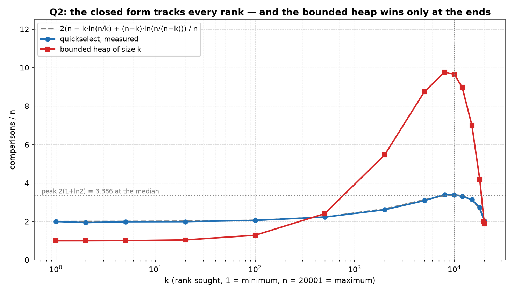
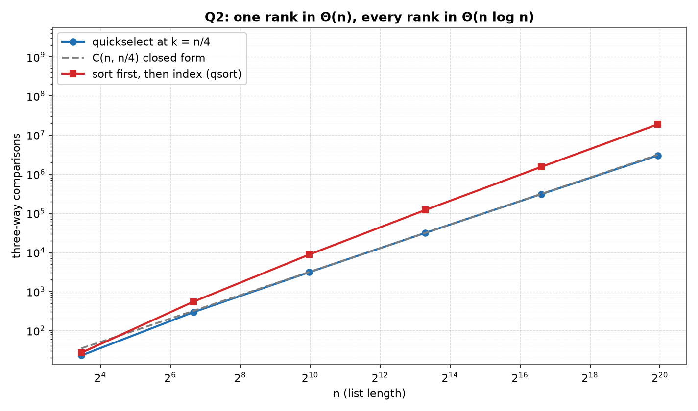

# Q2 — The K'th Smallest Without Sorting

> Find the K'th smallest element in a given list of `N` numbers **without sorting
> the list**, and do the complexity analysis of the algorithm. `k = 1` is the
> minimum, `k = n` the maximum, `k = ⌈n/2⌉` the median of [Q1](../Q1).

| | |
|---|---|
| **Source** | [`q2_kth_smallest_without_sorting.c`](q2_kth_smallest_without_sorting.c) |
| **Sample** | [`sample.txt`](sample.txt) |
| **Input** | None — a worked example, then a sweep over `k` and a sweep over `n` |
| **Build** | `gcc -Wall -Wextra q2_kth_smallest_without_sorting.c -o q2 -lm` |
| **Output** | Printed to the terminal |

---

## Problem Statement

Find the K'th smallest element in a given list of `N` numbers without sorting the
list. Do the complexity analysis of your algorithm.

The rank `k` is 1-based, so `k = 1` asks for the minimum and `k = n` for the
maximum. The input is a plain `int` array in arbitrary order, and the answer is
one of its elements — unlike the median of [Q1](../Q1), an order statistic is
always a member of the list, so the return type is `int`.

[Q1](../Q1) is the special case `k = ⌈n/2⌉`, and it turns out to be the *hardest*
case: the cost of selection depends strongly on where the wanted rank sits, is
lowest at the two ends, and peaks at the median. That dependence is the subject of
this question, so where Q1 measured one number at many sizes, this program measures
many ranks at one size — fifteen values of `k` at `n = 20001`, each against a
closed-form prediction — and only then repeats the size sweep to confirm linearity.

A second method is measured alongside: a **bounded heap of size `k`**, which
streams the list in one pass and never touches the input. It is not there for
decoration. It beats quickselect at both ends of the rank range and loses badly in
the middle, and locating the crossover is a result in its own right.

---

## The Analysis

### The algorithm — quickselect, with the rank as a parameter

```
KthSmallest(a[0..n−1], k):                    # k counted from 1
    (lo, hi, want) = (0, n−1, k−1)
    while lo < hi:
        p = a[ uniform random index in lo..hi ]
        (lt, gt) = Partition3(a, lo, hi, p)   # a[lo..lt−1] < p = a[lt..gt] < a[gt+1..hi]
        if    want < lt:  hi = lt − 1
        elif  want > gt:  lo = gt + 1
        else:             return p            # rank falls inside the equal block
    return a[lo]
```

This is the routine of [Q1](../Q1) with the rank lifted out of the caller.
`Partition3` is the same Dutch-national-flag partition, making exactly
`hi − lo + 1` three-way comparisons and never recursing into the block of elements
equal to the pivot — the property that keeps repeated keys linear instead of
quadratic, demonstrated at length in [Q1](../Q1#the-trap-two-way-partitioning-and-duplicate-keys).
The loop replaces recursion, so the stack is `O(1)` and the extra space is a
handful of indices.

The one line that makes this selection rather than sorting is the discarding: at
each step the block that *cannot* contain rank `k` is dropped unexamined. Quicksort
would recurse into both.

### Cost: the closed form, and the three things it predicts

Let `C(n,k)` be the expected number of comparisons for a uniformly random pivot.
The first partition costs `n`, and it leaves rank `k` in a window whose size
depends on where the pivot landed. If the pivot turns out to be the `j`'th
smallest, then

```
C(n,k) = n + (1/n) · Σ  ⎧ C(j−1, k)      if k < j    (keep the left block)
                    j=1 ⎨ 0              if k = j    (the pivot IS the answer)
                        ⎩ C(n−j, k−j)    if k > j    (keep the right block)
```

The solution is

```
C(n, k) = 2( n + k·ln(n/k) + (n−k)·ln(n/(n−k)) )
```

and rather than re-deriving it, the program *tests* it: every row of the first
table prints `pred/n` beside the measurement and their ratio. The formula makes
three predictions that are independently checkable, and the sweep is designed to
check each one.

**1. `2n` at both ends.** At the extremes the two logarithmic terms contribute
only `O(log n)`. At `k = 1` they are `ln n` and `(n−1)·ln(n/(n−1)) → 1`; at `k = n`
the first is `n·ln 1 = 0` and the second is the limit of `m·ln(n/m)` as `m → 0`,
which is also 0. So `C(n,1) = 2n + O(log n)` and `C(n,n) = 2n`: selecting an
extreme by partitioning costs about `2n`, not `n`. The reason is that the first
pass alone is `n` comparisons and the expected surviving window is about half,
giving `n + n/2 + n/4 + … = 2n`. That is **twice what a simple scan needs**, and it
is the whole reason the heap method is in this program. (`predict()` drops the two
terms at the boundaries rather than evaluating them, since `ln(n/(n−k))` is
singular at `k = n`; the difference at `k = 1` is the `2 ln n ≈ 20` comparisons
visible between the predicted 2.000 and the measured 2.001.)

**2. A peak of `2(1 + ln 2)·n ≈ 3.386n` at the median.** Setting `k = n/2` gives
`2(n + (n/2)ln2 + (n/2)ln2)`. Rank `n/2` is the most expensive rank there is, which
is why [Q1](../Q1) is the hard case of this question and not a lighter one.

**3. Symmetry in `k ↔ n+1−k`.** Swapping `k` for `n−k` swaps the two logarithmic
terms and leaves the total unchanged — as it must, since finding the `k`'th
smallest is finding the `(n+1−k)`'th largest, and the algorithm has no preference
for either direction. The sweep therefore includes mirrored pairs (100/19900,
2000/18000, 5000/15000) so the prediction can be checked against itself.

Finally, at any **fixed fraction** `k/n` the formula is linear in `n`: setting
`k = n/4` gives `2(1 + ¼ln4 + ¾ln(4/3))·n = 3.125n` for every `n`. That is what the
second table sweeps, and it is the `Θ(n)` claim.

### The bounded heap: `O(n log k)`, one pass, read-only

```
KthByHeap(src[0..n−1], k):
    h = first k elements of src
    build a MAX-heap on h                     # Floyd, bottom-up: ≤ 2k comparisons
    for i = k .. n−1:
        compare src[i] with h[0]              # ONE comparison per element
        if src[i] < h[0]:  h[0] = src[i]; SiftDown(h, k, 0)
    return h[0]                               # the k'th smallest overall
```

The invariant is that `h` holds the `k` smallest elements seen so far, so its
maximum — the root — is the `k`'th smallest of everything seen. At the end that is
the answer.

The cost has three parts:

```
build:        ≤ 2k               (Floyd's bottom-up heapify; see Q4)
root tests:   exactly n − k      (one comparison per remaining element)
insertions:   (number that pass) × up to 2·log₂k
```

The worst case is `O(n log k)` — every element passing the root test, which happens
on strictly descending input. On a **random** list far fewer pass, and the expected
number is worth computing. The element at position `i` enters the heap only if it
is among the `k` smallest of the first `i+1` elements, which for a random
permutation has probability `k/(i+1)`. Summing,

```
E[insertions] = Σ_{i=k}^{n−1} k/(i+1) = k·(H(n) − H(k)) ≈ k·ln(n/k)
```

so the expected total runs near

```
1.88k + (n − k) + 2·k·log₂(k)·ln(n/k)
```

Both ends of that estimate are exact and both are checkable in the output. At
`k = 1` the heap is a single cell, `log₂1 = 0`, and the whole method degenerates to
**exactly `n − 1` comparisons** — a bare scan for the minimum, and half of
quickselect's `2n`. At `k = n` there is nothing left to test and the cost is
**only Floyd's build**, measured at `1.880n`; that constant is measured
independently in [Q4](../Q4), which reports `1.879n` at `n = 10001` and `1.883n`
at `n = 100001` for the same bottom-up build. Two different programs, the same
constant.

Between the ends the insertion term dominates, and it is maximised where
`k·ln(n/k)` is: differentiating gives `ln(n/k) − 1 = 0`, so **`k = n/e ≈ 7358`**,
nudged a little higher by the slowly growing `log₂k` factor. This is the sharpest
qualitative difference between the two methods: **quickselect's cost is symmetric
about the median, the heap's is not.** The heap peaks near `n/e` and then falls
away, because past that point the build cost is replacing the insertion cost, and
building is cheaper.

The heap's real advantages are not in the comparison count:

- **It never writes to the input.** `src` is `const int *`. Quickselect permutes
  the array it is given, which is the price of its `O(1)` space.
- **It is one pass and needs `O(k)` memory, not `O(n)`.** It works on a stream
  whose length is not known in advance — quickselect needs the whole list in
  memory before it can choose a pivot.

So the choice between them is not settled by the table alone. The table settles
which is cheaper in comparisons; these two properties decide which is *usable*.

### What the measurements can and cannot establish

The rows are random shuffles, so they measure the **average** case. Quickselect's
worst case is `Θ(n²)` — every pivot the extreme of its window — and no number of
random rows says otherwise; [Q1](../Q1) discusses the deterministic
median-of-medians alternative that removes the caveat at the cost of a much larger
constant. The heap's worst case, `O(n log k)`, *is* a genuine worst-case bound, and
it is the only guaranteed bound in this program.

`C(n,k)` is also an **asymptotic** formula. It is not expected to hold at `n = 11`,
and the second table shows it failing there (2.12 measured against 3.17 predicted)
for a straightforward reason: a list of eleven elements has no room for a logarithm
to mean anything. The program prints the row anyway rather than starting the sweep
where the formula begins to work.

### Validating the answers: three independent checks

Every count below is produced only after these pass; a failure prints
`MISMATCH …` and exits non-zero.

**(a) An exact expected answer, with no sort in the loop.** Each run selects from
a fresh random permutation of `1..n`, whose `k`'th smallest is **exactly `k`** —
so a rank can be verified in constant time, without sorting and without a
reference implementation. Every one of the thousands of runs behind both tables is
checked this way.

**(b) Three methods, every rank, duplicate-heavy keys.** `smallCheck()` runs every
`n` from 1 to 30, eight instances each, keys drawn from `0 .. n/3+1` so ties
dominate, and every rank `1..n` of every instance — **3720 `(n,k)` pairs** — with
quickselect, the bounded heap and `qsort` all required to return the same value.
This is where `k = 1` and `k = n` and `n = 1` and all-equal lists are covered,
along with every case in which the wanted rank falls inside a block of equal keys.
The permutation runs of check (a) can never produce a tie; this check produces
almost nothing else.

**(c) The `after` lines, because the question says *without sorting*.** The worked
example prints the array after each selection so that the state it leaves behind
can be inspected rather than described.

---

## Sample Output

```
$ gcc -Wall -Wextra q2_kth_smallest_without_sorting.c -o q2 -lm
$ ./q2

worked example, n = 10
  input : 23 4 91 15 8 42 16 77 30 1
  sorted: 1 4 8 15 16 23 30 42 77 91   (for reference only)
  k =  1 ->  1   the minimum
  after : 1 4 8 15 42 16 77 30 91 23
  k =  3 ->  8
  after : 1 4 8 15 42 16 30 23 77 91
  k =  5 -> 16   the lower median
  after : 1 4 15 8 16 42 77 30 91 23
  k = 10 -> 91   the maximum
  after : 23 4 15 8 42 16 77 30 1 91

cross-check: 3720 (n,k) pairs with repeated keys, n = 1..30 and
every rank 1..n, quickselect and heap and sort all agree

=================================================
 THE K'TH SMALLEST WITHOUT SORTING
=================================================
cost against the rank, n = 20001, mean of 400 runs (40 for the heap)
-------------------------------------------------------------------
     k    k/n    selCmps  sel/n  pred/n obs/pred   heapCmps  heap/n
-------------------------------------------------------------------
     1  0.000      40020  2.001   2.000    1.000      20000   1.000
     2  0.000      38794  1.940   2.002    0.969      20018   1.001
     5  0.000      39750  1.987   2.005    0.991      20131   1.007
    20  0.001      39816  1.991   2.016    0.988      20874   1.044
   100  0.005      41175  2.059   2.063    0.998      25711   1.285
   500  0.025      44585  2.229   2.234    0.998      48147   2.407
  2000  0.100      52231  2.611   2.650    0.985     109310   5.465
  5000  0.250      61681  3.084   3.125    0.987     174932   8.746
  8000  0.400      68069  3.403   3.346    1.017     195336   9.766
 10001  0.500      67684  3.384   3.386    0.999     192993   9.649
 12000  0.600      66151  3.307   3.346    0.988     179538   8.976
 15000  0.750      62716  3.136   3.125    1.003     140145   7.007
 18000  0.900      54446  2.722   2.650    1.027      83936   4.197
 19900  0.995      40712  2.035   2.063    0.986      40107   2.005
 20001  1.000      40720  2.036   2.000    1.018      37604   1.880

growth at a fixed rank fraction k = n/4
------------------------------------------------------------------------------
       n  runs        k     selCmps  sel/n     +-  pred/n    sortCmps sort/sel
------------------------------------------------------------------------------
      11  4000        3          23  2.123  0.012   3.172          27     1.16
     101  4000       26         294  2.910  0.015   3.141         544     1.85
    1001  2000      251        3082  3.079  0.022   3.126        8719     2.83
   10001   800     2501       31292  3.129  0.033   3.125      120449     3.85
  100001   200    25001      308278  3.083  0.068   3.125     1536205     4.98
 1000001    50   250001     2996124  2.996  0.122   3.125    18674405     6.23
+- is the standard deviation of the mean of sel/n over the runs.

C(n,k) = 2( n + k ln(n/k) + (n-k) ln(n/(n-k)) ) is what obs/pred
     tests, and it holds column by column: 2n at both ends, a peak
     of 2(1+ln2)n ~ 3.386n at the median, symmetric in k <-> n+1-k,
     and linear in n at any fixed fraction k/n.  It is an
     asymptotic formula, so the small rows of the second table sit
     below it -- 2.12 against 3.17 at n = 11, where a list has no
     room for the logarithms to mean anything; from n = 1001 on it
     is inside a few per cent.
The bounded max-heap is the cheaper method at both ends and much
     dearer in between: 1.000n against 2.001n at k = 1, 1.285n against
     2.059n at k = 100, then 2.407n against 2.229n at k = 500 -- so the
     curves cross between those two ranks, and at the median the
     heap costs 2.9 times what quickselect does.  Its worst case
     is n log2 k, but only about k ln(n/k) elements get past the
     root test on a random list, so the cost runs nearer
     1.88k + (n-k) + 2 k log2(k) ln(n/k) -- some 10% above what is
     measured, since a sift-down from the root usually stops short
     of the bottom.  Both ends of that estimate are exact: 20000
     = n-1 comparisons at k = 1, a bare scan for the minimum, and
     1.880n at k = n, where the heap is the whole list, nothing is
     ever tested, and all that is left is Floyd's build.  So the
     heap curve is not symmetric in k <-> n+1-k as quickselect's
     is: it peaks near k = n/e ~ 7358 (9.766n at k = 8000, against
     9.649n at the median) and then falls back as the build cost
     takes over from the insertions.
Sorting first costs Theta(n log n) and answers every rank at once;
     selection answers one rank in Theta(n), which is why sort/sel
     grows from 1.16 to 6.23 across the decades.  Asking for many
     ranks at once is where sorting takes the lead back.
```

### Reading the output

**The `k = 5` line of the worked example demonstrates the invariant [Q1](../Q1)
depends on.** After selecting rank 5 the array is `1 4 15 8 | 16 | 42 77 30 91 23`.
Position 4 holds `16`, the answer, and the four cells below it hold `{1, 4, 15, 8}`
— which is exactly the set of the four smallest elements, in the wrong order. That
is what a partition-based selection guarantees and all it guarantees: the `k−1`
smallest are *below* rank `k`, not *sorted* below it. Q1's even-`n` median exploits
precisely this, taking the maximum of that block in `n/2 − 1` further comparisons
instead of running a second selection.

**The four `after` lines are four different partial orders, none of them sorted.**
At `k = 10` the array ends `… 1 91`: the maximum is in place and `1` sits at
position 8, one step from the end, as far from sorted as a list can be while still
having its largest element correct. The reference `sorted:` line is printed once,
above, and is never used by the algorithm.

**3720 cross-checked `(n,k)` pairs is where correctness is established.** Every
rank of every instance, at every `n` up to 30, on keys chosen so that ties are the
norm — and quickselect, the heap and `qsort` agree on all of them. The tables below
measure cost; this line is the only part of the output that certifies answers.

**`obs/pred` stays between 0.969 and 1.027 across fifteen ranks spanning three
orders of magnitude in `k`.** This is the central result. The closed form is not
fitted to the data — it has no free parameters — and it tracks the measurement at
`k = 1`, at `k = n`, at the median, and everywhere between. The two widest
deviations (0.969 at `k = 2`, 1.027 at `k = 18000`) are about 3%, on means of 400
runs whose per-run spread is over `1n`.

**The ends read `2.001n` and `2.036n`, and the middle reads `3.384n` against a
predicted `3.386n`.** Both predictions are confirmed to three digits at the same
`n`, in the same run. The median really is the worst rank to ask for, and it costs
about 1.7× what an extreme costs — which is why the minimum is not free just
because it is "simple".

**The symmetry is visible as identical `pred/n` values for mirrored ranks, and
the measurements follow.** `k = 100` and `k = 19900` are both predicted `2.063` and
measured `2.059` and `2.035`. `k = 2000` and `k = 18000` are both predicted `2.650`
and measured `2.611` and `2.722`. `k = 5000` and `k = 15000` are both predicted
`3.125` and measured `3.084` and `3.136`. Selection has no preferred direction, and
the sweep was built to show it rather than assert it.

**The heap wins at the ends by a factor of two and loses in the middle by a factor
of three.** At `k = 1` it needs `1.000n` against quickselect's `2.001n` — and its
20000 comparisons at `n = 20001` are **exactly `n − 1`**, the theoretical minimum
for finding a minimum. At `k = 100` it still leads, 1.285 to 2.059. By `k = 500` it
has lost the lead, 2.407 to 2.229. So the crossover lies between ranks 100 and 500
— below `k/n ≈ 0.025`, which is a narrow window: the bounded heap is the right
method only for genuinely small `k`, the "top ten of a million" case. At the median
it costs 2.9× quickselect.

**The heap's peak is at `k = 8000`, not at the median, and that asymmetry is
predicted.** `heap/n` reads 9.766 at `k = 8000` against 9.649 at `k = 10001` and
then falls to 1.880 at `k = n`. The insertion term `k·ln(n/k)` is maximised at
`k = n/e ≈ 7358`; past that the build cost takes over, and building a heap is
linear. The `1.880n` at `k = n` is the pure Floyd build constant — the same one
[Q4](../Q4) measures independently at 1.879 and 1.883.

**At a fixed fraction `k = n/4` the cost per element is flat: 3.079, 3.129, 3.083,
2.996 against a prediction of 3.125.** The standard errors are 0.022, 0.033, 0.068,
0.122, so the largest deviation — the 2.996 in the last row, on 50 runs — is 1.1
standard errors low. (The corresponding row in [Q1](../Q1) reads 1.9 standard
errors *high*; scatter in both directions across independent runs is what sampling
noise looks like, and is why the column is printed.) The two smallest rows sit
below the prediction because the formula is asymptotic, and the program says so
rather than trimming them.

**`sort/sel` climbs from 1.16 to 6.23, and the last sentence of the output is the
honest qualification.** One rank costs `Θ(n)`; all `n` ranks cost `Θ(n log n)`. So
for a single order statistic sorting is the wrong algorithm by a margin that grows
with every decade — but for `log n` or more ranks from the same list, sorting once
is the better plan. The program measures the first claim and states the second
rather than pretending selection wins unconditionally.

**No `MISMATCH` appears, and `rand()` is left unseeded** so the documented build
line reproduces these numbers byte for byte. Compiles clean under `-Wall -Wextra`.

---

## Figures

Both figures are generated by [`../make_plots.py`](../make_plots.py), which
compiles this program, runs it, and plots the tables it prints.

### The cost against the rank — the shape of `C(n,k)`



Log-`x`, because the interesting behaviour is at both ends of a range spanning
`k = 1` to `k = 20001`. **The blue measurement sits on the grey dashed closed form
for the whole sweep** — including the `2n` floor at the left edge, the `3.386n`
peak at the dotted median line, and the descent back to `2n` on the right, which is
the `k ↔ n+1−k` symmetry drawn out. No parameter was fitted.

The red heap curve tells the other story. It starts *below* blue at `1.000n`,
crosses it between `k = 100` and `k = 500`, rises to nearly 3× blue's height — and
then peaks early, near `k = n/e ≈ 7358`, well to the left of the median line, and
descends to `1.880n`. That visible asymmetry is the difference between a cost
driven by `k·ln(n/k)` insertions and one driven by partitioning: **only one of these
two curves is symmetric about the median.**

### Growth at a fixed rank fraction



Log-log, `k = n/4` throughout, over five decades. Blue (quickselect) tracks the
grey `C(n, n/4) = 3.125n` line; red is `qsort`, which answers every rank at once.
The lines look near-parallel because `n` and `n log n` separate only
logarithmically — the content is the widening gap, from 1.16× at `n = 11` to 6.23×
at `n = 1000001`. **Selection's advantage is not a constant factor; it grows
without bound.** The figure also shows what it does not buy: red answers 1000001
questions, blue answers one.

---

## Files

| File | Description |
|------|-------------|
| [`q2_kth_smallest_without_sorting.c`](q2_kth_smallest_without_sorting.c) | Solution source |
| [`sample.txt`](sample.txt) | Sample build/run output |
| [`plots/1_cost_vs_k.png`](plots/1_cost_vs_k.png) | Comparisons per element against the rank `k`, with the closed form |
| [`plots/2_growth.png`](plots/2_growth.png) | Selecting one rank against sorting, over five decades |
