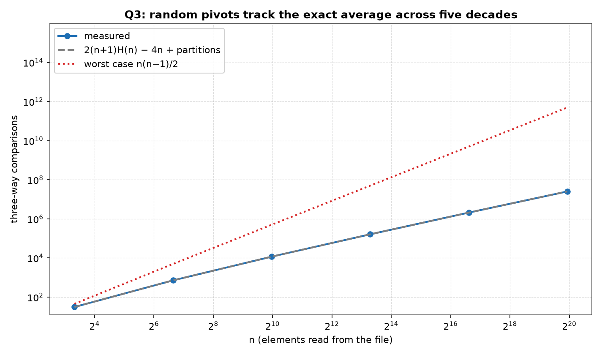
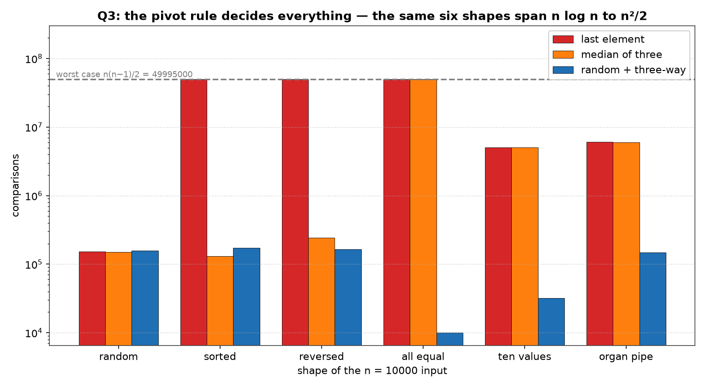

# Q3 — Quicksort on N Random Elements Stored in a File

> Implement quicksort on `N` random elements **stored in a file**: generate the
> numbers, write them out, read them back, sort them, and write the result.

| | |
|---|---|
| **Source** | [`q3_quicksort_file.c`](q3_quicksort_file.c) |
| **Sample** | [`sample.txt`](sample.txt) |
| **Input** | Generated — `q3_random_input.txt`, written then read back |
| **Build** | `gcc -Wall -Wextra q3_quicksort_file.c -o q3 -lm` |
| **Run** | `./q3` — or `./q3 --keep` to leave the two data files behind |
| **Output** | Printed to the terminal; data files removed unless `--keep` |

---

## Problem Statement

Implement Quick sort of `N` random elements stored in a file.

The file is treated as the actual input, not a formality. For each size the
program generates `n` random integers, writes them to `q3_random_input.txt`,
**frees the generated array**, reads the numbers back from disk, sorts the
read-back copy, and writes the sorted list to `q3_sorted_output.txt`. Nothing
that is sorted was ever in memory as anything but the result of a `fscanf`, so
the round trip cannot be accidentally skipped.

The format is deliberately dull: a count on the first line, then one integer per
line.

```
1000000
1804289383
846930886
...
```

The leading count is what lets `readFile` allocate exactly once instead of
growing a buffer, and it gives the first of the program's consistency checks —
the number of integers actually read must equal the header. At `n = 1000000` each
file is 10482423 bytes.

Both files are deleted on the way out, because a 10 MB pair of files per run does
not belong in a git working tree. `./q3 --keep` leaves them in place for
inspection.

The lab sheet asks for the implementation; the complexity analysis is included to
match the rest of the week, and because the second table is the only thing that
justifies the three implementation choices made below.

---

## The Analysis

### The algorithm — random pivot, three-way partition, smaller side recursed

```
QuickSort(a, lo, hi):
    while lo < hi:                            # the LARGER side is the loop
        p = a[ uniform random index in lo..hi ]
        (lt, gt) = Partition3(a, lo, hi, p)   # a[lo..lt−1] < p = a[lt..gt] < a[gt+1..hi]
        if (lt − lo) < (hi − gt):             # recurse on whichever is smaller
            QuickSort(a, lo, lt − 1);  lo = gt + 1
        else:
            QuickSort(a, gt + 1, hi);  hi = lt − 1
```

Three decisions are folded into those seven lines, and each is there because of a
specific failure the pattern table below reproduces:

1. **A random pivot**, so that no input shape is systematically bad. The textbook
   "last element" rule is `Θ(n²)` on sorted input — the single most common shape
   real data takes.
2. **A three-way partition**, so that runs of equal keys are resolved rather than
   re-partitioned. Median-of-three does not fix this; nothing that puts equal keys
   on one side can.
3. **Recursion on the smaller side only**, with the larger side taken by the
   enclosing loop, so that the stack depth is bounded by `log₂ n` *whatever the
   pivots do*. This is what separates "slow" from "crashed".

`Partition3` is the same Dutch-national-flag routine used in [Q1](../Q1) and
[Q2](../Q2), making exactly `hi − lo + 1` three-way comparisons and never
recursing into the equal block.

### Cost: `C(n) = 2(n+1)·H(n) − 4n`, exactly

Every element outside the pivot block is compared to the pivot once, so a
partition of a window of `m` elements costs `m` here (`m − 1` in the classical
two-way analysis, which does not compare the pivot with itself). If the pivot is
equally likely to be any of the `n` ranks, then

```
C(n) = (n − 1) + (1/n) · Σ_{j=1}^{n} [ C(j−1) + C(n−j) ]
```

The double sum collapses because each `C(i)` appears twice, giving
`C(n) = (n−1) + (2/n)·Σ_{i=0}^{n−1} C(i)`; multiplying by `n`, subtracting the
same identity at `n−1`, and telescoping yields the exact solution

```
C(n) = 2(n+1)·H(n) − 4n ,     H(n) = 1 + 1/2 + … + 1/n
```

whose leading term is `2n·ln n = 2·ln2 · n·log₂ n ≈ 1.386 n log₂ n`. That is the
number quoted in textbooks, and it is **not** the number a measurement at any
realistic `n` will produce. Since `H(n) ≈ ln n + γ`,

```
C(n)/(n log₂ n)  ≈  1.386 + 2γ/log₂n − 4/log₂n
```

and at `n = 10⁶` the correction terms are `+0.058` and `−0.201`, so the exact
average predicts about **1.277**, not 1.386. The `−4n` term does not become
negligible until `log₂ n` is large compared with 4 — which is to say, never in
practice. The output prints both figures side by side for this reason.

The `pred` column is `classicAvg(n) + parts`: the classical average plus exactly
one comparison per partition call, which is the difference between this
implementation's `m` comparisons per window and the classical `m − 1`. It is not a
fudge factor — `parts` is counted, not fitted, and at `n = 10⁶` it is 666692
calls against 25.5 million comparisons, so it moves `pred` by 2.6%.

### The bounds: `Θ(n log n)` to `Θ(n²)`

```
even split:   T(n) = 2·T(n/2) + n     →  Θ(n log n)
worst split:  T(n) = T(n−1)  + n      →  Θ(n²),  exactly n(n−1)/2 comparisons
```

Quicksort lies between the two, and *which* it gets is a property of the pivot
rule against the input, not of quicksort. The random-pivot version has expected
cost `Θ(n log n)` on **every** input, with the `Θ(n²)` case surviving only as an
event of vanishing probability. A deterministic rule has no such protection: for
any fixed rule there is an input that drives it quadratic, and for the
last-element rule that input is *already sorted data*.

### How the comparison count relates to the floor

No comparison-based sort can average fewer than `log₂(n!)` comparisons, since a
sort must distinguish `n!` orderings and each comparison yields one of three
answers. At `n = 10⁶`, `log₂(n!) = 18488885`. The output measures the library
`qsort` on the same read-back array at 18674766 — **within 1.0% of the floor** —
against this quicksort's 25224169, **36% above it**. The gap is not a defect: it
is `2 ln 2 = 1.386` against `1.0`, the constant-factor price of sorting in place
with `O(log n)` stack, where a comparison-optimal method wants `O(n)` scratch
space to merge into.

### Stack depth: why the quadratic cells finished

The recursive call is always on the *smaller* of the two sides, so its window is at
most half the parent's. Halving can happen at most `log₂ n` times, giving

```
stack depth ≤ ⌊log₂ n⌋ + 1        regardless of the comparison count
```

This decouples the two costs completely, and the pattern table is where it earns
its keep: the cells that make `n(n−1)/2 = 49995000` comparisons still use at most
**13 frames** against `log₂ 10000 = 13.3`. The naive version — recursing on the
left and looping on the right — would recurse 10000 deep on that same input and
overflow the stack, so those table cells would not exist to be reported.

### Verifying a sort without sorting it again

Checking a sort by sorting the array with a trusted sort is circular, needs a
second `O(n log n)` pass, and does not check that the output is a *permutation* of
the input. Three cheap properties do the whole job, and each run of every row is
checked against all of them:

**(a) Non-decreasing order.** One pass, `n − 1` comparisons: `a[i−1] > a[i]`
anywhere is a failure, reported with the index and the two offending values.

**(b) The sum is preserved.** An order-independent fingerprint of the multiset.
It catches any element that changed value.

**(c) The XOR is preserved.** A second, independent order-independent
fingerprint. It is here because the sum alone is fooled by compensating errors —
duplicating a `4` in place of a `3` and a `5` keeps the sum at 8 while the XOR
changes from `3^5 = 6` to `0`. Together, "sorted, same sum, same XOR" is a strong
statement that the output is a permutation of the input in non-decreasing order,
computed in one linear pass with no reference sort.

Two further checks come for free from the file layer: the count read back must
equal the count written, and — since sorting only permutes — the sorted file must
be **exactly as many bytes** as the input file, which the output confirms
(10482423 in, 10482423 out). The library `qsort` also runs on a copy of the same
data and is put through the same three checks, so a bug in the *checker* would
have to be a bug that both sorts happen to satisfy.

Any failure prints `MISMATCH …` and exits non-zero, and the plotting script
refuses to draw a figure from output containing that word.

### What the two tables can and cannot show

The growth table is **random data only**, so it measures the average case and
nothing else. That is why the second table exists: pivot rules are compared
against *chosen* shapes, where the deterministic rules are deterministic and a
single run is the exact answer rather than a sample. Only the `random 3w` column
and the `random` row involve any sampling at all — which is worth remembering when
reading the `random` row's 158357 against the growth table's 162110 mean, a 2%
difference that is one sample's worth of noise, not a discrepancy.

---

## Sample Output

```
$ gcc -Wall -Wextra q3_quicksort_file.c -o q3 -lm
$ ./q3

===============================================
 QUICKSORT ON N RANDOM ELEMENTS FROM A FILE
===============================================
random pivot, three-way partition, smaller side recursed first
------------------------------------------------------------------------------
       n  runs         cmps         pred obs/pred c/nlg2n  swp/n  depth  lg n
------------------------------------------------------------------------------
      10  4000           31           31    0.999   0.925   2.44      3   3.3
     100  4000          714          714    1.000   1.075   6.48      6   6.6
    1000  1000        11669        11652    1.001   1.171  11.00      8  10.0
   10000   200       162110       162438    0.998   1.220  15.54     11  13.3
  100000    40      2091423      2084720    1.003   1.259  20.25     13  16.6
 1000000     6     25224169     25452121    0.991   1.266  24.56     15  19.9
pred = 2(n+1)H(n) - 4n + one comparison per partition call, the
classical average plus what the three-way scan costs over a two-way
one; c/nlg2n is the same figure against the leading term alone.
the file round trip, per row: 10482423 bytes in and 10482423 out at n = 1000000
the library qsort on that same read-back data made 18674766
comparisons against this quicksort's 25224169 -- log2(n!) = 18488885 is
the floor no comparison sort can beat, and the library one comes
within 1.0% of it while quicksort's 2 ln 2 = 1.386 average is
36% above it -- the price of sorting in place.
both files removed on the way out; pass --keep to look

pivot rule against input shape, n = 10000, comparisons
--------------------------------------------------------------
pattern        last elem     median-3    random 3w   spread
--------------------------------------------------------------
random            152538       150497       158357        1
sorted          49995000       131343       171594      381
reversed        49995000       242135       165773      302
all equal       49995000     50024997        10000     5002
ten values       5030355      5058384        32033      158
organ pipe       6051676      5991315       148651       41
spread is the dearest rule over the cheapest on that shape; the
worst case n(n-1)/2 = 49995000 and the average 155772, so every cell
is somewhere on that scale.  The deepest stack anywhere in the
table was 13 frames against lg n = 13.3, quadratic cells included.

T(n) = 2T(n/2) + n on an even split, T(n) = T(n-1) + n on the
     worst one, so quicksort lies between Theta(n log n) and
     Theta(n^2).  obs/pred stays between 0.991 and 1.003 of the
     exact average over five decades, so the growth table is the
     first of those.  Note that c/nlg2n reads 1.27 at n = 1000000,
     not 1.386: the -4n term is still worth 0.20 of it there, and
     only vanishes as n -> infinity.
The last-element pivot needs 49995000 comparisons on already sorted
     input, 328 times what it needs on random input, because the
     partition splits off one element at a time.  At n = 1000000
     that would be 5x10^11 comparisons, hours instead of a second.
Median-of-three repairs sorted and reversed and organ-pipe input
     but not equal keys (50024997 comparisons, past n(n-1)/2 because
     the rule itself pays three per call), because a two-way
     partition has nowhere to put a run of equal elements.  The
     three-way partition needs 10000 -- one pass, no recursion --
     and on ten distinct values 32033 against 5030355.
Recursing on the smaller side keeps the stack at log2 n frames
     even where the comparison count is quadratic, which is why
     the quadratic cells above finished at all.
```

### Reading the output

**`obs/pred` stays between 0.991 and 1.003 across five decades, against an exact
closed form with no free parameters.** `2(n+1)H(n) − 4n` is computed from `n`
alone; the measured mean at `n = 1000` is 11669 against a predicted 11652. This is
the growth table's only real job — to show that random-pivot quicksort delivers
its `Θ(n log n)` average and to show it against arithmetic rather than a fitted
curve.

**`c/nlg2n` reads 1.266 at `n = 1000000`, not 1.386, and that is not an error.**
The textbook constant is the *asymptotic* leading coefficient. At `n = 10⁶` the
`−4n` term is still worth `4/log₂n = 0.20` of the ratio and the `2γ` term `+0.06`,
so the exact average itself predicts 1.277 — the whole column is a demonstration
that a leading coefficient is not a prediction. The column also rises steadily
(0.925 → 1.266), which is what approaching a limit from below looks like; it will
still be climbing at `n = 10⁹`.

**`swp/n` reaches 24.56 while `cmps/n` is 25.2 — the three-way partition swaps
almost as often as it compares.** Every element that is not equal to its pivot
gets swapped by the partition that examines it, so on distinct data the swap count
tracks the comparison count. It is the cost of the equal-block insurance, and the
`all equal` row is what it buys.

**The stack never exceeds `⌊lg n⌋`: 3, 6, 8, 11, 13, 15 against 3.3, 6.6, 10.0,
13.3, 16.6, 19.9.** Every measured depth is *below* `lg n`, over 4000 runs at the
small sizes. Recursing on the smaller side turns the stack from a data-dependent
risk into a compile-time guarantee, and this column is the evidence.

**The round trip is byte-exact: 10482423 in, 10482423 out.** Sorting only permutes,
so the multiset of decimal strings is unchanged and the two files must be the same
size. It is a free integrity check on the whole pipeline — generation, `fprintf`,
`fscanf`, sort, `fprintf` — and it would catch a truncated write or a lost element
that the sum and XOR checks might not (both are computed in memory; this one is
computed by the filesystem).

**The library sort is within 1.0% of the information-theoretic floor, and this
quicksort is 36% above it.** `log₂(10⁶!) = 18488885` comparisons is the absolute
minimum for any comparison sort; the library needs 18674766 and this one 25224169.
The ratio `25224169/18674766 = 1.35` is essentially `2 ln 2 = 1.386`, discounted by
the `−4n` term. What quicksort buys with that 36% is `O(1)` auxiliary space and
`O(log n)` stack; a comparison-optimal merge wants `O(n)` scratch.

**The `sorted` row is the one that matters most: 49995000 comparisons against
152538 on random data, a factor of 328.** And 49995000 is exactly
`n(n−1)/2 = 10000·9999/2`, the theoretical worst case, hit precisely — because on
sorted input the last element is the maximum, so every partition splits off one
element and nothing else. Sorted input is not adversarial, it is the most ordinary
shape data comes in, and the textbook pivot rule is quadratic on it. At `n = 10⁶`
that is `5×10¹¹` comparisons: hours instead of a second.

**Median-of-three repairs three of the four bad shapes and is defeated by the
fourth, at 50024997 comparisons on equal keys — *worse* than the worst case.** The
excess over `n(n−1)/2` is exactly 29997, which is `3(n−1)`: the rule itself pays
three comparisons per partition call, and on this input there are exactly `n − 1`
calls. No pivot *choice* can help here, because the problem is not the pivot — it
is that a two-way partition has nowhere to put a run of equal elements, so it
splits off one per call no matter which one it picks.

**The three-way partition needs 10000 comparisons on the same input: exactly `n`,
one pass, no recursion at all.** Every element equals the pivot, so the first
partition returns `lt = 0, gt = n−1` and the sort is finished. The `spread` column
reads 5002 on that row — the widest in the table, and the clearest single argument
for the three-way partition.

**On ten distinct values the three-way partition needs 32033 against 5030355 — a
factor of 157 — and `32033/10000 = 3.20` is `log₂ 10 = 3.32`.** A list of `d`
distinct values costs `O(n log d)` however long it is, because each distinct value
can be eliminated only once. The measured ratio landing on `log₂ d` is the closed
form of that claim.

**The `organ pipe` row shows a near-miss rather than a disaster: 6051676 for the
last-element rule, 39× the average but not quadratic.** The last element of an
organ pipe is its minimum, so the rule does split off one element at a time — until
the shape breaks up. It is the row that shows "quadratic or not" is a spectrum,
and that a rule can be badly wrong without being maximally wrong.

**The `random 3w` column is never the cheapest and never the worst — `spread`
reads 1 on random data and it is within a factor of 1.2 of the best cell on every
other shape.** That is the entire argument for the implementation chosen: it gives
up a few per cent against median-of-three on friendly input and never loses a
factor of 300 anywhere. Its worst cell in the table (171594 on sorted input) is
1.06× its random-data cost; the last-element rule's worst cell is 328×.

**No `MISMATCH` appears anywhere.** Every one of the 5246 sorts behind these two
tables was checked for order, sum and XOR, and `rand()` is left unseeded so the
documented build line reproduces the figures byte for byte. Clean under
`-Wall -Wextra`.

---

## Figures

Both figures are generated by [`../make_plots.py`](../make_plots.py), which
compiles this program, runs it, and plots the tables it prints.

### The average case against the exact closed form



Log-log over five decades. The measured comparison count (blue) sits on the exact
average (grey dashed) the whole way, and the quadratic reference (red) shows the
other end of quicksort's range — the two diverge steadily, which is what a
`log n` factor versus an `n` factor looks like on this scale. **The gap between
blue and red at `n = 10⁶` is the entire difference between a working sort and a
hung one**, and the pivot rule alone decides which side of it you land on.

### Pivot rules against input shapes



Grouped bars, log-`y` because the cells span 10000 to 50 million. The dashed line
is the worst case `n(n−1)/2 = 49995000` and the dotted line the average 155772.
**The story is in which bars touch the worst-case line:** the last-element rule
touches it on three of six shapes; median-of-three touches it on one — and passes
it, by exactly the `3(n−1)` its own rule costs; the random three-way version never
comes near it. On `all equal` its bar is two and a half orders of magnitude below
the others, at exactly `n`.

Reading the figure the other way is just as useful: on the `random` shape all three
bars are the same height. Every argument for the more careful implementation is
invisible on random data, which is precisely why the growth table cannot be the
whole analysis.

---

## Files

| File | Description |
|------|-------------|
| [`q3_quicksort_file.c`](q3_quicksort_file.c) | Solution source |
| [`sample.txt`](sample.txt) | Sample build/run output |
| [`plots/1_growth.png`](plots/1_growth.png) | Measured comparisons against the exact average and the quadratic bound |
| [`plots/2_pivot_rules.png`](plots/2_pivot_rules.png) | Three pivot rules across six input shapes |
