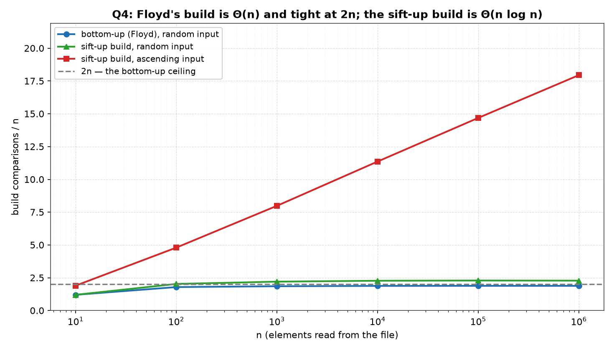
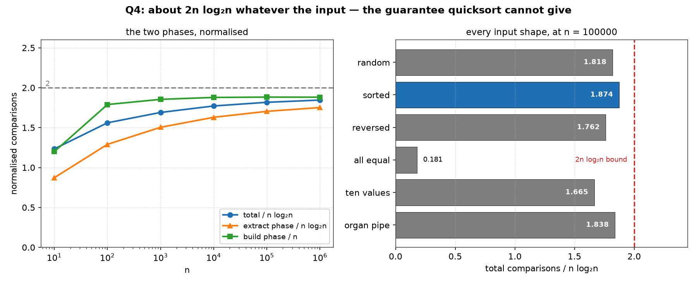

# Q4 — Heapsort on N Random Elements Stored in a File

> Implement heap sort to sort `N` randomly generated elements **stored in a
> file**, and do the complexity analysis of the algorithm.

| | |
|---|---|
| **Source** | [`q4_heapsort_file.c`](q4_heapsort_file.c) |
| **Sample** | [`sample.txt`](sample.txt) |
| **Input** | Generated — `q4_random_input.txt`, written then read back |
| **Build** | `gcc -Wall -Wextra q4_heapsort_file.c -o q4 -lm` |
| **Run** | `./q4` — or `./q4 --keep` to leave the two data files behind |
| **Output** | Printed to the terminal; data files removed unless `--keep` |

---

## Problem Statement

Implement Heap Sort to sort `N` randomly generated elements stored in a file. Do
the complexity analysis of the algorithm.

The file handling is the same as [Q3](../Q3), on purpose: `n` random integers are
written to `q4_random_input.txt` with a count on the first line and one integer
per line, the generated array is freed, the numbers are read back with `fscanf`,
the read-back copy is sorted in place, and the result is written to
`q4_sorted_output.txt`. At `n = 1000000` each file holds 10482480 bytes — about
10.48 bytes per number, since `rand()` returns values of nine or ten digits plus a
newline.

Counting comparisons the same way as Q3 — **one three-way answer per test**, which
is what a `qsort` comparator returns — is what makes the two questions comparable,
and the last column of the first table is that comparison: heapsort against
quicksort's exact average on the same measurement convention.

Both files are removed on the way out; `./q4 --keep` leaves them for inspection.

The complexity analysis has three separate parts, and each gets its own
measurement rather than a paragraph: the **build**, the **extract**, and the
**bound that holds whatever the input looks like**. The third is the entire reason
to prefer heapsort, and it is measured against the same six input shapes that took
quicksort's textbook form from `n log n` to `n(n−1)/2` in Q3.

---

## The Analysis

### The algorithm — Floyd's build, then n−1 extractions

```
SiftDown(a, m, i):                   # restore the heap at i, within a[0..m−1]
    loop:
        l = 2i + 1
        if l ≥ m: return
        big = l
        if l+1 < m and a[l+1] > a[l]: big = l + 1     # 1 comparison
        if a[i] ≥ a[big]: return                      # 1 comparison
        swap(a[i], a[big]);  i = big

BuildHeap(a, n):                     # Floyd, bottom-up
    for i = ⌊n/2⌋ − 1 down to 0: SiftDown(a, n, i)

HeapSort(a, n):
    BuildHeap(a, n)
    for i = n−1 down to 1:
        swap(a[0], a[i])             # the largest goes to its final place
        SiftDown(a, i, 0)            # restore the heap on the shrinking prefix
```

The cost accounting rests on one observation: **`SiftDown` spends exactly two
comparisons per level it descends** — one to pick the larger child, one to test it
against the parent — so a node at height `h` costs at most `2h`, and no input can
make a sift-down longer than the tree is tall. Everything below follows from that.

The array is both the input and the heap; the sorted region grows from the back as
the heap shrinks from the front. Nothing but the array and a few indices is
allocated, so the sort is in place with `O(1)` extra space and no recursion.

### The build is `Θ(n)`, and the `2n` bound is tight

```
a node at height h costs at most 2h comparisons
there are at most n/2^(h+1) nodes at height h
   →   build ≤ Σ_{h≥0} 2h · n/2^(h+1)  =  n · Σ_{h≥0} h/2^h  =  2n
```

`Σ h/2^h = 2` is the standard `Σ h x^h = x/(1−x)²` at `x = 1/2`. The build is
therefore **linear, not `n log n`** — the counter-intuitive part being that the
expensive nodes (the ones near the root, which can sift far) are exactly the rare
ones, and the numerous nodes (the leaves' parents) can sift only one level.

The measurement gives both halves of that claim:

- On the random file, `bld/n` = 1.882 at `n = 10⁶` — flat across five decades
  (1.790, 1.855, 1.879, 1.883, 1.882), so the build is `Θ(n)` and its constant is
  about 1.88.
- On an **ascending** list, where `a[i] = i` makes every parent smaller than both
  its children and so every node does sift its full height, the build reaches
  **1999974** comparisons against the ceiling of `2n = 2000000` — 26 short. The
  bound is not merely correct, it is attained.

### The other build is `Θ(n log n)` — and its cost is an exact closed form

The obvious alternative is to insert the elements one at a time and let each climb
toward the root:

```
BuildByInsertion(a, n):
    for i = 1 to n−1:
        j = i
        while j > 0 and a[j] > a[parent(j)]:      # 1 comparison per level
            swap(a[j], a[parent(j)]);  j = parent(j)
```

This is `Ω(n log n)`, and the reason is a counting argument in the opposite
direction from Floyd's: **half the indices lie in the bottom level**, and an
element inserted there may have to climb the whole tree, so an input that makes
every element climb to the root costs at least `(n/2)(log₂n − 1)`. An ascending
list is exactly that input.

On ascending input the climb never stops early, so element `i` makes exactly
`⌊log₂(i+1)⌋` comparisons and the total is

```
Σ_{m=2}^{n} ⌊log₂ m⌋  =  (n+1)⌊log₂n⌋ − 2^(⌊log₂n⌋+1) + 2
```

At `n = 10⁶` that is `1000001·19 − 2²⁰ + 2 = 17951445`, and the program measures
**17951445** — the closed form to the digit, which is a stronger check on the
implementation than any ratio.

The comparison that matters is not against the formula, though: it is
**17951445 against 1999974** for Floyd's build on the *same list*, a factor of 9.0
at `n = 10⁶` and growing like `log n`. On random input the sift-up build is linear
too (`insRnd/n ≈ 2.28`, i.e. each element climbs about 1.3 levels), which is why
the ascending column has to be in the table: on random data the two methods look
almost the same, and the choice between them looks like a matter of taste.

### The extract phase is `≈ 2n log₂ n`, with almost no average-case saving

There are `n − 1` extractions, and the `i`'th sifts a former leaf from the root of
a heap of size `i`, so it costs at most `2⌊log₂ i⌋`:

```
extract ≤ Σ_{i=1}^{n−1} 2⌊log₂ i⌋  ≈  2n log₂n − 2.9n
```

which at `n = 10⁶` is 35902852. The measured 34911584 is **97.2% of that upper
bound**. That number is the most informative single figure in the question: the
element promoted to the root came from the bottom of the heap and is therefore
likely to belong back near the bottom, so it nearly always sifts almost the whole
way down. Heapsort's extract phase has essentially **no average case** — its
typical cost *is* its worst case, to within 3%.

This is the exact opposite of quicksort, whose `1.386 n log₂n` average sits far
below its `n²/2` worst case, and it is why the two algorithms trade places
depending on which you need: a good average or a guarantee.

Total: `build + extract ≈ 2n log₂n`, and `tot/nlgn` climbs 1.234 → 1.846 across
the table, approaching 2 from below as the `−2.9n` term thins out.

### The guarantee, and what it costs

`vs qs` is heapsort's total over quicksort's exact average `2(n+1)H(n) − 4n` on the
same `n`. It falls 1.68 → **1.48**, heading for `2/(2 ln 2) = 1/ln 2 = 1.443`. So
the guarantee is bought at roughly **44% more comparisons than quicksort's
average** — and what it buys is that there is no input for which heapsort does
materially worse than this. The six-shape table is the demonstration: the dearest
shape costs `1.874 n log₂n` and the cheapest of the five non-degenerate ones
`1.665`, a spread of 13%. In Q3 the same six shapes spread the last-element pivot
rule over a factor of 5002.

The constant list is the one genuinely easy input: `299994` comparisons at
`n = 100000`, which is `3n − 6` and decomposes exactly as **99999 in the build**
(two comparisons at each of the 49999 nodes with two children, one at the node
with a single child) plus **199995 in the extract** (every sift-down stops at the
first level, two comparisons each). Heapsort on constant input is `Θ(n)`, for the
same reason [Q1](../Q1)'s three-way partition is: the comparison that stops the
descent is `a[i] ≥ a[big]`, which equal keys satisfy.

### Checking the sort — and checking the heap

Every run of every row is checked against three properties, and the plotting
script refuses to draw a figure from output containing `MISMATCH`:

**(a) The heap property, directly.** After *every* build — Floyd's and both
sift-up builds — `verifyHeap` walks all `n` indices and asserts `a[i] ≥ a[2i+1]`
and `a[i] ≥ a[2i+2]` wherever those children exist. This is checked rather than
assumed because a sort can come out correct while the intermediate heap is wrong
(a build bug that leaves a valid heap-shaped-but-not-heap array often still sorts,
just slowly), and because the build is where two of the three cost claims live.

**(b) Non-decreasing order** after the sort, reported with the index and the two
offending values.

**(c) The sum and the XOR are unchanged.** Two order-independent fingerprints of
the multiset. The sum alone is fooled by compensating errors — a duplicated `4`
replacing a `3` and a `5` keeps the sum at 8 — but it changes the XOR from `6` to
`0`. Together, "sorted, same sum, same XOR" says the output is a permutation of
the input in non-decreasing order, in one linear pass and with **no reference
sort**, since verifying a sort by sorting is circular.

The file layer adds a fourth: the count read back must equal the count written,
and since sorting only permutes, the sorted file must be exactly as many bytes as
the input — 10482480 in, 10482480 out.

### What these tables can and cannot show

They count comparisons, and **comparisons are not time**. `SiftDown` walks indices
`i, 2i+1, 4i+3, …`, so it jumps by powers of two and touches a fresh cache line at
almost every level, while quicksort's partition scans linearly. On real hardware
that gap is worth more than the 1.48 comparison ratio suggests, and nothing in this
output measures it; the `vs qs` column is a statement about the comparison model
alone.

Six input shapes cannot *prove* the `2n log₂ n` upper bound either — the proof is
the `Σ 2h·n/2^(h+1) = 2n` sum and the `2⌊log₂ i⌋` per extraction, both of which
hold by the tree's geometry rather than by measurement. What the shape table shows
is the thing a bound cannot: that the bound is not merely true but *nearly always
attained*, so heapsort has no shape it is fast on and no shape it is slow on. That
is a different, and for a guarantee more useful, property than being fast on
average.

The `insAsc` and ascending-`bu` figures come from a single run each, which is
exact: the input is deterministic, both builds are deterministic, so there is
nothing to average. Only the rows measured on the random file are means, over the
run counts printed in the second column.

---

## Sample Output

```
$ gcc -Wall -Wextra q4_heapsort_file.c -o q4 -lm
$ ./q4

worked example, n = 10
  input      : 23 4 91 15 8 42 16 77 30 1
  after build: 91 77 42 30 8 23 16 15 4 1
               91 at the root, every parent >= its children
  sorted     : 1 4 8 15 16 23 30 42 77 91

==============================================
 HEAPSORT ON N RANDOM ELEMENTS FROM A FILE
==============================================
-----------------------------------------------------------------------
       n  runs      build  bld/n      extract ext/nlgn tot/nlgn  vs qs
-----------------------------------------------------------------------
      10  4000         12  1.200           29    0.873    1.234   1.68
     100  4000        179  1.790          858    1.291    1.561   1.60
    1000  1000       1855  1.855        15001    1.505    1.691   1.53
   10000   200      18793  1.879       216606    1.630    1.772   1.51
  100000    40     188345  1.883      2831579    1.705    1.818   1.50
 1000000     6    1881511  1.882     34911584    1.752    1.846   1.48
vs qs is heapsort's comparisons over quicksort's exact average
2(n+1)H(n) - 4n.  At n = 1000000 the file held 10482480 bytes in, 10482480 out
both files removed on the way out; pass --keep to look

building the heap: bottom-up against successive insertion
--------------------------------------------------------------
       n     bu/n  insRnd/n   insAsc/n insAsc/nlgn
--------------------------------------------------------------
      10    1.200     1.200      1.900       0.572
     100    1.790     2.030      4.800       0.722
    1000    1.855     2.204      7.987       0.801
   10000    1.879     2.273     11.363       0.855
  100000    1.883     2.290     14.689       0.884
 1000000    1.882     2.280     17.951       0.901
bu is Floyd's build on the same random file, insRnd the sift-up
build on it, insAsc the sift-up build on 0..n-1 ascending.

input shape, n = 100000, total comparisons
---------------------------------------------
pattern                cmps    /nlg2n /random
---------------------------------------------
random              3019660     1.818   1.000
sorted              3112517     1.874   1.031
reversed            2926640     1.762   0.969
all equal            299994     0.181   0.099
ten values          2764808     1.665   0.916
organ pipe          3053431     1.838   1.011

build: a node at height h costs at most 2h and there are at most
     n/2^(h+1) of them, and sum(2h/2^(h+1)) = 2, so the build stays
     under 2n comparisons whatever the input.  bld/n reads 1.882 on
     the random file at n = 1000000, and the ascending list -- where
     every node does sift its full height -- reads 1.999974, so the
     bound is tight and the build is Theta(n), not n log n.
insert: the sift-up build is Omega(n log n) instead.  Half the
     indices lie in the bottom level, so an ascending list, where
     every new element climbs to the root, costs at least
     (n/2)(log2 n - 1); measured 17951445 against 1999974 for bottom-up on
     the same list, a factor of 9.0 at n = 1000000 and growing with
     log n.  On random input it is linear too (insRnd/n ~ 2.28), so
     the ascending column is where the two methods part.
extract: n-1 sift-downs of the full height, 2 log2 i each, giving
     2n log2 n; ext/nlgn reads 1.752 and tot/nlgn 1.846.
bound: the dearest of the six shapes costs 1.874 n log2 n, only
     1.03 times the random figure, and the cheapest 0.181 -- that
     one is the constant list, where every sift-down stops at the
     first level and the sort is linear.  No shape costs materially
     more than random, which is the difference from quicksort: the
     same six shapes took its textbook form to n(n-1)/2.
     Heapsort pays 1.48 times quicksort's average comparisons for
     that guarantee, sorts in place, and is not stable.
```

### Reading the output

**`bld/n` is flat at 1.88 across five decades — 1.790, 1.855, 1.879, 1.883,
1.882 — which is what `Θ(n)` looks like when the alternative claim is
`Θ(n log n)`.** Over those decades `log₂ n` grows from 6.6 to 19.9, a factor of
three; a build with a hidden log factor would have shown that factor in this
column. Instead the column is constant to three digits from `n = 10000` on.

**The `2n` ceiling is attained, not just respected: 1999974 against 2000000 on
ascending input.** A bound proved by a geometric series could easily have been
loose by a factor of two; this one is loose by 26 comparisons out of two million.
It also identifies *which* input is the build's worst case — an ascending list, in
which every parent is smaller than both children so no sift-down ever stops early.

**The sift-up build costs 17951445 on that same ascending list — 9.0× Floyd's
1999974 — and the figure matches `(n+1)⌊lg n⌋ − 2^(⌊lg n⌋+1) + 2` exactly.** The
closed form is `1000001·19 − 1048576 + 2 = 17951445`. Matching a closed form to
the digit, rather than to a ratio, is possible here because ascending input makes
every climb go the full depth, so the count is a sum of `⌊lg m⌋` with nothing
random left in it.

**On random input the two builds are within 21% of each other (1.882 against
2.280), and both are linear.** This is why the ascending column exists. Random
data cannot distinguish a `Θ(n)` build from a `Θ(n log n)` one, because a randomly
placed element rarely climbs far — about 1.3 levels on average. Every argument for
Floyd's build is invisible on the input the question actually asks about, which is
a good general warning about validating an algorithm on random data alone.

**`ext/nlgn` climbs 0.873 → 1.752, and 34911584 is 97.2% of the full-depth bound
35902852.** The extraction phase does almost exactly its worst-case work every
time: the element it promotes to the root came from the bottom level, so it nearly
always sifts all the way back down. Heapsort's typical cost is its guarantee. Two
of the three cost claims in this question are about how *cheap* the build is; this
one is about why the build hardly matters — 1.9M against 34.9M at `n = 10⁶`, 5% of
the total.

**`vs qs` falls 1.68 → 1.48, heading for `1/ln 2 = 1.443`.** That is the price of
the guarantee, stated as a number: about 44% more comparisons than quicksort's
average, in exchange for never being 328× worse (Q3's `sorted` row) and never
needing more than `O(1)` extra space.

**The six shapes span 1.665 to 1.874 — 13% — where Q3's spanned a factor of
5002.** `sorted` is the dearest at 1.031× random, `reversed` the cheapest of the
non-degenerate shapes at 0.969×, and neither is a surprise: they change which
comparisons the sift-downs win, not how far they descend. It is worth noting that
`random` is *not* the worst shape here — sorted input costs 3% more — so the
growth table's random rows are not quietly reporting a best case.

**The constant list costs 299994 = `3n − 6`, and the two phases split it as
99999 + 199995.** Both are exact: the build makes two comparisons at each of the
49999 nodes with two children and one at the single node with one child; the
extract makes two at each of 99997 sift-downs that stop at the first level, one at
the heap of size 2, and none at size 1. Heapsort on equal keys is `Θ(n)` because
`a[i] ≥ a[big]` is true immediately — the same `≥` that makes [Q1](../Q1)'s
three-way partition linear on the same input.

**The worked example shows the build's output, not just the sort's:
`23 4 91 15 8 42 16 77 30 1` becomes `91 77 42 30 8 23 16 15 4 1`.** The root
holds the maximum, every parent dominates its children — 30 over 15 and 4, 42 over
23 and 16 — and the array is otherwise nothing like sorted. Printing the
intermediate heap is what makes the two-phase structure visible; the sorted line
alone would prove only that *something* worked.

**No `MISMATCH` appears.** Every build in every run was checked for the heap
property at all `n` indices, every sort for order, sum and XOR, and the file for
its count and its byte total. `rand()` is left unseeded so the build line above
reproduces these figures byte for byte. Clean under `-Wall -Wextra`.

---

## Figures

Both figures are generated by [`../make_plots.py`](../make_plots.py), which
compiles this program, runs it, and plots the tables it prints.

### Two ways to build a heap



Build comparisons per element, against `n` on a log axis, so a horizontal line
means linear and a rising line means a log factor. Floyd's build (blue) and the
sift-up build on random data (green) are both flat, under the `2n` ceiling and just
above it respectively. The sift-up build on ascending input (red) climbs steadily —
1.9, 4.8, 8.0, 11.4, 14.7, 18.0 — adding about 3.3 per decade, which is `log₂ 10`.
**The whole argument for Floyd's build is the vertical distance between the red and
blue lines at the right-hand edge, and its absence at the left-hand edge.**

### The guarantee



*Left:* the two phases normalised, against `n`. `tot/nlgn` (blue) and `ext/nlgn`
(orange) rise toward the dashed `2` from below, while `bld/n` (green) is flat at
1.88 — the shape of a sum whose leading term is `2n log₂n` and whose linear term is
being diluted. The build is the small green line at the bottom: at `n = 10⁶` it is
5% of the total, and the reason the whole sort is `Θ(n log n)` is entirely the
orange curve.

*Right:* every input shape at `n = 100000`, as total comparisons over `n log₂ n`,
with the `2n log₂ n` bound as the red line. **Five of the six bars sit between 1.66
and 1.88 — the flatness is the result.** The sixth, `all equal`, is at 0.181,
which is the linear case. Put this panel beside Q3's `2_pivot_rules.png`, where the
same six shapes drive a log-scale bar chart across four orders of magnitude, and
the trade-off the two questions are really about is visible in one glance.

---

## Files

| File | Description |
|------|-------------|
| [`q4_heapsort_file.c`](q4_heapsort_file.c) | Solution source |
| [`sample.txt`](sample.txt) | Sample build/run output |
| [`plots/1_build.png`](plots/1_build.png) | Floyd's build against successive insertion |
| [`plots/2_guarantee.png`](plots/2_guarantee.png) | The two phases, and every input shape against the `2n log₂n` bound |
